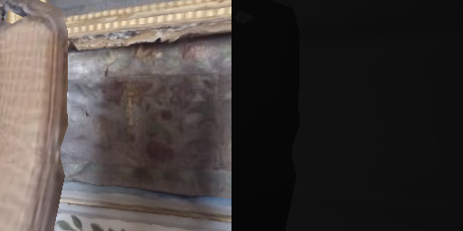
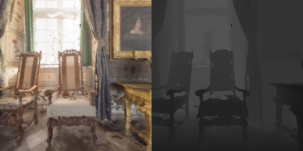
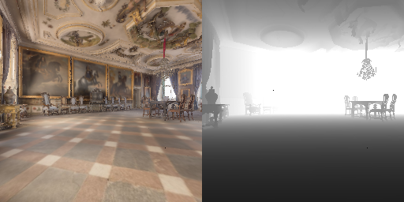
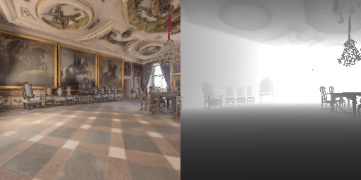
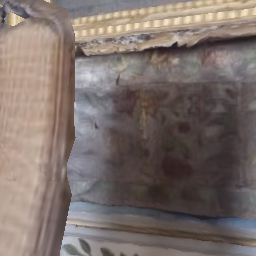
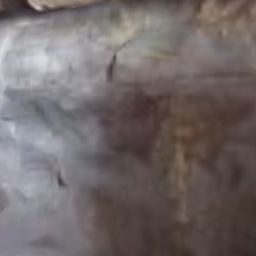

# 第2章：跑通示例 — Habitat 从零理解

> 亲手运行 Habitat 的示例程序，亲眼看到 3D 场景中的 Agent 移动。从"环境装好了"到"我知道它在做什么"。

## 0\. Habitat 有哪些示例？

Habit 仓库的 `examples/` 目录下有 15+ 个示例程序。本章精选 5 个最适合小白的学习路径。

| 序号      | 示例文件                                   | 难度  | 你将学到什么                                         |
| ------- | -------------------------------------- | --- | ---------------------------------------------- |
| **2-1** | `example_pointnav.py`                  | ⭐   | Gym API 接口、PointNav 任务、env.step() 随机动作循环（无需联网） |
| **2-2** | `tutorials/.../Habitat_Lab.py`         | ⭐⭐  | **Native API**、PointNav 任务、观测字典的内容、手动控制 Agent  |
| **2-3** | `benchmark.py`                         | ⭐⭐  | 标准化评估流程、Benchmark 对象、ForwardOnlyAgent          |
| **2-4** | `shortest_path_follower_example.py`    | ⭐⭐⭐ | 最短路径导航、Top-down 地图可视化、视频生成                     |
| **2-5** | `register_new_sensors_and_measures.py` | ⭐⭐⭐ | 自定义传感器、自定义指标、Registry 注册机制                     |

> 💡
> 
> 

> 
> 本章的学习策略
> 
> **2-1 到 2-3 必须亲手跑通。**2-4 跑通即可，不需要逐行理解。2-5 留到第4章（改配置实验）再深入。 目标不是"读懂所有代码"，而是**建立对关键数据格式和交互循环的肌肉记忆**。
> 
> 

> 
> 

> 
> 

> 
> ## 2-1 · example\_pointnav.py — 你的第一个 Habitat 程序
> 
> Gym 接口。PointNav 任务。随机动作。无需联网下载数据。
> 
> 

> 
> **① 这个案例做什么？**
> 
> 创建一个 **PointNav (PointGoal Navigation)** 环境——Agent 被随机放在 3D 场景中， 目标是导航到指定的坐标点。Agent 使用**随机动作**（turn\_left / turn\_right / move\_forward / stop） 在场景中乱走，几秒后 episode 结束。  
>   
> 虽然它什么也学不到（没有 RL 训练），但它是**未来所有 RL rollout 的最简原型**。 你通过这个程序验证：环境能创建、reset 能跑、step 能推进、观测数据格式正确。 数据集使用 `habitat-test`（本地文件，无需联网）。
> 
> 

> 
> ### ② 核心代码 & 关键函数
> 
> #### 完整代码
> 
>     import gym
>     import habitat.gym  # noqa: F401 — 注册 Habitat-v0
>     
>     # (1) 创建 Gym 环境 — PointNav 导航任务，使用本地 habitat-test 数据集
>     env = gym.make(
>         "Habitat-v0",
>         cfg_file_path="benchmark/nav/pointnav/pointnav_habitat_test.yaml",
>     )
>     
>     # (2) 重置环境 — 开始一个新的 episode
>     obs = env.reset()
>     print("Keys:", obs.keys())  # → rgb, depth, pointgoal_with_gps_compass
>     
>     count_steps = 0
>     while True:
>         # (3) 随机选择一个动作（turn left/right, move_forward, stop）
>         action = env.action_space.sample()
>         # (4) 执行动作 — 环境前进一步
>         obs, reward, done, info = env.step(action)
>         count_steps += 1
>         if done:
>             break
>     
>     # (5) 输出结果 — 包含 success/spl 等评测指标
>     print("Steps:", count_steps)
>     print("Metrics:", info)
> 
> #### 关键函数调用
> 
> | 函数                            | 作用          | 说明                                                                          |
> | ----------------------------- | ----------- | --------------------------------------------------------------------------- |
> | `gym.make("Habitat-v0", ...)` | 创建环境        | Gym 标准接口。传入 YAML 配置文件路径，Habitat 自动注册 `Habitat-v0`                           |
> | `env.reset()`                 | 开始新 episode | 返回观测字典 `obs`。每次 reset 会随机选择起点和终点                                            |
> | `env.action_space.sample()`   | 随机动作        | Gym 标准接口。返回 0\~3 的 int：0=stop, 1=move\_forward, 2=turn\_left, 3=turn\_right |
> | `env.step(action)`            | 前进一步        | 返回 `(obs, reward, done, info)` — Gym 标准 4 元组                                |
> | `env.render("rgb_array")`     | 获取画面        | 返回 RGB+深度左右拼接的 numpy 数组 (256×512×3)，用 cv2.imshow 显示                         |
> 

> 

> 
> **Habitat Gym 完整注册表 (`gym_definitions.py`)**
> 
> 共 **30 个**已注册 Gym ID：**2 个通用** + **16 个 Skill 任务**（含 Render 变体）+ **12 个 Home Assistant Benchmark 任务**。 注册逻辑在 `habitat/gym/gym_definitions.py`，导入 `habitat.gym` 时自动触发。
> 
> 类别
> 
> 

> 
> 

> 
>

Gym ID（Performance）

Render 变体

说明

**通用**

`Habitat-v0`

`HabitatRender-v0`

接受 `cfg_file_path=...` 参数，可加载任意 YAML 配置

用于 PointNav / ObjectNav 等导航任务，或自定义 config。

**Skill  
任务**

`HabitatPick-v0`

`HabitatRenderPick-v0`

抓取物体（Fetch 机器人 + 吸盘）

`HabitatPlace-v0`

`HabitatRenderPlace-v0`

放置物体到目标位置

`HabitatNavToObj-v0`

`HabitatRenderNavToObj-v0`

纯导航到目标物体附近

`HabitatOpenCab-v0`

`HabitatRenderOpenCab-v0`

打开柜门（关节物体交互）

`HabitatCloseCab-v0`

`HabitatRenderCloseCab-v0`

关闭柜门

`HabitatOpenFridge-v0`

`HabitatRenderOpenFridge-v0`

打开冰箱门

`HabitatCloseFridge-v0`

`HabitatRenderCloseFridge-v0`

关闭冰箱门

`HabitatReachState-v0`

`HabitatRenderReachState-v0`

控制手臂到达指定位姿

**HAB  
Benchmark**

`HabitatTidyHouse-v0`

`HabitatRenderTidyHouse-v0`

整理房间（PDDL 复合任务）

`HabitatPrepareGroceries-v0`

`HabitatRenderPrepareGroceries-v0`

准备食材

`HabitatSetTable-v0`

`HabitatRenderSetTable-v0`

布置餐桌

`HabitatRearrange-v0`

`HabitatRenderRearrange-v0`

通用重排任务（无 solution）

`HabitatRearrangeEasy-v0`

`HabitatRenderRearrangeEasy-v0`

简化重排（PDDL solution 已知）

`HabitatRearrangeEasyMultiAgent-v0`

`HabitatRenderRearrangeEasyMultiAgent-v0`

多智能体协作重排

注意：上面展示的代码 ≠ 工程文件 `example_pointnav.py`

**上面这个代码块是"教学版"（16 行）** — 它只保留核心逻辑：创建环境 → reset → 随机动作循环 → 打印结果。 目的是让你在 30 秒内看清整个程序的结构，不被无关细节分散注意力。  
  
**工程里的 `examples/example_pointnav.py`（73 行）** 在此基础上加了：

| 多出的部分                 | 在工程文件里怎么写的                                                                | 为什么加这个                                |
| --------------------- | ------------------------------------------------------------------------- | ------------------------------------- |
| **OpenCV 可视化**        | `frame = env.render(mode="rgb_array"); cv2.imshow(win, frame[..., ::-1])` | 让你**实时看到** Agent 的 RGB+深度画面，而不是只看终端数字 |
| **分组动作 + 暂停**         | 每 10 步为一组 + `time.sleep(1.0)`                                             | 防止画面闪太快看不清；给窗口时间渲染                    |
| **按键退出**              | `cv2.waitKey(1) & 0xFF` 检测 Q 键 + 窗口关闭                                     | 让你优雅退出，而不是 kill 进程                    |
| **KeyboardInterrupt** | `try/except KeyboardInterrupt; finally: cv2.destroyAllWindows()`          | Ctrl+C 或关窗口时清理 OpenCV 资源，不留僵尸窗口       |
| **Episode 自动重置**      | `if done: obs = env.reset(); count_steps = 0`                             | 一个 episode 结束自动开新的，程序持续运行到你手动退出       |

**简单记法：**教学版 = 骨架，工程版 = 骨架 + 可视化 + 交互 + 错误处理。 两者核心逻辑完全一致（都是 PointNav + 随机动作），建议**先读懂教学版，再看工程版源码**。

### ③ 如何创建和运行

代码已保存在 `examples/example_pointnav.py`。直接从仓库根目录运行：

    $ cd /develop/habitat-lab    ← 必须在仓库根目录（配置文件使用相对路径）
    $ conda activate habitat        ← 激活 conda 环境
    $ python examples/example_pointnav.py
    
    # 期望输出：
    # Observation keys: ['depth', 'pointgoal_with_gps_compass', 'rgb']
    # RGB shape: (256, 256, 3)
    # Episode finished after N steps.
    # Metrics: {'success': 0.0, 'spl': 0.0, ...}

> ⚠️
> 
> 

> 
> 常见报错：X\_GLXMakeCurrent BadAccess
> 
> 如果在 NVIDIA GPU + GNOME 桌面下报 `X_GLXMakeCurrent: BadAccess`： **本课程的 example\_pointnav.py 已内置修复**（`mode="rgb_array"` + OpenCV）， 直接运行即可，无需任何额外配置。详见[永久修复方法](#glx-fix)。
> 
> 

> 
> ### ④ 运行效果
> 
> 以下是在本机 (NVIDIA RTX 2070 SUPER, Ubuntu 22.04, habitat-sim 0.2.5) 上**实际运行**的终端输出和画面。
> 
> #### 终端输出（随机动作循环）
> 
>     Observation keys: ['depth', 'pointgoal_with_gps_compass', 'rgb']
>       RGB: shape=(256, 256, 3), dtype=uint8, min=26, max=252
>       Depth: shape=(256, 256, 1), dtype=float32, min=0.0247, max=0.0776
>       pointgoal_with_gps_compass: shape=(2,), dtype=float32, [10.9006, 1.5645]
>     
>     初始状态: distance=10.9006m, angle=1.5645rad
>     
>     执行 10 步随机动作 (env.action_space.sample())...
>       action 编号: 0=stop, 1=move_forward, 2=turn_left, 3=turn_right
>       Step  1: action=2(turn_left),    dist=10.9006m, angle=1.3900rad  reward=-0.010
>       Step  2: action=1(move_forward), dist=10.8868m, angle=1.4127rad  reward=-0.270
>       Step  3: action=3(turn_right),   dist=10.8868m, angle=1.5872rad  reward=-0.010
>       Step  4: action=2(turn_left),    dist=10.8868m, angle=1.4127rad  reward=-0.010
>       Step  5: action=2(turn_left),    dist=10.8868m, angle=1.2381rad  reward=-0.010
>       Step  6: action=1(move_forward), dist=10.8858m, angle=1.2522rad  reward=-0.171
>       Step  7: action=3(turn_right),   dist=10.8858m, angle=1.4268rad  reward=-0.010
>       Step  8: action=3(turn_right),   dist=10.8858m, angle=1.6013rad  reward=-0.010
>       Step  9: action=0(stop),            dist=10.8858m, angle=1.6013rad  reward=-0.010  ← Agent 主动停止!
>     
>     After 9 steps metrics: {'distance_to_goal': 11.814, 'success': 0.0, 'spl': 0.0}
> 
> #### 4 个动作的视觉效果对比
> 
> 随机动作大概率中途抽到 stop，无法保证"前进 10 步"。下面用**手动指定动作**展示不同动作对视野的影响 （场景和出生点相同，使用 `env.render(mode="rgb_array")` 截图）。
> 
> 

> 
> 

> 
> #### 初始位置 (reset 后)
> 
> 
> 
> distance=10.90m, angle=1.56rad
> 
> 

> 
> 

> 
> #### turn\_left ×6（左转 \~90°）
> 
> 
> 
> 视野大幅变化 — 看到了房间右侧
> 
> 

> 
> 

> 
> #### turn\_right ×12（右转 \~90°）
> 
> 
> 
> 视野完全不同 — 角度改变即改变"看到的世界"
> 
> 

> 
> 

> 
> #### move\_forward ×8（前进 2m）
> 
> 
> 
> 靠近墙壁 — 视野中物体变大
> 
> ### ⑤ 输出结果的含义
> 
> 

> 
> **逐条解读**
> 
> **1. 观测字典有三个 key：**`rgb` (视觉)、`depth` (深度)、`pointgoal_with_gps_compass` (导航信号)。 这就是 PointNav 中 AI 策略**能获取的全部信息** — 没有地图、没有绝对坐标、没有"这里是什么房间"的标注。  
>   
> **2. move\_forward 的 reward 是 -0.17\~-0.27：**而 turn\_left / turn\_right / stop 只有 -0.01（slack penalty）。 为什么前进的惩罚更大？因为初始朝向 (1.56rad ≈ 89°) 几乎**垂直**于目标方向。 往前走不仅不靠近目标，反而可能远离 — **在 PointNav 中，选对方向比走多远更重要。**  
>   
> **3. 距离从 10.90m 降到 10.886m 后卡住：**Agent 在第2章撞墙。 后续 turn 只能改变朝向不能改位置 — **碰撞检测正常工作**，物理引擎阻止穿墙。  
>   
> **4. success=0.0 但 Agent 调用了 stop：**第9章 的 stop 结束了 episode。 但 success 仍是 0 — 因为 stop 时距目标还有 11.8m（远大于 success\_distance=0.1m）。 **success 需同时满足 (a) 调用 stop (b) distance \< 0.1m**。  
>   
> **5. 随机动作很容易抽到 stop：**这就是 RL 训练时策略网络必须学会"不随便 stop"的原因。
> 
> 

> 
> ### ⑥ 试试调整这些，再观察变化
> 
> <table>
> <colgroup>
> <col style="width: 33%" />
> <col style="width: 33%" />
> <col style="width: 33%" />
> </colgroup>
> <thead>
> <tr class="header">
> <th>调整项</th>
> <th>怎么改</th>
> <th>预期看到什么</th>
> </tr>
> </thead>
> <tbody>
> <tr class="odd">
> <td>手动指定动作</td>
> <td>把 <code>action_space.sample()</code> 换成固定 int： 
> <code>action = 1  # 一直前进</code></td>
> <td>Agent 一直往前走直到撞墙 — 观察 distance 如何变化，何时卡住</td>
> </tr>
> <tr class="even">
> <td>打印更多观测</td>
> <td>在循环里加： 
> <code>print(obs['depth'].mean())</code></td>
> <td>深度图的平均深度值 — 越靠近障碍物均值越小</td>
> </tr>
> <tr class="odd">
> <td>修改最大步数</td>
> <td>编辑 YAML 中 <code>max_episode_steps</code> 
> 或创建新 YAML 覆盖这个值</td>
> <td>不改 agent 永远 500 步超时；改成 20 看提前超时的效果</td>
> </tr>
> <tr class="even">
> <td>缩小图片分辨率</td>
> <td>编辑 YAML 中 RGB sensor 的 <code>width: 128, height: 128</code></td>
> <td>画面变模糊，但 step 速度更快 — 理解传感器分辨率对性能的影响</td>
> </tr>
> </tbody>
> </table>
> 
> 

> 
> 

> 
> ## 2-2 · Native API — PointNav 任务 & 观测字典
> 
> 这是本章**最重要**的一节。你会看到 Agent 的"眼睛"能看到什么，以及如何用代码读取。
> 
> 

> 
> **① 案例含义 — 这个案例要演示什么**
> 
> **Native API** 是 Habitat 最底层的 Python 接口。与 Gym API 不同，它不经过 `gym.make()` 封装， 直接用 `habitat.Env(config)` 创建环境。这个案例演示三件事：  
> **1. 如何用 Native API 创建环境并获取观测** — `obs = env.reset()` 返回一个字典，Agent 的所有"感官"都在里面  
> **2. 观测字典里有什么** — RGB 图像（256×256×3）、深度图（256×256×1）、GPS+Compass 导航信号（2,）  
> **3. 如何加上实时画面显示** — 把 RGB 和深度图左右拼接成 256×512，用 OpenCV 显示，**不触发 GLX 错误**
> 
> 

> 
> ### ② 核心代码 & 关键函数调用
> 
> #### 最小 PointNav 程序（Native API）
> 
>     import habitat
>     
>     # (1) 加载 PointNav 测试配置
>     config = habitat.get_config("benchmark/nav/pointnav/pointnav_habitat_test.yaml")
>     
>     # (2) 创建环境（Native API，非 Gym）
>     env = habitat.Env(config)
>     
>     # (3) 重置 — 返回观测字典
>     obs = env.reset()
>     
>     # (4) 看看观测字典里有什么
>     print("观测类型:", obs.keys())
>     
>     # (5) 执行几步，观察数据变化
>     for step in range(5):
>         action = {"action": "move_forward"}  # 前进 0.25m
>         obs = env.step(action)
>         gps = obs["pointgoal_with_gps_compass"]
>         print(f"第{step}步 — 到目标的距离: {gps[0]:.2f}m, 角度: {gps[1]:.2f}rad")
> 
> 这个程序涉及的**关键函数调用**：
> 
> | 函数调用                       | 作用                      | 返回值                                       |
> | -------------------------- | ----------------------- | ----------------------------------------- |
> | `habitat.get_config(path)` | 加载 YAML 配置文件，解析默认值和继承关系 | `Config` 对象（类 OmegaConf / dict）           |
> | `habitat.Env(config)`      | 根据配置创建模拟器 + 任务环境        | `Env` 对象                                  |
> | `env.reset()`              | 开始新 episode：随机出生点、随机目标  | `dict` — 观测字典（rgb, depth, gps 等）          |
> | `env.step(action)`         | 执行动作，模拟器更新，返回新观测        | `dict` — 新观测字典                            |
> | `env.episode_over`         | 检查当前 episode 是否已结束      | `bool` — stop/超时/到达目标则为 True              |
> | `env.get_metrics()`        | 获取 episode 的评估指标        | `dict` — success, spl, distance\_to\_goal |
> 

> #### 加上实时画面显示（RGB + 深度图拼接）
> 
> Native API 不需要 `env.render()` — RGB 和深度图直接在观测字典里。 把两者**左右拼接**成 256×512 画面，效果和 `example_pointnav.py` 的 `render('rgb_array')` 完全一致。 同样**不会触发 GLX 错误**。
> 
>     import cv2
>     import numpy as np
>     import habitat
>     
>     def make_frame(obs):
>         # 深度归一化 → 灰度 → 3 通道（含 NaN/Inf 保护）
>         depth = obs["depth"].squeeze().copy()
>         dmin, dmax = depth.min(), depth.max()
>         if dmax - dmin 
> 
> > ⚠️
> > 
> > 

> > 
> > 常见问题：窗口显示黑屏或不完整
> > 
> > **根因：**OpenCV 的 `cv2.imshow()` 只是把图像"提交"给窗口系统， **必须调用 `cv2.waitKey(n)`** 才能让 GUI 事件循环真正渲染画面。 如果 `imshow` 后没有紧跟 `waitKey`，窗口就会显示为黑色或不完整。  
> >   
> > **正确写法：**每行 `imshow` 下一行就是 `waitKey(1)`。 上面代码中循环末尾的 `waitKey(300)` 既负责画面刷新，又负责检测按键（300ms 超时）。
> > 
> > 

> > 
> > > 💡
> > > 
> > > 

> > > 
> > > Gym API vs Native API 的渲染差异
> > > 
> > > **Gym API：**`env.render(mode="rgb_array")` 自动把 RGB 和深度图左右拼接成 256×512。  
> > > **Native API：**RGB 在 `obs["rgb"]`（256×256），深度在 `obs["depth"]`（256×256×1）， 需要手动拼接。上面的 `make_frame()` 就是干这件事的 — 先归一化深度，再 `np.hstack`。
> > > 
> > > 

> > > 
> > > ### ③ 创建和运行
> > > 
> > > 把上面的代码保存为 `my_native_pointnav.py`，在仓库根目录运行。**Native API 必须从仓库根目录运行**，因为配置文件使用相对路径。
> > > 
> > >     $ cd /develop/habitat-lab
> > >     $ conda activate habitat
> > >     $ python my_native_pointnav.py
> > >     
> > >     # 期望输出：
> > >     # 观测类型: ['rgb', 'depth', 'pointgoal_with_gps_compass']
> > >     # 初始 GPS: distance=10.9006m, angle=1.5645rad
> > >     # 第1章 — 到目标的距离: 10.90m, 角度: 1.59rad
> > >     # ...
> > > 
> > > 

> > > 
> > > 

> > > 
> > > 推荐：交互式控制脚本 play\_pointnav.py
> > > 
> > > 

> > > 
> > > 上面的代码只是演示"怎么加画面"。实际使用建议直接跑 `examples/play_pointnav.py`： **WASD 控制 Agent（W=前进, A=左转, D=右转, S=停止），窗口一直显示直到你按 Q 退出。** episode 结束后按 R 重开，不会闪现消失。已内置 `waitKey(1)` 刷新机制，不会黑屏。
> > > 
> > >     $ python examples/play_pointnav.py
> > > 
> > > 

> > > 
> > > ### ④ 运行效果
> > > 
> > > #### 终端输出
> > > 
> > >     观测类型: ['rgb', 'depth', 'pointgoal_with_gps_compass']
> > >       rgb: shape=(256, 256, 3), dtype=uint8        ← 注意：3 通道 RGB，不是 RGBA
> > >       depth: shape=(256, 256, 1), dtype=float32
> > >       pointgoal_with_gps_compass: shape=(2,), dtype=float32
> > >     
> > >     初始 GPS: distance=10.9006m, angle=1.5645rad
> > >     执行 5 步 move_forward...
> > >       第1章 — 到目标的距离: 10.9019m, 角度: 1.5874rad
> > >       第2章 — 到目标的距离: 10.8858m, 角度: 1.6013rad
> > >       第3章 — 到目标的距离: 10.8858m, 角度: 1.6013rad  ← 距离不再变化, Agent 撞墙了!
> > >       第4章 — 到目标的距离: 10.8858m, 角度: 1.6013rad
> > >       第5章 — 到目标的距离: 10.8858m, 角度: 1.6013rad
> > >     
> > >     5 步后 metrics: {
> > >       'distance_to_goal': 11.814,
> > >       'success': 0.0,
> > >       'spl': 0.0
> > >     }
> > > 
> > > #### Agent 看到的画面 — 前进 5 步前后对比
> > > 
> > > 

> > > 
> > > 

> > > 
> > > #### 初始位置 (reset 后)
> > > 
> > > 
> > > 
> > > RGB 256×256 — Agent 紧贴墙壁
> > > 
> > > 

> > > 
> > > 

> > > 
> > > #### 前进 5 步之后
> > > 
> > > 
> > > 
> > > 视野几乎没有变化 — Agent 已经撞墙卡住, 距离停在 10.886m
> > > 
> > > ### ⑤ 输出结果的含义
> > > 
> > > #### 观测字典里有什么？
> > > 
> > > 根据配置不同，观测字典包含不同的 key。PointNav 测试配置下：
> > > 
> > > 

> > > 
> > > 

> > > 
> > > 📷
> > > 
> > > 

> > > 
> > > RGB 图像
> > > 
> > > 

> > > 
> > > 

> > > 
> > > obs\["rgb"\]
> > > 
> > > 

> > > 
> > > 

> > > 
> > > Agent 第一人称视角的彩色图像
> > > 
> > > 

> > > 
> > > 

> > > 
> > > shape: (H, W, 3) RGB uint8
> > > 
> > > 

> > > 
> > > 🎯
> > > 
> > > 

> > > 
> > > GPS + 指南针
> > > 
> > > 

> > > 
> > > 

> > > 
> > > obs\["pointgoal\_with\_gps\_compass"\]
> > > 
> > > 

> > > 
> > > 

> > > 
> > > 到目标的距离 + 相对角度偏差
> > > 
> > > 

> > > 
> > > 

> > > 
> > > shape: (2,) float32 \[distance, angle\]
> > > 
> > > 

> > > 
> > > 🔭
> > > 
> > > 

> > > 
> > > 深度图
> > > 
> > > 

> > > 
> > > 

> > > 
> > > obs\["depth"\]
> > > 
> > > 

> > > 
> > > 

> > > 
> > > 每个像素到 Agent 的距离（米）
> > > 
> > > 

> > > 
> > > 

> > > 
> > > shape: (H, W, 1) float32
> > > 
> > > 

> > > 
> > > 🏷️
> > > 
> > > 

> > > 
> > > 语义分割
> > > 
> > > 

> > > 
> > > 

> > > 
> > > obs\["semantic"\]
> > > 
> > > 

> > > 
> > > 

> > > 
> > > 每个像素的物体类别 ID
> > > 
> > > 

> > > 
> > > 

> > > 
> > > shape: (H, W) int32
> > > 
> > > 

> > > 
> > > 

> > > 
> > > **关键洞察：观测字典是策略的唯一信息源**
> > > 
> > > Agent 的"世界"完全由这个字典定义。它不知道场景文件在哪里、不知道自己的绝对坐标 — 它只知道 `obs` 里的内容。这就是为什么 Sensor 的设计如此重要：**你给什么，AI 就学什么。**
> > > 
> > > 

> > > 
> > > 

> > > 
> > > **逐条解读运行结果**
> > > 
> > > **1. rgb shape=(256, 256, 3), dtype=uint8：**3 通道是 RGB（不是 RGBA），值域 0–255。 这和 Gym API 的 `render('rgb_array')` 返回的 256×512 不同 — render 自动拼接了深度图。  
> > >   
> > > **2. depth dtype=float32：**深度值单位是**米**，不是像素。深度图记录的是从相机到物体表面的距离， 不是到导航目标的距离 — 两者是不同的概念。  
> > >   
> > > **3. 第3章开始距离不再变化：**Agent 在第2章已经撞墙，后续 step 无法移动。 Habitat 的物理引擎**自动阻止穿墙** — Agent 只能在 NavMesh（导航网格）上移动。  
> > >   
> > > **4. angle 随 move\_forward 也会变化：**即使是直走（不转弯），角度也会轻微变化（1.5645→1.5874→1.6013）。 因为 Agent 移动后，它相对于目标的方向自然改变 — 这是正常的几何效应。
> > > 
> > > 

> > > 
> > > ### ⑥ 试试调整这些，再观察变化
> > > 
> > > | 调整项            | 怎么改                                            | 预期看到什么                                              |
> > > | -------------- | ---------------------------------------------- | --------------------------------------------------- |
> > > | 换不同动作序列        | 把 `move_forward` 换成 `turn_left` / `turn_right` | 距离不变但角度变化 — 理解纯旋转不改变 Agent 位置，只改变朝向                 |
> > > | 增加传感器          | 在 YAML 的 `sim_sensors` 中添加 `semantic_sensor`   | `obs` 中多出一个 key — 体验"传感器声明即启用"的机制                   |
> > > | 打印 episode 元信息 | 加 `print(env.current_episode.__dict__)`        | 看到 scene\_id, start\_position, goal\_position 等幕后数据 |
> > > | 调整深度图可视化       | 改 `make_frame()`，用 `cv2.COLORMAP_JET` 替换灰度     | 伪彩色深度图 — 红色=近, 蓝色=远，比灰度更直观                          |
> > > 

> > > 

> > > 
> > > **Native API 官方教程文件**
> > > 
> > > 完整的官方教程在 `examples/tutorials/nb_python/Habitat_Lab.py`（Jupyter notebook 格式）。 它包含更多功能：交互式控制 Agent、matplotlib 可视化、自定义 Task/Sensor 注册。 上面展示的是其中最核心的部分 — 理解了这些，剩下的都是"加功能"。
> > > 
> > > 

> > > 
> > > 

> > > 
> > > #### 练习 2-2A：打印每个观测的形状和类型
> > > 
> > > 修改上面的程序，在 `env.reset()` 之后添加一个循环： `for key, val in obs.items(): print(key, type(val), val.shape if hasattr(val, 'shape') else 'N/A')`  
> > > 记录下来你看到的每一种观测 — 它们就是你未来训练模型的**输入数据**。
> > > 
> > > 

> > > 
> > > 

> > > 
> > > ## 2-2B · 动作空间 — Agent 能做什么
> > > 
> > > PointNav 的离散动作空间只有 4 个动作。这是最简单也最重要的动作设计。
> > > 
> > > 

> > > 
> > > **① 案例含义 — 这个案例要演示什么**
> > > 
> > > **动作空间**定义了 Agent 在环境中"能做什么"。PointNav 的离散动作空间只有 4 个动作：停止、前进、左转、右转。 这看起来简单，但**已经足够完成导航任务** — 任何复杂路径都可以分解为"转+走"的组合。  
> > > 这个案例演示：**每个动作执行后 GPS 数据如何变化**、哪些动作改变位置、哪些只改变朝向、以及**Native API 和 Gym API 的动作格式差异**。
> > > 
> > > 

> > > 
> > > ### ② 动作空间定义 & 两种 API 的格式差异
> > > 
> > > | 动作名    | 键值               | 效果            | Native API 写法                | Gym API 编号 |
> > > | ------ | ---------------- | ------------- | ---------------------------- | ---------- |
> > > | **停止** | `"stop"`         | 结束当前 episode  | `{"action": "stop"}`         | `0`        |
> > > | **前进** | `"move_forward"` | 向当前朝向移动 0.25m | `{"action": "move_forward"}` | `1`        |
> > > | **左转** | `"turn_left"`    | 逆时针旋转 15°     | `{"action": "turn_left"}`    | `2`        |
> > > | **右转** | `"turn_right"`   | 顺时针旋转 15°     | `{"action": "turn_right"}`   | `3`        |
> > > 

> > > 

> > > 
> > > **Native API vs Gym API 的动作格式差异**
> > > 
> > > **Native API：**`{"action": "move_forward"}` — 字典格式，action 的值是字符串。更灵活，支持参数化动作。  
> > > **Gym API：**`env.action_space.sample()` — 返回 int（0-3）。Gym 封装层做了离散化编号，方便对接 RL 库（Stable-Baselines3）。  
> > > 两种 API 在你的学习过程中都会遇到，理解它们的对应关系很重要。
> > > 
> > > 

> > > 
> > > ### ③ 创建和运行 — 验证 4 个动作
> > > 
> > > 下面的代码对每个动作：创建新环境 → reset → 执行一次 → 记录 GPS 变化。可以直接在前面 2-2 的程序中替换动作来测试。
> > > 
> > >     import habitat
> > >     
> > >     config = habitat.get_config("benchmark/nav/pointnav/pointnav_habitat_test.yaml")
> > >     
> > >     for action_name in ["move_forward", "turn_left", "turn_right", "stop"]:
> > >         env = habitat.Env(config)
> > >         obs = env.reset()
> > >         before = obs["pointgoal_with_gps_compass"].copy()
> > >         obs = env.step({"action": action_name})
> > >         after = obs["pointgoal_with_gps_compass"]
> > >         print(f"{action_name:>14s}: dist {before[0]:.4f}→{after[0]:.4f}  angle {before[1]:.4f}→{after[1]:.4f}  over={env.episode_over}")
> > >         env.close()
> > > 
> > > ### ④ 运行效果
> > > 
> > >     # 对每个动作：创建新环境 → reset → 执行一次 → 记录 GPS 变化
> > >       move_forward: gps 10.9006 -> 10.9019 (Δ=+0.0013), over=False
> > >       turn_left:    gps 10.9006 -> 10.9006 (Δ=+0.0000), over=False
> > >       turn_right:   gps 10.9006 -> 10.9006 (Δ=+0.0000), over=False
> > >       stop:         gps 10.9006 -> 10.9006 (Δ=+0.0000), over=True
> > > 
> > > 

> > > 
> > > 

> > > 
> > > #### 动作前
> > > 
> > > 
> > > 
> > > 

> > > 
> > > 

> > > 
> > > #### move\_forward 动作后
> > > 
> > > 
> > > 
> > > 前进 0.25m — 视觉上几乎看不到变化，但 GPS 距离确实变了
> > > 
> > > ### ⑤ 输出结果的含义
> > > 
> > > 

> > > 
> > > **逐条解读**
> > > 
> > > **1. move\_forward: Δ=+0.0013m（距离反而增加）：**因为 Agent 初始朝向与目标方向夹角为 1.56 rad (≈89°)， 几乎垂直于目标方向。直走不会缩短距离，甚至可能远离 — **在 PointNav 中，选对方向比走多远更重要。**  
> > >   
> > > **2. turn\_left / turn\_right: Δ=0（距离不变）：**纯旋转动作不改变位置，所以到目标的测地距离不变。 但 **角度**（angle）会改变 ±0.1745 rad（=10°），下一次 forward 的方向就不同了。  
> > >   
> > > **3. stop: over=True（立即结束）：**这是唯一导致 episode 立即结束的动作。 **如果 AI 永远不调用 stop，episode 会一直运行直到超时**（默认 500 步），但永远不会被判定为"成功到达"。 **success 需要同时满足 (a) 调用 stop (b) 距离 \< 0.1m。**
> > > 
> > > 

> > > 
> > > ### ⑥ 试试调整这些，再观察变化
> > > 
> > > | 调整项           | 怎么改                                     | 预期看到什么                                      |
> > > | ------------- | --------------------------------------- | ------------------------------------------- |
> > > | 走一个正方形        | 前进 4 步 → 右转 6 次 → 重复 4 轮                | Agent 走一个 \~1m×1m 的正方形，验证 "15°×6=90°" 的转向精度 |
> > > | 连续左转 24 次     | 循环执行 `turn_left` 24 次                   | 360° 转回原位 — 验证 15°×24=360°，角度应该基本回到初始值      |
> > > | Gym API 中验证编号 | 在 `example_pointnav.py` 中手动设 `action=1` | 确认 Gym API 的 int 编号和 Native API 字符串的对应关系    |
> > > 

> > > 

> > > 
> > > #### 练习 2-2B：手动控制 Agent 走一个正方形
> > > 
> > > 写一个循环，让 Agent 做：前进 4 步 → 右转 6 次（90°）→ 前进 4 步 → 右转 6 次 → … 重复直到 episode 结束。 观察 `pointgoal_with_gps_compass` 的值如何变化。这是一个经典的"验证动作空间"实验。
> > > 
> > > 

> > > 
> > > 

> > > 
> > > ## 2-3 · benchmark.py — 标准化评估
> > > 
> > > "我的 Agent 有多好？" — Benchmark 用统一的标准回答这个问题。
> > > 
> > > 

> > > 
> > > **① 案例含义 — 这个案例要演示什么**
> > > 
> > > **Benchmark（基准测试）**是 Habitat 的标准化评估框架。它在多个 episode 上运行 Agent，自动计算 Success、SPL 等指标。 这个案例演示三件事：  
> > > **1. 如何定义一个 Agent** — 继承 `habitat.Agent`，实现 `act()` 方法  
> > > **2. 如何用 Benchmark 评估** — `benchmark.evaluate(agent, num_episodes=10)`  
> > > **3. 为什么"靠近目标就停"这个看似合理的策略**在 PointNav 中依然是 success=0
> > > 
> > > 

> > > 
> > > ### ② 核心代码 & 关键函数调用
> > > 
> > > #### 定义 Agent 并评估
> > > 
> > >     import habitat
> > >     
> > >     # (1) 定义一个最简单的 Agent — 永远前进，永不停止
> > >     class ForwardOnlyAgent(habitat.Agent):
> > >         def reset(self): pass
> > >         def act(self, observations):
> > >             return {"action": "move_forward"}
> > >     
> > >     # (2) 创建基准测试
> > >     benchmark = habitat.Benchmark("benchmark/nav/pointnav/pointnav_habitat_test.yaml")
> > >     
> > >     # (3) 评估 — 10 个 episode
> > >     metrics = benchmark.evaluate(ForwardOnlyAgent(), num_episodes=10)
> > >     
> > >     # (4) 查看指标
> > >     for key, val in metrics.items():
> > >         print(f"{key}: {val:.3f}")
> > > 
> > > 关键函数调用：
> > > 
> > > | 函数调用                                      | 作用                               | 关键参数                                 |
> > > | ----------------------------------------- | -------------------------------- | ------------------------------------ |
> > > | `habitat.Agent`                           | Agent 基类，需实现 `act()` 和 `reset()` | `act(observations)` → 返回 action dict |
> > > | `habitat.Benchmark(config)`               | 创建评估器，加载任务配置和数据集                 | 配置文件路径（同 Native API）                 |
> > > | `benchmark.evaluate(agent, num_episodes)` | 在多个 episode 上运行 Agent，汇总指标       | `num_episodes` 控制评估规模                |
> > > 

> > > #### 改进版：SmartStopAgent — 靠近目标就停
> > > 
> > >     class SmartStopAgent(habitat.Agent):
> > >         def reset(self): pass
> > >         def act(self, observations):
> > >             gps = observations["pointgoal_with_gps_compass"]
> > >             distance = gps[0]
> > >             if distance 
> > > 
> > > ### ③ 创建和运行
> > > 
> > >     $ cd /develop/habitat-lab
> > >     $ conda activate habitat
> > >     $ python -c "
> > >     import habitat
> > >     class SmartStopAgent(habitat.Agent):
> > >         def reset(self): pass
> > >         def act(self, obs):
> > >             return {'action': 'stop' if obs['pointgoal_with_gps_compass'][0] 
> > > 
> > > ### ④ 运行效果
> > > 
> > >     # 在 10 个 episode 上评估，每个 episode 最多 500 步
> > >     
> > >     ForwardOnlyAgent (永远前进):
> > >       distance_to_goal: 12.975
> > >       success: 0.000
> > >       spl:               0.000
> > >     
> > >     SmartStopAgent (距目标 
> > > 
> > > ### ⑤ 输出结果的含义
> > > 
> > > 

> > > 
> > > **为什么 SmartStopAgent 的 success 也是 0？**
> > > 
> > > 这是一个**非常经典的新手误解**。Success 需要 **同时满足两个条件**：  
> > > (1) Agent 调用了 `stop`  
> > > (2) stop 时 Agent 距目标的**测地距离** ≤ 0.1m（success\_distance）  
> > >   
> > > SmartStopAgent 的问题在于：它只会 `move_forward`，**从不会转弯**。 如果 Agent 的初始朝向没有正对目标，一直往前走**永远到不了目标** — 距离停在 \~11m 处（撞墙了）， 永远不会降到 0.5m 以下，所以 `stop` 根本不会被调用。  
> > >   
> > > **这揭示了一个本质问题：**仅仅"靠近就停"不够 — AI 需要学会**"先转向目标方向，再前进"**。 这就是为什么导航策略需要至少 3 个动作（前进、左转、右转）才能完成 PointNav 任务。
> > > 
> > > 

> > > 
> > > ### ⑥ 试试调整这些，再观察变化
> > > 
> > > | 调整项              | 怎么改                                         | 预期看到什么                                              |
> > > | ---------------- | ------------------------------------------- | --------------------------------------------------- |
> > > | 增加转弯逻辑           | 在 `act()` 中加入：如果 angle 偏差大，先 turn 再 forward | success 可能突破 0 — 体验"有转向能力"对导航的关键作用                  |
> > > | 调整 stop 阈值       | 改 `distance < 0.5` 为 `0.15`                 | 更接近 success\_distance(0.1m) 才停 — 但前提是 Agent 能到达目标附近 |
> > > | 增加评估 episode 数   | 改 `num_episodes=100`                        | 统计更稳定 — 10 个 episode 可能运气好，100 个更反映真实水平             |
> > > | 打印每个 episode 的结果 | 在 `act()` 中加 `print(distance, angle)`       | 看到 10 个 episode 各自的距离变化 — 有些出生点可能离目标更近              |
> > > 

> > > 

> > > 
> > > #### 练习 2-3：给 Agent 加上转向能力
> > > 
> > > 修改 `SmartStopAgent.act()`：读取 `observations["pointgoal_with_gps_compass"]` 中的 angle， 如果 `abs(angle) > 0.2`（约 11°），先转向目标（angle\>0 则 turn\_right，否则 turn\_left）；否则前进。 再跑一次 benchmark，看看 **success 是否有提升**。
> > > 
> > > 

> > > 
> > > 

> > > 
> > > ## 2-4 · shortest\_path\_follower — 聪明的 Agent
> > > 
> > > Habitat 内置了一个"学霸 Agent"——它不靠视觉，直接读取场景的导航网格，用图搜索算法找到最短路径。我们来拆解它是怎么做到的。
> > > 
> > > 

> > > 
> > > **① 案例含义 — 这个案例要演示什么**
> > > 
> > > **ShortestPathFollower** 是 Habitat 内置的"最优 Agent"——它不"看"RGB 图像，而是直接读取场景的**导航网格（NavMesh）**， 用 Dijkstra 算法计算从当前位置到目标的最短路径，然后每一步沿着这条路径走。 它要导航到的目标是 **PointNav 数据集中预先定义的目标坐标**——一个 3D 空间点 `(x, y, z)`， 附带一个 **到达半径（goal\_radius）**，Agent 进入该半径即判定为"到达"。  
> > >   
> > > 这个案例演示三个核心问题：  
> > > **1. 导航目标从哪来？** — 目标坐标存储在数据集的 episode 中，每个 episode 有一个 `NavigationGoal`，包含 `position` 和 `radius`  
> > > **2. 最短路径如何计算？** — NavMesh 将场景的可通行区域建模为图，Dijkstra 算法在图上搜索最短路径  
> > > **3. Agent 如何沿路径走？** — 每一步调用 `get_next_action(goal_pos)`，返回当前应执行的动作（前进/左转/右转/停止）  
> > > **4. ShortestPathFollower 能取得什么性能？** — Success≈1.0, SPL≈0.99，这是 RL 训练的**理论上限**
> > > 
> > > 

> > > 
> > > ### ② 核心代码 & 运行流程
> > > 
> > > #### 完整代码（带注释）
> > > 
> > >     import numpy as np
> > >     import habitat
> > >     from habitat.tasks.nav.shortest_path_follower import ShortestPathFollower
> > >     from habitat.utils.visualizations import maps
> > >     from habitat.utils.visualizations.utils import images_to_video
> > >     
> > >     # ═══════════════════════════════════════════
> > >     # 步骤 1：创建环境 + 配置 Top-down 地图传感器
> > >     # ═══════════════════════════════════════════
> > >     config = habitat.get_config(
> > >         config_path="benchmark/nav/pointnav/pointnav_habitat_test.yaml",
> > >         overrides=[
> > >             # 添加 top_down_map 测量指标 — 用于生成俯视地图
> > >             "+habitat/task/measurements@habitat.task.measurements.top_down_map=top_down_map"
> > >         ],
> > >     )
> > >     
> > >     # SimpleRLEnv 是 habitat.RLEnv 的最简子类 — 只用于封装环境
> > >     env = SimpleRLEnv(config=config)
> > >     
> > >     # ═══════════════════════════════════════════
> > >     # 步骤 2：创建 ShortestPathFollower
> > >     # ═══════════════════════════════════════════
> > >     # goal_radius 从 episode 数据中读取 — 定义了"到达"的判定半径
> > >     goal_radius = env.episodes[0].goals[0].radius
> > >     if goal_radius is None:
> > >         goal_radius = config.habitat.simulator.forward_step_size  # 默认 0.25m
> > >     
> > >     follower = ShortestPathFollower(
> > >         env.habitat_env.sim,   # 传入底层 HabitatSim 实例（用于访问 NavMesh）
> > >         goal_radius,           # 到达判定半径
> > >         False                  # return_one_hot=False → 返回离散动作 int
> > >     )
> > >     
> > >     # ═══════════════════════════════════════════
> > >     # 步骤 3：主循环 — 对每个 episode 执行导航
> > >     # ═══════════════════════════════════════════
> > >     for episode in range(3):
> > >         env.reset()
> > >     
> > >         # 每一步都向 follower 查询"下一步该走哪个动作"
> > >         while not env.habitat_env.episode_over:
> > >             # ★ 核心调用：给定目标 3D 坐标，返回一个最优动作
> > >             best_action = follower.get_next_action(
> > >                 env.habitat_env.current_episode.goals[0].position
> > >             )
> > >             if best_action is None:
> > >                 break  # 无法到达目标（孤立 NavMesh 区域）
> > >     
> > >             # 执行动作，获取新的观测 + 指标
> > >             observations, reward, done, info = env.step(best_action)
> > >     
> > >             # 合成双视图：左侧 RGB + 右侧 Top-down 地图
> > >             im = observations["rgb"]
> > >             top_down_map = draw_top_down_map(info, im.shape[0])
> > >             output_im = np.concatenate((im, top_down_map), axis=1)
> > >     
> > >         # 将每一帧合成为导航视频
> > >         images_to_video(images, dirname, "trajectory")
> > > 
> > > #### 程序运行流程图
> > > 
> > > 

> > > 
> > > 

> > > 
> > > **① 加载配置**
> > > 
> > > get\_config()  
> > > 读取 YAML
> > > 
> > > 

> > > 
> > > 

> > > 
> > > →
> > > 
> > > 

> > > 
> > > 

> > > 
> > > **② 创建 Env**
> > > 
> > > SimpleRLEnv  
> > > 加载场景+数据集
> > > 
> > > 

> > > 
> > > 

> > > 
> > > →
> > > 
> > > 

> > > 
> > > 

> > > 
> > > **③ 创建 Follower**
> > > 
> > > ShortestPathFollower  
> > > 接收 sim + goal\_radius
> > > 
> > > 

> > > 
> > > 

> > > 
> > > →
> > > 
> > > 

> > > 
> > > 

> > > 
> > > **④ reset() 开始**
> > > 
> > > 新 episode  
> > > Agent 出生 + 目标就位
> > > 
> > > 

> > > 
> > > 

> > > 
> > > →
> > > 
> > > 

> > > 
> > > 

> > > 
> > > **⑤ 循环导航**
> > > 
> > > get\_next\_action(goal)  
> > > → env.step(action)
> > > 
> > > 

> > > 
> > > 

> > > 
> > > →
> > > 
> > > 

> > > 
> > > 

> > > 
> > > **⑥ 生成视频**
> > > 
> > > RGB + Top-down  
> > > images\_to\_video()
> > > 
> > > #### 关键函数调用
> > > 
> > > | 函数                                                | 作用           | 说明                                                                                                                    |
> > > | ------------------------------------------------- | ------------ | --------------------------------------------------------------------------------------------------------------------- |
> > > | `habitat.get_config(...)`                         | 加载配置         | 读取 YAML + 命令行 override。这里额外添加了 `top_down_map` measurement                                                             |
> > > | `ShortestPathFollower(sim, radius, False)`        | 创建最短路径导航器    | 接收底层 sim 对象以访问 NavMesh；`goal_radius` 决定"到达"的判定距离；`return_one_hot=False` 返回离散 int 动作                                   |
> > > | `env.reset()`                                     | 开始新 episode  | 随机选择起点和终点，Agent 回到起点。episode 数据中包含 `goals[0].position`                                                                |
> > > | `follower.get_next_action(goal_pos)`              | ★ 核心：计算下一步动作 | 传入目标 3D 坐标，内部调用 C++ 层的 `GreedyGeodesicFollower.next_action_along(goal_pos)`，在 NavMesh 上运行 Dijkstra 后返回当前最优动作（0/1/2/3） |
> > > | `env.step(action)`                                | 执行动作         | 返回 (obs, reward, done, info)。info 中包含 top\_down\_map 等 measurement 输出                                                 |
> > > | `maps.colorize_draw_agent_and_fit_to_height(...)` | 绘制俯视地图       | 将 info\["top\_down\_map"\] 渲染为彩色地图：白色=可通行区域，黑线=墙壁/障碍，绿色圆=目标，红色箭头=Agent                                                |
> > > | `images_to_video(images, dirname, name)`          | 生成导航视频       | 将帧列表合成 .mp4 文件，保存到 `examples/images/shortest_path_example/`                                                           |
> > > 

> > > #### 导航目标是如何确定的？
> > > 
> > > 目标**不是代码里写死的**，而是从**数据集的 episode 文件中读取**的。一条完整的导航目标确定链路如下：
> > > 
> > > 

> > > 
> > > 

> > > 
> > > #### Episode 数据文件 (JSON)
> > > 
> > >     {
> > >       "episodes": [
> > >         {
> > >           "episode_id": "0",
> > >           "scene_id": "data/scene_datasets/.../skokloster-castle.glb",
> > >           "start_position": [-7.37, 0.08, 6.58],
> > >           "start_rotation": [0, 0.82, 0, 0.57],
> > >           "goals": [{
> > >             "position": [-5.31, 0.26, 17.28],
> > >             "radius": 0.25
> > >           }]
> > >         },
> > >         // ... 更多 episode
> > >       ]
> > >     }
> > > 
> > > 每个 episode 包含：起点坐标、起点朝向、**目标坐标 + 到达半径**
> > > 
> > > 

> > > 
> > > 

> > > 
> > > #### 目标在代码中的传递链
> > > 
> > > **1. 数据集加载阶段：**  
> > > `JSON 文件` → `PointNavDatasetV1` 解析每个 episode → 包装为 `NavigationEpisode` 对象  
> > > 其中 `goals` 字段是 `List[NavigationGoal]`，每个 `NavigationGoal` 有 `position` 和 `radius` 两个属性  
> > >   
> > > **2. env.reset() 阶段：**  
> > > `env.reset()` → 从 dataset 中选一个 episode → 设置为 `env.current_episode`  
> > > Agent 被放置到 `start_position`，目标坐标存储在 `current_episode.goals[0].position`  
> > >   
> > > **3. 导航循环中：**  
> > > 每一帧调用 `follower.get_next_action(env.current_episode.goals[0].position)`  
> > > → 传入目标的 `(x, y, z)` 坐标 → follower 内部计算到该坐标的最短路径 → 返回下一步动作
> > > 
> > > #### 最短路径是如何计算的？（NavMesh + Dijkstra）
> > > 
> > > 

> > > 
> > > 

> > > 
> > > **NavMesh**
> > > 
> > > 场景加载时  
> > > 自动预计算
> > > 
> > > 

> > > 
> > > 

> > > 
> > > →
> > > 
> > > 

> > > 
> > > 

> > > 
> > > **图上 Dijkstra**
> > > 
> > > 从当前位置  
> > > 搜到目标位置
> > > 
> > > 

> > > 
> > > 

> > > 
> > > →
> > > 
> > > 

> > > 
> > > 

> > > 
> > > **生成路径点**
> > > 
> > > 一串连续的  
> > > 3D 坐标序列
> > > 
> > > 

> > > 
> > > 

> > > 
> > > →
> > > 
> > > 

> > > 
> > > 

> > > 
> > > **每步查询动作**
> > > 
> > > 沿路径点  
> > > 返回 turn/move/stop
> > > 
> > > **第 1 层 — NavMesh（C++ 层，Habitat-Sim 内部）：**  
> > > 场景（.glb 文件）加载时，Habitat-Sim 自动分析 3D 几何，计算出所有 Agent 可以站立和行走的区域。 这些区域被离散化为一张**图（Graph）**——每个节点是一个可到达的 3D 点，边表示两个点之间可以直接移动。 这张图就是 **NavMesh**（Navigation Mesh）。墙壁、家具、楼梯边缘等不可通行区域不会出现在图中。  
> > >   
> > > **第 2 层 — GreedyGeodesicFollower（C++ 层，Habitat-Sim 内部）：**  
> > > 在 NavMesh 图上运行 **Dijkstra 最短路径算法**，找到从 Agent 当前位置到目标位置的一条最短路径。 路径是一串连续的 3D 坐标点（waypoints）。"Geodesic"（测地线）的含义是：路径沿可通行表面走， 而不是穿墙的直线。  
> > >   
> > > **第 3 层 — ShortestPathFollower（Python 层，habitat-lab）：**  
> > > 封装了 C++ 的 `GreedyGeodesicFollower`。每一步调用 `get_next_action(goal_pos)` 时：  
> > >   1. 检查是否需要重建 follower（场景切换时）  
> > >   2. 调用 `self._follower.next_action_along(goal_pos)` → C++ 层  
> > >   3. C++ 层计算：Agent 当前位置在路径上的哪个点？下一个路径点在哪？需要前进还是转向？  
> > >   4. 返回一个离散动作 int：0=stop（已到达），1=move\_forward，2=turn\_left，3=turn\_right  
> > >   5. 如果目标在不可达的 NavMesh 孤岛上，抛出 `GreedyFollowerError` → 返回 stop
> > > 
> > > 

> > > 
> > > **为什么要分三层？**
> > > 
> > > NavMesh 计算和 Dijkstra 搜索是**计算密集型**操作，必须在 C++ 中完成以保证性能。 Python 层的 `ShortestPathFollower` 只是一个**薄封装**——它把 Habitat-Sim 的 C++ 能力暴露给 Python 用户。 这种"底层 C++ 计算 + 上层 Python 接口"的模式在 Habitat 中非常普遍（渲染管线、物理引擎同理）。
> > > 
> > > 

> > > 
> > > ### 深入理解：NavMesh 地图从哪来？——完整链路跟踪
> > > 
> > > 上面说到"场景加载时自动预计算 NavMesh"，但你可能会问：**场景文件是谁选的？NavMesh 具体是怎么生成的？如果我想换一张地图该改哪里？** 下面从 Episode 定义到 C++ NavMesh 构建，完整跟踪这条链路。
> > > 
> > > 

> > > 
> > > 

> > > 
> > > 

> > > 
> > > **① Dataset 定义场景**
> > > 
> > > episode.scene\_id  
> > > \= "van-gogh-room.glb"
> > > 
> > > 

> > > 
> > > 

> > > 
> > > →
> > > 
> > > 

> > > 
> > > 

> > > 
> > > **② Task 覆写 config**
> > > 
> > > NavigationTask  
> > > overwrite\_sim\_config()
> > > 
> > > 

> > > 
> > > 

> > > 
> > > →
> > > 
> > > 

> > > 
> > > 

> > > 
> > > **③ HabitatSim 组装**
> > > 
> > > sim\_config.scene\_id  
> > > \+ navmesh\_settings
> > > 
> > > 

> > > 
> > > 

> > > 
> > > →
> > > 
> > > 

> > > 
> > > 

> > > 
> > > **④ C++ Recast 建网**
> > > 
> > > 分析 .glb 几何  
> > > → 生成 NavMesh
> > > 
> > > 

> > > 
> > > 

> > > 
> > > →
> > > 
> > > 

> > > 
> > > 

> > > 
> > > **⑤ Follower 使用**
> > > 
> > > make\_greedy\_follower()  
> > > → next\_action\_along()
> > > 
> > > 

> > > 
> > > 

> > > 
> > > 

> > > 
> > > 代码链路跟踪：5 个关键文件
> > > 
> > > 

> > > 
> > > <table>
> > > <colgroup>
> > > <col style="width: 25%" />
> > > <col style="width: 25%" />
> > > <col style="width: 25%" />
> > > <col style="width: 25%" />
> > > </colgroup>
> > > <thead>
> > > <tr class="header">
> > > <th style="text-align: center;">环节</th>
> > > <th>文件</th>
> > > <th style="text-align: center;">行号</th>
> > > <th>关键代码</th>
> > > </tr>
> > > </thead>
> > > <tbody>
> > > <tr class="odd">
> > > <td style="text-align: center;">①</td>
> > > <td><code style="font-size:0.72rem;">habitat-test-scenes/.../habitat_test.json</code></td>
> > > <td style="text-align: center;">—</td>
> > > <td>Dataset JSON 中每个 episode 的 <code>"scene_id": "data/scene_datasets/habitat-test-scenes/van-gogh-room.glb"</code></td>
> > > </tr>
> > > <tr class="even">
> > > <td style="text-align: center;">②</td>
> > > <td><code style="font-size:0.72rem;">habitat/tasks/nav/nav.py</code></td>
> > > <td style="text-align: center;">L1329</td>
> > > <td><code>config.simulator.scene = episode.scene_id</code> — Task 将 Episode 的场景 ID 写入 Simulator 配置</td>
> > > </tr>
> > > <tr class="odd">
> > > <td style="text-align: center;">③</td>
> > > <td><code style="font-size:0.72rem;">habitat/sims/habitat_simulator/...py</code></td>
> > > <td style="text-align: center;">L327 
> > > L352-357</td>
> > > <td><code>sim_config.scene_id = self.habitat_config.scene</code>；并根据 agent radius/height 设置 <code>NavMeshSettings</code></td>
> > > </tr>
> > > <tr class="even">
> > > <td style="text-align: center;">④</td>
> > > <td>habitat_sim C++ (Recast/Detour)</td>
> > > <td style="text-align: center;">—</td>
> > > <td><code>habitat_sim.Simulator(config)</code> 构造时检测 <code>config.navmesh_settings</code> 非空 → 自动调用 Recast 分析 .glb 3D 几何 → 生成 NavMesh → 存入 <code>sim.pathfinder</code></td>
> > > </tr>
> > > <tr class="odd">
> > > <td style="text-align: center;">⑤</td>
> > > <td><code style="font-size:0.72rem;">habitat/tasks/nav/shortest_path_follower.py</code></td>
> > > <td style="text-align: center;">L54-64</td>
> > > <td><code>self._follower = self._sim.make_greedy_follower(0, goal_radius, ...)</code> — 从 sim.pathfinder 读取 NavMesh，创建贪心跟随器</td>
> > > </tr>
> > > </tbody>
> > > </table>
> > > 
> > > 

> > > 
> > > #### NavMesh 是如何生成的？——Recast/Detour 算法
> > > 
> > > Habitat-Sim 使用业界标准的 **Recast/Detour** 库（游戏引擎中用了几十年）自动生成 NavMesh。 整个过程在 C++ 层完成，不需要手动标注任何东西：
> > > 
> > > 

> > > 
> > > 

> > > 
> > > **输入 .glb 几何**
> > > 
> > > 场景 3D 三角网格  
> > > （墙壁、地板、家具）
> > > 
> > > 

> > > 
> > > 

> > > 
> > > →
> > > 
> > > 

> > > 
> > > 

> > > 
> > > **体素化**
> > > 
> > > 把三角网格转为  
> > > 3D 体素（小方块）
> > > 
> > > 

> > > 
> > > 

> > > 
> > > →
> > > 
> > > 

> > > 
> > > 

> > > 
> > > **过滤可通行区域**
> > > 
> > > 根据 radius/height/  
> > > slope/climb 参数筛选
> > > 
> > > 

> > > 
> > > 

> > > 
> > > →
> > > 
> > > 

> > > 
> > > 

> > > 
> > > **生成凸多边形**
> > > 
> > > 把可通行体素  
> > > 聚合为凸多边形
> > > 
> > > 

> > > 
> > > 

> > > 
> > > →
> > > 
> > > 

> > > 
> > > 

> > > 
> > > **建图**
> > > 
> > > 多边形 → 图节点  
> > > 邻接 → 图边
> > > 
> > > | 参数                       | 默认值                     | 含义                              |
> > > | ------------------------ | ----------------------- | ------------------------------- |
> > > | `agent_radius`           | \= agent\_config.radius | Agent 的碰撞半径。小于此宽度的通道视为不可通行      |
> > > | `agent_height`           | \= agent\_config.height | Agent 的"身高"。天花板低于此高度的区域视为不可通行   |
> > > | `agent_max_climb`        | 默认 0.2m                 | Agent 能攀爬的最大台阶高度（低于此的台阶视为可通行地形） |
> > > | `agent_max_slope`        | 默认 45°                  | Agent 能行走的最大坡度。超过此角度的斜坡不可通行     |
> > > | `include_static_objects` | 见 config                | 是否将场景中的静态物体（家具等）也纳入障碍物计算        |
> > > 

> > > 

> > > 
> > > 

> > > 
> > > 关键理解：NavMesh ≠ 场景文件
> > > 
> > > 

> > > 
> > > **场景文件**（.glb）是完整的 3D 模型 — 包括墙壁纹理、家具、光照等所有视觉内容。 **NavMesh** 只是从 3D 几何中**提取出来的一张"可通行地图"** — 只记录"哪些地方可以站、哪些地方可以走"。 这两者的关系类似于：**一栋楼的完整 BIM 模型** vs **楼层平面图**。导航只需要平面图，渲染才需要完整模型。
> > > 
> > > 

> > > 
> > > #### 如何指定或替换地图？——4 种方式
> > > 
> > > <table>
> > > <colgroup>
> > > <col style="width: 25%" />
> > > <col style="width: 25%" />
> > > <col style="width: 25%" />
> > > <col style="width: 25%" />
> > > </colgroup>
> > > <thead>
> > > <tr class="header">
> > > <th style="text-align: center;">方法</th>
> > > <th>操作</th>
> > > <th>改动位置</th>
> > > <th>适用场景</th>
> > > </tr>
> > > </thead>
> > > <tbody>
> > > <tr class="odd">
> > > <td style="text-align: center;"><strong>①</strong></td>
> > > <td>换 <strong>.glb 场景文件</strong></td>
> > > <td>Dataset JSON 
> > > episode.scene_id</td>
> > > <td>用不同的 3D 场景（如从 apartment_1 换成 skokloster-castle）。只需改 JSON，NavMesh 自动重建</td>
> > > </tr>
> > > <tr class="even">
> > > <td style="text-align: center;"><strong>②</strong></td>
> > > <td>换 <strong>场景数据集配置</strong></td>
> > > <td>config 中的 
> > > scene_dataset</td>
> > > <td>正式数据集（Gibson/MP3D/HSSD）需要 .scene_dataset.json 来定义场景路径、语义标签等，不能直接用裸 .glb</td>
> > > </tr>
> > > <tr class="odd">
> > > <td style="text-align: center;"><strong>③</strong></td>
> > > <td>调整 <strong>NavMesh 参数</strong></td>
> > > <td>habitat_simulator.py 
> > > L350-358</td>
> > > <td>同一个场景，改变 agent_radius/agent_height 会得到不同的 NavMesh（更宽/更高的 agent 意味着更少的可通行区域）</td>
> > > </tr>
> > > <tr class="even">
> > > <td style="text-align: center;"><strong>④</strong></td>
> > > <td>使用<strong>预烘焙 .navmesh</strong></td>
> > > <td>pathfinder.save_nav_mesh() 
> > > + load_nav_mesh()</td>
> > > <td>场景很大时 Recast 计算耗时。先跑一次保存为 .navmesh 文件，后续直接加载跳过重建</td>
> > > </tr>
> > > </tbody>
> > > </table>
> > > 
> > > **对于 habitat\_test 数据集：**3 个场景（apartment\_1, skokloster-castle, van-gogh-room）都是 Habitat-Sim pip 安装时自带的， 存储在 `data/scene_datasets/habitat-test-scenes/`。每次启动时 Episode 随机分配一个场景 — 所以你跑 `example_pointnav.py` 时每次看到的房间可能不同。
> > > 
> > > ### 从模拟到真实：机器人如何自己生成 NavMesh？
> > > 
> > > 一个关键洞察：**如果真实机器人能生成 NavMesh，整个 Habitat 导航管线就能直接在真实世界运行。** ShortestPathFollower 不关心 NavMesh 是从 .glb 还是从 Lidar 数据生成的——它只认 `PathFinder` 接口。 这意味着模拟器中的导航算法和真实机器人的导航算法**可以是同一套代码**。
> > > 
> > > 

> > > 
> > > 

> > > 
> > > 

> > > 
> > > **模拟器路径**
> > > 
> > > .glb 完美几何  
> > > → Recast 直接出 NavMesh
> > > 
> > > 

> > > 
> > > 

> > > 
> > > ⟹
> > > 
> > > 

> > > 
> > > 

> > > 
> > > **同一个 NavMesh + 同一个导航算法**
> > > 
> > > ShortestPathFollower / RL Policy  
> > > → env.step(action) 循环
> > > 
> > > 

> > > 
> > > 

> > > 
> > > ⟸
> > > 
> > > 

> > > 
> > > 

> > > 
> > > **真实机器人路径**
> > > 
> > > 传感器数据  
> > > → SLAM → Mesh → Recast
> > > 
> > > 

> > > 
> > > 上图 — 模拟器和真实机器人在 NavMesh 层面是打通的。左右两条路径的输出格式完全相同。
> > > 
> > > #### 真实机器人获取 NavMesh 的三条流水线
> > > 
> > > <table>
> > > <colgroup>
> > > <col style="width: 20%" />
> > > <col style="width: 20%" />
> > > <col style="width: 20%" />
> > > <col style="width: 20%" />
> > > <col style="width: 20%" />
> > > </colgroup>
> > > <thead>
> > > <tr class="header">
> > > <th style="text-align: center;">#</th>
> > > <th>流水线</th>
> > > <th>传感器</th>
> > > <th>核心算法</th>
> > > <th>输出 → NavMesh 的路径</th>
> > > </tr>
> > > </thead>
> > > <tbody>
> > > <tr class="odd">
> > > <td style="text-align: center;"><strong>1</strong></td>
> > > <td><strong>2D 占据栅格</strong></td>
> > > <td>2D Lidar 
> > > 或深度图投影</td>
> > > <td>GMapping / Cartographer / Hector SLAM</td>
> > > <td>2D 占据栅格地图 → 直接当 <strong>2D NavMesh</strong> 用（ROS nav2 的 costmap 模式）。 
> > > ⚠️ 丢失高度信息，不支持多层/斜坡</td>
> > > </tr>
> > > <tr class="even">
> > > <td style="text-align: center;"><strong>2</strong></td>
> > > <td><strong>3D 体素 → 表面重建</strong></td>
> > > <td>RGB-D 相机 
> > > （Realsense / Kinect）</td>
> > > <td><strong>Voxblox</strong> (TSDF 体素) 
> > > <strong>OctoMap</strong> (八叉树) 
> > > 或 <strong>RTAB-Map</strong> (RGB-D SLAM)</td>
> > > <td>TSDF 体素 → <strong>Marching Cubes</strong> 提取三角 Mesh → <strong>Recast</strong> 在 Mesh 上生成 NavMesh 
> > > ✅ 真 3D，支持多层、斜坡</td>
> > > </tr>
> > > <tr class="odd">
> > > <td style="text-align: center;"><strong>3</strong></td>
> > > <td><strong>3D LiDAR 点云 → Mesh</strong></td>
> > > <td>3D LiDAR 
> > > （Velodyne / Ouster）</td>
> > > <td>LOAM / LeGO-LOAM / FAST-LIO</td>
> > > <td>LiDAR 点云 → 点云配准 + SLAM → <strong>Poisson Surface Reconstruction</strong> → 三角 Mesh → <strong>Recast</strong> 生成 NavMesh 
> > > ✅ 精度最高，室外/大场景首选</td>
> > > </tr>
> > > </tbody>
> > > </table>
> > > 
> > > 

> > > 
> > > 

> > > 
> > > 三条流水线的选用指南
> > > 
> > > 

> > > 
> > > **流水线 1（2D 占据栅格）— 最简单，适合室内平面导航：**  
> > > 如果机器人只在**单层平面上移动**（如家庭扫地机、仓库 AGV），2D 栅格地图完全够用。 ROS2 nav2 默认就是这个方案 — 它内部也用 Dijkstra/A\* 做全局规划，和 Habitat 的 ShortestPathFollower 思路完全一致， 区别只是地图表示（2D 栅格 vs 3D NavMesh）。  
> > >   
> > > **流水线 2（RGB-D + 体素融合）— Habitat 研究者最常用的真实世界方案：**  
> > > Habitat 的许多论文作者（如 FAIR / Meta）在真实世界实验中使用这个方案。 因为 RGB-D 相机便宜（Realsense D435 约 $200），Voxblox 的 TSDF 重建质量可靠， Marching Cubes 提取的 Mesh 可以直接喂给 Recast——这和 Habitat 内部的 NavMesh 生成用的是**同一个算法**。  
> > >   
> > > **流水线 3（3D LiDAR）— 精度最高的方案，适合大场景/室外：**  
> > > 3D LiDAR 点云密度高、范围远（可达 100m+），是自动驾驶的事实标准。 LOAM 系列算法实时性好，Poisson 重建能生成平滑的 Mesh。 代价是 LiDAR 本身价格高（数千到上万美元），对算力要求也更高。
> > > 
> > > 

> > > 
> > > #### 涉及的关键算法一览
> > > 
> > > | 算法                 | 类别         | 输入          | 输出                    | 在流水线中的角色                                                               |
> > > | ------------------ | ---------- | ----------- | --------------------- | ---------------------------------------------------------------------- |
> > > | **Cartographer**   | 2D/3D SLAM | Lidar + IMU | 2D/3D 占据栅格地图          | Google 开源的实时 SLAM。室内用 2D 模式直接出栅格地图；3D 模式可输出点云                          |
> > > | **RTAB-Map**       | RGB-D SLAM | RGB-D       | 2D 栅格 + 3D 点云 + 视觉里程计 | 老牌方案，ROS 集成成熟。输出 3D 点云后可用 Poisson 重建转 Mesh                             |
> > > | **Voxblox**        | 体素建图       | 深度图 + 位姿    | TSDF 体素 / ESDF        | ETH Zurich 出品。TSDF 体素直接用 Marching Cubes 提取 Mesh — 这是 Habitat→真实打通的关键环节 |
> > > | **OctoMap**        | 体素建图       | 深度图/点云 + 位姿 | 八叉树占据地图               | 八叉树压缩 3D 地图，内存效率高。也能提取 Mesh，适合大场景                                      |
> > > | **Marching Cubes** | 表面重建       | 体素数据（TSDF）  | 三角 Mesh               | 经典算法（1987）。从体素提取等值面，生成三角网格 — 这就是 Recast 要吃的格式                          |
> > > | **Poisson 重建**     | 表面重建       | 3D 点云 + 法向量 | 三角 Mesh               | 从有向点云重建光滑闭合 Mesh。LiDAR 方案的标准选择                                         |
> > > | **Recast/Detour**  | 导航网格       | 三角 Mesh     | NavMesh（凸多边形图）        | Habitat-Sim 内部使用。模拟和真实**共用这一层**——这是打通的关键                               |
> > > 

> > > > ⚠️
> > > > 
> > > > 

> > > > 
> > > > Sim-to-Real 的实际差距
> > > > 
> > > > 虽然在 NavMesh 层面模拟和真实可以打通，但实际落地还有几个现实差距：  
> > > >   
> > > > **1. 真实 NavMesh 有噪声和盲区：**传感器视线被遮挡的区域（如沙发后面）无法建图，NavMesh 会有"空洞"。 相比之下，Habitat 的 NavMesh 是完美覆盖的。  
> > > >   
> > > > **2. 动态障碍物：**Recast 生成的是静态地图。真实环境中的行人、移动的椅子等需要额外的**局部避障层** （类似 ROS 的 DWA/TEB）——这也是为什么真实导航系统通常是"全局规划 + 局部规划"双层架构。  
> > > >   
> > > > **3. 定位误差：**Habitat 中 Agent 的位置是模拟器直接给出的精确坐标。真实机器人需要 AMCL 等定位算法， 定位误差会传导到导航决策。  
> > > >   
> > > > **4. 但这些都不改变核心结论：**只要你能生成 NavMesh，Habitat 的导航算法（ShortestPathFollower、RL Policy） 就能直接用。模拟器中训练的 RL 策略，在真实环境中用同一套 NavMesh 做导航，是活跃的研究方向（PointNav Sim2Real）。
> > > > 
> > > > 

> > > > 
> > > > ### 对比阅读：ShortestPathFollower 与 ROS 导航有什么区别？
> > > > 
> > > > 如果你有 ROS 背景，可能会问：这不就是 ROS 的 move\_base / nav2 吗？其实两者的设计哲学完全不同—— 一个是**为 AI 研究提供"标准答案"的 oracle**，一个是**为真实机器人提供可靠性的工程系统**。
> > > > 
> > > > 

> > > > 
> > > > 

> > > > 
> > > > #### Habitat ShortestPathFollower
> > > > 
> > > > 🎯 **目标：**提供导航的"理论上限"  
> > > > 🗺️ **地图：**NavMesh — 3D 三角网格  
> > > > 🔍 **规划：**单层 Dijkstra 全局规划  
> > > > 🚫 **避障：**无 — 场景是静态的  
> > > > 📡 **传感器：**不使用 — 直接读几何数据  
> > > > 👁️ **信息：**完美信息（完整 3D 几何）  
> > > > 📐 **维度：**真 3D（支持多层、斜坡）  
> > > > 📍 **定位：**模拟器直接给精确坐标  
> > > > 🔗 **坐标系：**单一场景本地坐标  
> > > > 👥 **受众：**AI/RL 研究者
> > > > 
> > > > 

> > > > 
> > > > 

> > > > 
> > > > #### ROS Navigation (move\_base / nav2)
> > > > 
> > > > 🤖 **目标：**在真实世界中可靠导航  
> > > > 🗺️ **地图：**Costmap — 2D 占据栅格  
> > > > 🔍 **规划：**全局规划 + 局部规划 双层架构  
> > > > 🚫 **避障：**DWA/TEB 实时局部避障  
> > > > 📡 **传感器：**Lidar/深度相机实时更新  
> > > > 👁️ **信息：**部分可观测（噪声、盲区）  
> > > > 📐 **维度：**通常是 2D (x, y, yaw)  
> > > > 📍 **定位：**AMCL 等融合多种传感器  
> > > > 🔗 **坐标系：**TF2 管理多级坐标变换  
> > > > 👥 **受众：**机器人工程师
> > > > 
> > > > | 对比维度      | ShortestPathFollower                                        | ROS Navigation                                                                   |
> > > > | --------- | ----------------------------------------------------------- | -------------------------------------------------------------------------------- |
> > > > | **地图表示**  | NavMesh — 3D 三角网格，Habitat-Sim 从场景 .glb 几何自动生成               | Costmap — 2D 栅格图。全局 costmap 来自 SLAM/预建地图；局部 costmap 由传感器实时更新                     |
> > > > | **规划架构**  | **单层规划** — 只在 NavMesh 上跑一次 Dijkstra，直接沿路径走。没有局部重规划          | **双层规划** — Global Planner（Dijkstra/A\*）出大致路径 → Local Planner（DWA/TEB）负责速度平滑和实时避障 |
> > > > | **动态障碍物** | 不存在 — 场景是纯静态的，NavMesh 在加载后不再变化                              | 核心能力 — 传感器持续扫描，local costmap 动态更新，检测到障碍物立即调整轨迹                                   |
> > > > | **传感器依赖** | 完全不使用传感器进行规划 — follower 直接读取 NavMesh 内部图结构，RGB/Depth 仅用于可视化 | 高度依赖传感器 — Lidar/深度相机提供 real-time 点云或扫描数据来构建和更新 costmap                           |
> > > > | **信息完备性** | **完美信息** — 知道场景中每一面墙、每一件家具的精确 3D 几何。没有"未知区域"                | **部分可观测** — 传感器有噪声、视野有限，未被扫描的区域标记为"未知"，不保证最优路径                                   |
> > > > | **定位**    | 无定位误差 — Agent 的 (x, y, z, quaternion) 由模拟器直接给出，精度无限         | 需要 AMCL / EKF 等定位算法融合 IMU、里程计、Lidar 等多源数据，存在累积误差                                 |
> > > > | **空间维度**  | 真 **3D** — NavMesh 天然支持多层建筑、楼梯、斜坡。Agent 可以在不同楼层间导航          | 通常是 **2D** (x, y, yaw) — 3D 导航（如无人机、多楼层）仍在积极发展中（nav2 有实验性 3D 支持）                 |
> > > > | **坐标管理**  | 单一场景本地坐标系 — 没有 TF 变换树，所有坐标在同一个参考系下                          | **TF2 变换树** — 管理 map→odom→base\_link→sensor 等多级坐标变换，是 ROS 的基础设施                  |
> > > > 

> > > > 

> > > > 
> > > > 

> > > > 
> > > > 一句话总结
> > > > 
> > > > 

> > > > 
> > > > **ShortestPathFollower = 理想世界的导航标准答案。**它告诉你"如果一切完美，最优路径是什么"。 它的价值在于为 RL 训练提供 **ground truth 参考**——你知道理论上限是多少（Success=1.0, SPL≈0.99）， 就能判断自己的策略学到了多少。  
> > > > **ROS Navigation = 真实世界的导航工程方案。**它要应对传感器噪声、定位漂移、动态障碍、计算资源限制等实际问题。 两者的设计目标不同，不能互相替代——但理解 ShortestPathFollower 的简单性，有助于你更深刻地理解 ROS 导航的每个模块**为什么存在**。
> > > > 
> > > > 

> > > > 
> > > > ### ③ 如何创建和运行
> > > > 
> > > >     $ cd /develop/habitat-lab
> > > >     $ conda activate habitat
> > > >     $ python examples/shortest_path_follower_example.py
> > > >     
> > > >     # 期望输出：
> > > >     # Environment creation successful
> > > >     # Agent stepping around inside environment.
> > > >     # Episode finished  (×3 次，对应 3 个 episode)
> > > >     #
> > > >     # 输出文件：
> > > >     # examples/images/shortest_path_example/00/trajectory.mp4
> > > >     # examples/images/shortest_path_example/01/trajectory.mp4
> > > >     # examples/images/shortest_path_example/02/trajectory.mp4
> > > > 
> > > > > 💡
> > > > > 
> > > > > 

> > > > > 
> > > > > 如果 headless 模式下没有 DISPLAY
> > > > > 
> > > > > 这个示例依赖 `matplotlib` 绘图。在纯 headless 服务器上，在脚本开头添加：  
> > > > > `import matplotlib; matplotlib.use('Agg')` — 这会切换到非交互式后端，仅生成文件不弹窗。
> > > > > 
> > > > > 

> > > > > 
> > > > > ### ④ 运行效果
> > > > > 
> > > > > #### 实际终端输出
> > > > > 
> > > > >     # 场景: skokloster-castle.glb (城堡内部)
> > > > >     # 3 个 episode，每次随机出生点和目标点
> > > > >     
> > > > >     Environment creation successful
> > > > >     Agent stepping around inside environment.
> > > > >       # Episode 0: 77 步到达目标 — 长距离走廊导航
> > > > >     100%|████████████████████████████████████| 77/77 [00:00
> > > > > 
> > > > > 

> > > > > 
> > > > > **三个 episode 的步数差异说明了什么？**
> > > > > 
> > > > > 同一个城堡场景，三个 episode 分别走了 **77 步、9 步、31 步**。差异来源于每次 reset 随机选取不同的起点和目标： Episode 1 的目标刚好在出生点附近（几步就到），Episode 0 的目标在城堡的另一个区域（需绕行大量墙壁）。 这说明**导航难度高度依赖 episode 的起点-目标配对**——同一个场景可以同时包含"几秒钟走完"和"绕整个城堡"的任务。
> > > > > 
> > > > > 

> > > > > 
> > > > > #### 导航视频 — 左侧 RGB 第一人称视角 + 右侧 Top-down 俯视地图
> > > > > 
> > > > > 以下三个视频是实际运行生成的结果。每个视频并排显示：**左侧 = Agent 看到的 RGB 画面**（第一人称）， **右侧 = Top-down 地图**（白色=可通行 NavMesh，黑线=墙壁，绿色圆=目标，红色箭头=Agent 位置与朝向）。 注意观察 Episode 0（77 步）中 Agent 如何沿白色 NavMesh 区域绕行，从不穿越黑色墙壁。
> > > > > 
> > > > > 

> > > > > 
> > > > > 

> > > > > 
> > > > > #### Episode 0 — 长距离导航（77 步）
> > > > > 
> > > > > 您的浏览器不支持视频播放。
> > > > > 
> > > > > 起点和目标分布在城堡不同区域，需要绕过多个房间和走廊
> > > > > 
> > > > > 

> > > > > 
> > > > > 

> > > > > 
> > > > > #### Episode 1 — 超短距离导航（9 步）
> > > > > 
> > > > > 您的浏览器不支持视频播放。
> > > > > 
> > > > > 目标恰好在出生点附近，几步即达 — 这是最简单的 episode 类型
> > > > > 
> > > > > 

> > > > > 
> > > > > #### Episode 2 — 中等距离导航（31 步）
> > > > > 
> > > > > 您的浏览器不支持视频播放。
> > > > > 
> > > > > 中等难度的 episode — 需要绕过一些墙壁但不需要穿越整个城堡
> > > > > 
> > > > > 

> > > > > 
> > > > > #### Top-Down 地图细节放大
> > > > > 
> > > > > 

> > > > > 
> > > > > 

> > > > > 
> > > > > #### 初始位置（reset 后第一帧）
> > > > > 
> > > > > 
> > > > > 
> > > > > 🔵 起点 (start\_position)   🟢 目标 (goal.position)  
> > > > > 🔴 红色箭头 = Agent 当前位置与朝向  
> > > > > 白色 = NavMesh 可通行区域，黑色线条 = 墙壁/障碍物边界
> > > > > 
> > > > > 

> > > > > 
> > > > > 

> > > > > 
> > > > > #### 导航结束位置（77 步后）
> > > > > 
> > > > > 
> > > > > 
> > > > > Agent 已到达目标附近（距目标 0.113m ≤ goal\_radius 0.25m）  
> > > > > 77 步走完城堡迷宫式路径 — 沿白色 NavMesh 区域绕行
> > > > > 
> > > > > ### ⑤ 输出结果的含义
> > > > > 
> > > > > 

> > > > > 
> > > > > **逐条解读**
> > > > > 
> > > > > **1. Success=1.0, SPL=0.988 — 几乎完美：**ShortestPathFollower 使用 NavMesh 的最短路径， 是 PointNav 任务的**性能理论上限**。如果你的 RL 策略能达到 SPL≈0.98，训练就趋近最优。 SPL = Success × (最短路径长度 / 实际路径长度)，0.988 表示实际路径比最短路径仅长 \~1.2%。  
> > > > >   
> > > > > **2. 78 步走 11m 的迷宫路径：**Agent 起点在城堡左下角 (-7.37, 6.58)，目标在右上角 (-5.31, 17.28)。 直线距离虽然只有约 11m，但城堡内部有大量墙壁和房间分隔——Agent 不能穿墙， 只能沿白色 NavMesh 区域移动。78 步 × 0.25m/步 ≈ 19.5m 的实际行走距离，远大于直线距离。  
> > > > >   
> > > > > **3. NavMesh 是导航的基础设施：**所有 Agent（包括你的 RL 策略）都被限制在 NavMesh 内。 没有 NavMesh，Agent 无法判断哪里可以通过 — 场景数据必须预计算导航网格。 NavMesh 由 Habitat-Sim 在场景加载时自动生成，存储为内部图结构。  
> > > > >   
> > > > > **4. SPL 为什么不是 1.0？**离散动作空间（步长 = `forward_step_size` = 0.25m）必然引入轻微误差 — Agent 不能"沿路径精确走"，只能每次前进固定距离或转固定角度（10° 或 30°）。 转弯后的位置会微微偏离最优路径，累积成 \~1.2% 的额外路程。这是离散动作空间的固有特性。  
> > > > >   
> > > > > **5. distance\_to\_goal = 0.113m \< goal\_radius = 0.25m：**follower 判定"已到达"的条件是 Agent 进入目标周围的半径为 `goal_radius` 的球体。0.113m 已经在球内，所以 episode 以 success 结束。
> > > > > 
> > > > > 

> > > > > 
> > > > > ### ⑥ 试试调整这些，再观察变化
> > > > > 
> > > > > <table>
> > > > > <colgroup>
> > > > > <col style="width: 33%" />
> > > > > <col style="width: 33%" />
> > > > > <col style="width: 33%" />
> > > > > </colgroup>
> > > > > <thead>
> > > > > <tr class="header">
> > > > > <th>调整项</th>
> > > > > <th>怎么改</th>
> > > > > <th>预期看到什么</th>
> > > > > </tr>
> > > > > </thead>
> > > > > <tbody>
> > > > > <tr class="odd">
> > > > > <td>增加 episode 数量</td>
> > > > > <td>改脚本中 <code>for episode in range(3)</code> → <code>range(10)</code></td>
> > > > > <td>不同 episode 起点和目标都不同 — 有些在走廊里几步就到，有些要绕多个房间，步数从 15 到 150+ 不等</td>
> > > > > </tr>
> > > > > <tr class="even">
> > > > > <td>换一个场景</td>
> > > > > <td>修改 YAML 中的 <code>scene</code> 路径指向其他 .glb 文件</td>
> > > > > <td>不同场景的 NavMesh 差异巨大 — 小场景几步就到，大场景 100+ 步。地图可视化让你直观看到场景布局</td>
> > > > > </tr>
> > > > > <tr class="odd">
> > > > > <td>修改 goal_radius</td>
> > > > > <td>在创建 follower 前设置 
> > > > > <code>goal_radius = 1.0  # 改成 1m</code></td>
> > > > > <td>更宽松的到达条件 → 更少步数就 success。但评估指标会变差（distance_to_goal 更大就停了）</td>
> > > > > </tr>
> > > > > <tr class="even">
> > > > > <td>查看生成视频的不同帧</td>
> > > > > <td>用视频播放器逐帧观看输出的 .mp4</td>
> > > > > <td>看到 Agent 在 Top-down 地图上沿白色 NavMesh 区域移动的完整轨迹，观察何时转弯、何时直行</td>
> > > > > </tr>
> > > > > <tr class="odd">
> > > > > <td>打印每步的动作和坐标</td>
> > > > > <td>在 step 循环中加入： 
> > > > > <code>print(f"Step: action={best_action}, pos={info['position']}")</code></td>
> > > > > <td>看到每一步 follower 选择了什么动作，Agent 的 3D 坐标如何逐帧变化 — 理解"前进→靠近目标→判断是否需要转弯"的决策循环</td>
> > > > > </tr>
> > > > > </tbody>
> > > > > </table>
> > > > > 
> > > > > 

> > > > > 
> > > > > #### 练习 2-4：对比不同 episode 的导航难度
> > > > > 
> > > > > 运行 ShortestPathFollower 跑 10 个 episode，记录每个 episode 的步数和 SPL。 观察步数的分布 — 最短几步？最长几步？为什么差异这么大？  
> > > > > **进阶：**在脚本中打印每个 episode 的 `start_position` 和 `goals[0].position`， 计算起点到目标的直线距离，与实际的步数 × 0.25m 行走距离对比。你会发现走廊中的 episode 比值接近 1.0， 而需要绕过多个房间的 episode 比值可达 2.0+ ——这就是**路径效率**的概念来源。
> > > > > 
> > > > > 

> > > > > 
> > > > > 

> > > > > 
> > > > > ## 2-5 · 自定义传感器与指标
> > > > > 
> > > > > Habitat 的一切组件都通过 Registry 注册 + YAML 声明 + 运行时自动装配。这个案例演示如何在不修改框架源码的前提下，给 Agent 添加全新的传感器和评估指标。
> > > > > 
> > > > > 

> > > > > 
> > > > > **① 案例含义 — 这个案例要演示什么**
> > > > > 
> > > > > **Registry（注册表）**是 Habitat 的核心扩展机制。一切组件 — Task、Sensor、Measure、Action — 都通过 Registry 注册，通过 YAML 声明，运行时自动装配。不需要写任何胶水代码。这个案例具体做了两件事：  
> > > > > **1. 注册一个自定义传感器 `agent_position`** — 返回 Agent 当前的 3D 世界坐标 (x, y, z)  
> > > > > **2. 注册一个自定义指标 `episode_info`** — 在 reset 时附加自定义字段 `my_value`，在 step 时移除  
> > > > >   
> > > > > 核心目的是让你看到：**写一个类 + 加一个装饰器 + 在配置中声明一行 = 新功能立即可用。**
> > > > > 
> > > > > 

> > > > > 
> > > > > ### ② 核心代码 & 关键函数
> > > > > 
> > > > > #### 自定义传感器：AgentPositionSensor
> > > > > 
> > > > >     @habitat.registry.register_sensor(name="my_supercool_sensor")
> > > > >     class AgentPositionSensor(habitat.Sensor):
> > > > >         def __init__(self, sim, config, **kwargs):
> > > > >             super().__init__(config=config)
> > > > >             self._sim = sim
> > > > >             print("The answer to life is", self.config.answer_to_life)
> > > > >     
> > > > >         def _get_uuid(self, *args, **kwargs):
> > > > >             return "agent_position"     # 在 obs 字典中的 key
> > > > >     
> > > > >         def _get_observation_space(self, *args, **kwargs):
> > > > >             return spaces.Box(low=-np.inf, high=np.inf, shape=(3,), dtype=np.float32)
> > > > >     
> > > > >         def get_observation(self, observations, *args, episode, **kwargs):
> > > > >             return self._sim.get_agent_state().position   # 从 sim 读取 Agent 3D 坐标
> > > > >     
> > > > >     # 对应的配置类（dataclass）
> > > > >     @dataclass
> > > > >     class AgentPositionSensorConfig(LabSensorConfig):
> > > > >         type: str = "my_supercool_sensor"
> > > > >         answer_to_life: int = MISSING    # MISSING = 必填，无默认值
> > > > > 
> > > > > #### 自定义指标：EpisodeInfoExample
> > > > > 
> > > > >     @habitat.registry.register_measure
> > > > >     class EpisodeInfoExample(habitat.Measure):
> > > > >         def __init__(self, sim, config, **kwargs):
> > > > >             self._config = config
> > > > >             super().__init__()
> > > > >     
> > > > >         def _get_uuid(self, *args, **kwargs):
> > > > >             return "episode_info"      # 在 metrics 字典中的 key
> > > > >     
> > > > >         def reset_metric(self, *args, episode, **kwargs):
> > > > >             self._metric = vars(episode).copy()   # 复制 episode 所有属性
> > > > >             self._metric["my_value"] = self._config.VALUE   # ★ 附加自定义字段
> > > > >     
> > > > >         def update_metric(self, *args, episode, action, **kwargs):
> > > > >             self._metric = vars(episode).copy()   # 只复制 episode 属性，不加 my_value
> > > > >     
> > > > >     # 对应的配置类
> > > > >     @dataclass
> > > > >     class EpisodeInfoExampleConfig(MeasurementConfig):
> > > > >         type: str = "EpisodeInfoExample"
> > > > >         VALUE: int = -1
> > > > > 
> > > > > #### 运行时注入 — 在配置中声明自定义组件
> > > > > 
> > > > >     with habitat.config.read_write(config):
> > > > >         # 将自定义指标挂载到 task.measurements
> > > > >         config.habitat.task.measurements["episode_info_example"] = \
> > > > >             EpisodeInfoExampleConfig(VALUE=5)
> > > > >     
> > > > >         # 将自定义传感器挂载到 task.lab_sensors
> > > > >         config.habitat.task.lab_sensors["agent_position_sensor"] = \
> > > > >             AgentPositionSensorConfig(answer_to_life=42)
> > > > > 
> > > > > #### 关键函数调用
> > > > > 
> > > > > | 函数                                       | 调用时机                  | 说明                                                                       |
> > > > > | ---------------------------------------- | --------------------- | ------------------------------------------------------------------------ |
> > > > > | `Sensor.__init__(sim, config)`           | 环境创建时                 | Habitat 自动传入 sim 实例和配置。这里 `print("The answer to life is", 42)` 证明配置值正确传递 |
> > > > > | `Sensor.get_observation(obs)`            | 每次 reset() 和 step() 后 | 返回 numpy 数组。这里返回 `sim.get_agent_state().position` — Agent 当前 3D 坐标       |
> > > > > | `Sensor._get_uuid()`                     | 注册时                   | 返回该传感器在 obs 字典中的 key 名称，如 `"agent_position"`                             |
> > > > > | `Sensor._get_observation_space()`        | 注册时                   | 声明观测数据的 shape 和 dtype。这里是 `Box(shape=(3,), dtype=float32)`               |
> > > > > | `Measure.reset_metric(episode)`          | 每次 env.reset() 时      | **只在 reset 时调用一次。**这里复制 episode 属性 + 附加 my\_value=5                      |
> > > > > | `Measure.update_metric(episode, action)` | 每次 env.step() 后       | **每步 step 都调用。**这里只复制 episode 属性，**不附加** my\_value — 用于示范生命周期差异          |
> > > > > 

> > > > > ### ③ 如何创建和运行
> > > > > 
> > > > > #### 方式一：运行原始示例
> > > > > 
> > > > >     $ cd /develop/habitat-lab
> > > > >     $ conda activate habitat
> > > > >     $ python examples/register_new_sensors_and_measures.py
> > > > > 
> > > > > #### 方式二（推荐）：运行增强验证脚本
> > > > > 
> > > > > 我们添加了 `examples/verify_custom_sensor.py`，用 5 个明确的验证步骤来检验传感器和指标的正确性。
> > > > > 
> > > > >     $ python examples/verify_custom_sensor.py
> > > > > 
> > > > > ### ④ 运行效果
> > > > > 
> > > > > #### 原始示例的实际输出
> > > > > 
> > > > >     # 两个 Warning 可忽略 — habitat-test-scenes 不含语义标注
> > > > >     [Warning]:[Assets] ResourceManager.cpp(353)::loadSemanticSceneDescriptor :
> > > > >       SSD File Naming Issue! ... skokloster-castle.scn ... not exist on disk.
> > > > >     [Warning]:[Sim] Simulator.cpp(508)::instanceStageForSceneAttributes :
> > > > >       The active scene does not contain semantic annotations
> > > > >     
> > > > >     2026-05-28 14:24:04,687 Initializing task Nav-v0
> > > > >     The answer to life is 42               ← ① 传感器 __init__ 被调用，配置值 42 传入正确!
> > > > >     [-7.3699  0.0828  6.5763]                 ← ② reset() 后 agent_position = Agent 出生坐标
> > > > >     {'episode_id': '3662', ..., 'my_value': 5}   ← ③ metrics 中包含 my_value=5
> > > > >     [-7.6151  0.1508  6.6251]                 ← ④ step() 后坐标变了（前进了 ~0.25m）
> > > > >     {'episode_id': '3662', ...}                  ← ⑤ my_value 消失了！update_metric() 不写入它
> > > > > 
> > > > > #### 增强验证脚本的完整输出（推荐对照查看）
> > > > > 
> > > > >     # ═══════════════════════════════════════════════════
> > > > >     [INIT] 传感器接收到的配置: answer_to_life = 42
> > > > >     
> > > > >     ============================================================
> > > > >       验证 0: 环境创建成功
> > > > >     ============================================================
> > > > >     [PASS] habitat.Env(config=config) 正常返回，无异常
> > > > >     
> > > > >     ============================================================
> > > > >       验证 1: reset() 后自定义传感器 agent_position 出现在 obs 中
> > > > >     ============================================================
> > > > >       内置传感器:     ['rgb', 'depth', 'pointgoal_with_gps_compass']
> > > > >       自定义传感器:   agent_position = [-7.3699493  0.08276175  6.5762997]
> > > > >       [PASS] agent_position 已被注册并返回 Agent 的 3D 坐标
> > > > >     
> > > > >     ============================================================
> > > > >       验证 2: reset() 后 episode_info 包含 my_value=5
> > > > >     ============================================================
> > > > >       episode_id:    3662
> > > > >       start_position:[-7.3699, 0.0828, 6.5763]
> > > > >       goals[0].pos:  [-5.3076, 0.2629, 17.28]
> > > > >       my_value:      5  ← reset_metric() 写入
> > > > >       [PASS] reset_metric() 被调用，my_value == 5
> > > > >     
> > > > >     ============================================================
> > > > >       验证 3: step('move_forward') 后 agent_position 发生变化
> > > > >     ============================================================
> > > > >       step 前坐标:      [-7.3699493   0.08276175  6.5762997]
> > > > >       step 后坐标:      [-7.615132    0.15081047  6.6251426]
> > > > >       移动距离:         0.259m  (forward_step_size=0.25m)
> > > > >       [PASS] 自定义传感器正确跟踪了 Agent 位置变化
> > > > >     
> > > > >     ============================================================
> > > > >       验证 4: step() 后 my_value 从 episode_info 中消失
> > > > >     ============================================================
> > > > >       'my_value' in episode_info: False
> > > > >       [PASS] update_metric() 不写入 my_value，只在 reset_metric() 出现
> > > > >     
> > > > >     ============================================================
> > > > >       总结: 5 项验证全部通过
> > > > >     ============================================================
> > > > >       ✅ 自定义 Sensor 已注册并出现在 obs 中
> > > > >       ✅ 传感器正确返回 Agent 3D 坐标
> > > > >       ✅ 传感器正确跟踪 step() 后的坐标变化
> > > > >       ✅ 自定义 Measure 已注册并出现在 metrics 中
> > > > >       ✅ reset_metric / update_metric 生命周期正确
> > > > > 
> > > > > ### ⑤ 如何验证传感器注册成功？（没有可视化测试怎么办）
> > > > > 
> > > > > 自定义传感器通常**不产生可视化输出**——它只是一个返回 numpy 数组的函数。但你可以通过以下**5 个验证点**来确认一切正常。 这也是实际开发中调试自定义组件的方法论。
> > > > > 
> > > > > 

> > > > > 
> > > > > 

> > > > > 
> > > > > #### 验证传感器
> > > > > 
> > > > > **① \_\_init\_\_ 被调用**  
> > > > >    `print("The answer to life is", 42)` → 证明配置值传入正确  
> > > > > **② 出现在 obs 字典中**  
> > > > >    `"agent_position" in obs` → 证明注册成功  
> > > > > **③ 返回值合理性**  
> > > > >    坐标是 3 个浮点数，且在场景范围内 → 证明数据格式正确  
> > > > > **④ step 后数值变化**  
> > > > >    比较 step 前后的坐标，差异约 0.25m → 证明传感器在每步更新
> > > > > 
> > > > > 

> > > > > 
> > > > > 

> > > > > 
> > > > > #### 验证指标
> > > > > 
> > > > > **⑤ my\_value 生命周期**  
> > > > >    reset 后 `my_value=5` 存在 → 证明 `reset_metric()` 被调用  
> > > > >    step 后 `my_value` 消失 → 证明 `update_metric()` 被调用且行为不同
> > > > > 
> > > > > 

> > > > > 
> > > > > 

> > > > > 
> > > > > 没有可视化 ≠ 无法验证
> > > > > 
> > > > > 

> > > > > 
> > > > > Habitat 中的 sensor 大多数都是"数据源"而非"可视化组件"——RGB sensor 恰好有图像，但 GPS compass sensor、collision sensor、joint state sensor 等**都没有可视化输出**。 验证它们的标准方法就是：**断言其返回值的数据类型、shape、值域和生命周期行为符合预期。** 两个 `assert` 语句比任何可视化都更可靠 — 前者是"看着像"，后者是"一定是"。
> > > > > 
> > > > > 

> > > > > 
> > > > > ### ⑥ 试试调整这些，再观察变化
> > > > > 
> > > > > <table>
> > > > > <colgroup>
> > > > > <col style="width: 33%" />
> > > > > <col style="width: 33%" />
> > > > > <col style="width: 33%" />
> > > > > </colgroup>
> > > > > <thead>
> > > > > <tr class="header">
> > > > > <th>调整项</th>
> > > > > <th>怎么改</th>
> > > > > <th>预期看到什么</th>
> > > > > </tr>
> > > > > </thead>
> > > > > <tbody>
> > > > > <tr class="odd">
> > > > > <td>修改 answer_to_life</td>
> > > > > <td>把 <code>answer_to_life=42</code> 改成 <code>answer_to_life=999</code></td>
> > > > > <td>传感器 init 打印变为 "The answer to life is 999" — 证明配置系统正确传递了你的值</td>
> > > > > </tr>
> > > > > <tr class="even">
> > > > > <td>修改 my_value</td>
> > > > > <td>把 <code>my_value = 5</code> 改成 <code>my_value = 100</code></td>
> > > > > <td>reset 后 metrics 中 my_value=100。注意 step 后同样消失 — 生命周期与值无关</td>
> > > > > </tr>
> > > > > <tr class="odd">
> > > > > <td>在 update_metric 中也加 my_value</td>
> > > > > <td>在 <code>update_metric()</code> 末尾加： 
> > > > > <code>self._metric["my_value"] = self._config.VALUE</code></td>
> > > > > <td>reset 后和每步 step 后都有 my_value — 体验生命周期控制的灵活性</td>
> > > > > </tr>
> > > > > <tr class="even">
> > > > > <td>添加更多传感器</td>
> > > > > <td>注册一个新 sensor 返回 <code>self._sim.get_agent_state().rotation</code></td>
> > > > > <td>obs 中多一个 agent_rotation key — 体验"写类+装饰器=新功能"的开发流程</td>
> > > > > </tr>
> > > > > <tr class="odd">
> > > > > <td>打印所有注册组件</td>
> > > > > <td>在脚本末尾加： 
> > > > > <code>print(habitat.registry.mapping.keys())</code></td>
> > > > > <td>看到 Registry 中所有已注册的 task/sensor/measure/lab_sensor — 理解全局注册表的概念</td>
> > > > > </tr>
> > > > > </tbody>
> > > > > </table>
> > > > > 
> > > > > > 💡
> > > > > > 
> > > > > > 

> > > > > > 
> > > > > > 这个案例为什么重要？
> > > > > > 
> > > > > > 2-1 到 2-4 你用的是**别人写好的组件**。2-5 是第一次**你写自己的组件**。 后面第4章（改配置实验）和第6章（RL 训练）都会频繁使用这个模式 — 你可能需要添加自定义奖励函数（Measure）、自定义传感器（Sensor）、甚至自定义任务（Task）。 理解"写类 → 装饰器 → 配置声明"这个三步流程，是真正使用 Habitat 做研究的基础。
> > > > > > 
> > > > > > 

> > > > > > 
> > > > > > 

> > > > > > 
> > > > > > #### 练习 2-5：写一个自定义距离传感器
> > > > > > 
> > > > > > 注册一个名为 `distance_to_goal_sensor` 的自定义传感器，在 `get_observation()` 中计算 Agent 当前位置到 episode 目标的欧氏距离并返回。提示：参考 `AgentPositionSensor` 的写法， 使用 `sim.get_agent_state().position` 和 `episode.goals[0].position`。 然后运行 `verify_custom_sensor.py` 看它出现在 obs 字典中。
> > > > > > 
> > > > > > 

> > > > > > 
> > > > > > 

> > > > > > 
> > > > > > ## 核心理解：step/reset 交互循环
> > > > > > 
> > > > > > 跑完 5 个示例后，你应该对下面这张图形成清晰的直觉。
> > > > > > 
> > > > > > 

> > > > > > 
> > > > > > 

> > > > > > 
> > > > > > 

> > > > > > 
> > > > > > **env.reset()** 开始新 episode  
> > > > > > Agent 随机出生  
> > > > > > 返回初始 obs
> > > > > > 
> > > > > > 

> > > > > > 
> > > > > > ↓
> > > > > > 
> > > > > > 

> > > > > > 
> > > > > > 

> > > > > > 
> > > > > > 

> > > > > > 
> > > > > > **循环体** 1. 策略看 obs 选 action  
> > > > > > 2\. env.step(action) → 新 obs  
> > > > > > 3\. 检查 env.episode\_over
> > > > > > 
> > > > > > 

> > > > > > 
> > > > > > ↓   episode\_over = True 时退出   ↓
> > > > > > 
> > > > > > 

> > > > > > 
> > > > > > 

> > > > > > 
> > > > > > 

> > > > > > 
> > > > > > **env.get\_metrics()** Success / SPL / DistanceToGoal
> > > > > > 
> > > > > > 

> > > > > > 
> > > > > > ↓   reset() → 下一个 episode   ↓
> > > > > > 
> > > > > > 

> > > > > > 
> > > > > > **Observation → Action → Observation 循环的本质**
> > > > > > 
> > > > > > 这整个循环就是一个**马尔可夫决策过程 (MDP)** 的展开 —— **State** (观测) → **Action** (动作) → **Next State** (新观测) → **Reward** (奖励)。 在后面的章节中你会看到 RL 训练就是数百万次地重复这个循环，每次根据 reward **微调策略参数**。
> > > > > > 
> > > > > > 

> > > > > > 
> > > > > > 

> > > > > > 
> > > > > > ## 学后自检 — 你掌握了什么
> > > > > > 
> > > > > > 6 个问题验证你是否真正理解了"示例在做什么"。
> > > > > > 
> > > > > > 

> > > > > > 
> > > > > > 

> > > > > > 
> > > > > > #### Q1：Native API 和 Gym API 的区别是什么？
> > > > > > 
> > > > > > Native API 返回观测字典，动作也是字典格式（`{"action": "move_forward"}`）；Gym API 在 Native 上包了一层，返回标准的 `(obs, reward, done, info)` 元组，方便对接 Stable-Baselines3 等现成 RL 库。
> > > > > > 
> > > > > > 

> > > > > > 
> > > > > > 

> > > > > > 
> > > > > > #### Q2：obs\["rgb"\] 的 shape 是什么？dtype 是什么？
> > > > > > 
> > > > > > shape 是 `(H, W, 3)`，3 个通道是 RGB（不是 RGBA）。dtype 是 `uint8`（范围 0-255）。H 和 W 由 YAML 配置决定，默认通常是 256×256。
> > > > > > 
> > > > > > 

> > > > > > 
> > > > > > 

> > > > > > 
> > > > > > #### Q3：PointNav 的 GPS+Compass 观测包含什么信息？
> > > > > > 
> > > > > > 一个 shape=(2,) 的 float32 数组：`[distance, angle]`。distance = 当前到目标的测地距离(米)；angle = 当前朝向与目标方向的夹角(弧度)。这是 PointNav 最核心的导航信号。
> > > > > > 
> > > > > > 

> > > > > > 
> > > > > > 

> > > > > > 
> > > > > > #### Q4：ShortestPathFollower 为什么不需要 RGB 图像？
> > > > > > 
> > > > > > 它不"看"图像 — 它直接读取预计算的 **NavMesh（导航网格）** 和场景的图形结构，用 Dijkstra 算法规划路径。可以把 NavMesh 理解为"内置的地图 GPS"。
> > > > > > 
> > > > > > 

> > > > > > 
> > > > > > 

> > > > > > 
> > > > > > #### Q5：env.episode\_over 和 done 是什么关系？
> > > > > > 
> > > > > > `env.episode_over` 是 Native API 的终止标志；`done` 是 Gym API 的终止标志。两者含义相同，只是不同 API 层的命名差异。episode 结束的条件：stop 被调用 / 达到目标 / 超时。
> > > > > > 
> > > > > > 

> > > > > > 
> > > > > > 

> > > > > > 
> > > > > > #### Q6：跑完这一章后，你下次打开 example\_pointnav.py 应该能回答什么问题？
> > > > > > 
> > > > > > 你应该能回答：① 每一行在做什么；② `obs` 包含哪些 key，每个 key 的 shape 和含义；③ action 的格式是什么；④ 如何换一个 action 让 Agent 做不同的事。
> > > > > > 
> > > > > > 

> > > > > > 
> > > > > > 

> > > > > > 
> > > > > > 

> > > > > > 
> > > > > > 

> > > > > > 
> > > > > > [← 第1章：安装环境](habitat-textbook-step1.html) [第3章：读核心代码 →](habitat-textbook-step3.html)
> > > > > > 
> > > > > > 

> > > > > > 
> > > > > > 

> > > > > > 
> > > > > > 

> > > > > > 
> > > > > > 

> > > > > > 
> > > > > > 

> > > > > > 
> > > > > > 

> > > > > > 
> > > > > > 

> > > > > > 
> > > > > > 

> > > > > > 
> > > > > > 

> > > > > > 
> > > > > > 

> > > > > > 
> > > > > > 

> > > > > > 
> > > > > > 

> > > > > > 
> > > > > > 

> > > > > > 
> > > > > > 

> > > > > > 
> > > > > > 

> > > > > > 
> > > > > > 

> > > > > > 
> > > > > > 

> > > > > > 
> > > > > > 

> > > > > 
> > > > > 

> > > > > 
> > > > > 

> > > > > 
> > > > > 

> > > > > 
> > > > > 

> > > > > 
> > > > > 

> > > > > 
> > > > > 

> > > > > 
> > > > > 

> > > > > 
> > > > > 

> > > > > 
> > > > > 

> > > > 
> > > > 

> > > > 
> > > > 

> > > 
> > > 

> > > 
> > > 

> > > 
> > > 

> > > 
> > > 

> > > 
> > > 

> > > 
> > > 

> > > 
> > > 

> > > 
> > > 

> > > 
> > > 

> > > 
> > > 

> > > 
> > > 

> > > 
> > > 

> > > 
> > > 

> > > 
> > > 

> > > 
> > > 

> > > 
> > > 

> > > 
> > > 

> > > 
> > > 

> > > 
> > > 

> > > 
> > > 

> > > 
> > > 

> > > 
> > > 

> > > 
> > > 

> > > 
> > > 

> > > 
> > > 

> > > 
> > > 

> > > 
> > > 

> > > 
> > > 

> > > 
> > > 

> > > 
> > > 

> > > 
> > > 

> > > 
> > > 

> > > 
> > > 

> 
> 

> 
> 

> 
> 

> 
> 

