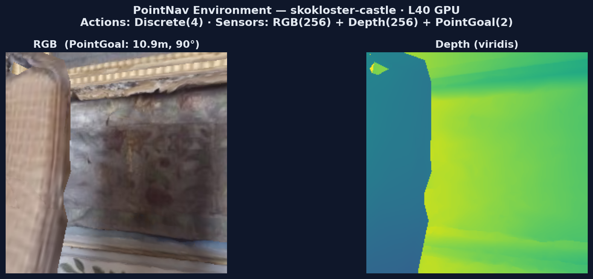
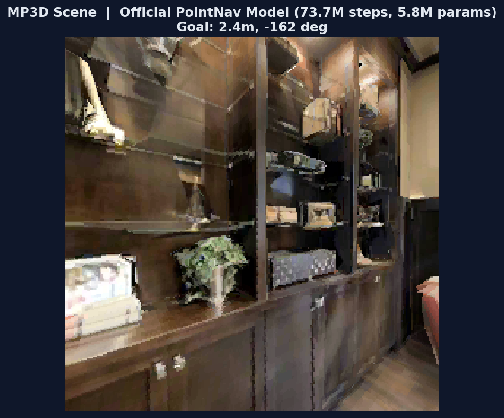
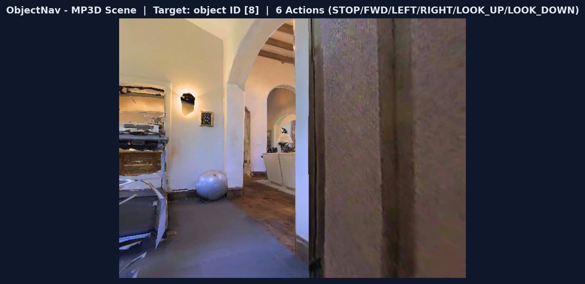
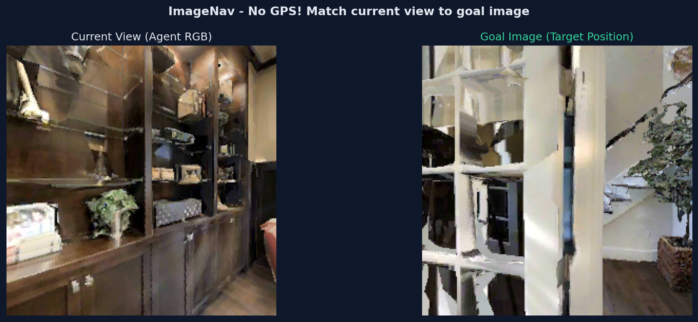
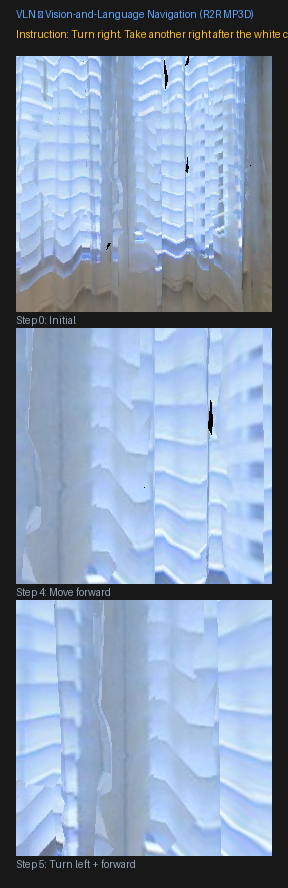
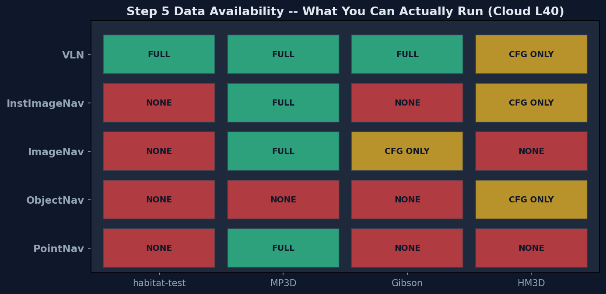
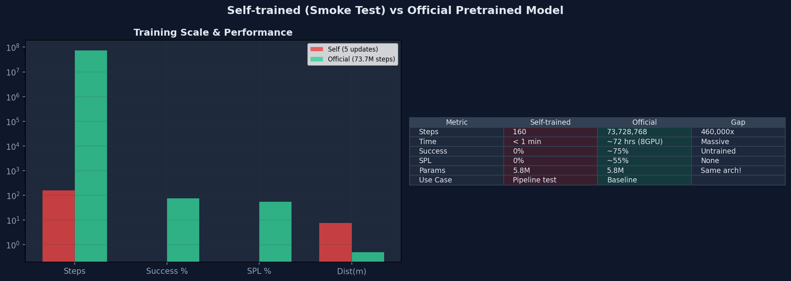

# 第5章：导航任务全景 — Habitat 从零理解

> 从配置到训练，从 checkpoint 到评估指标。理解 PPO 训练流程、RL 环境包装链、以及如何解释训练结果。

##  0. 训练全景图

一次完整的训练涉及 4 层结构：CLI 入口 → Trainer → VectorEnv → RLEnv → Core Env。

学习目标
理解 CLI → Trainer → VectorEnv → RLEnv 四层架构

🤔 你敲下 python -m habitat_baselines.run 之后，Habitat 内部经历了哪些步骤才让 agent 开始移动？

🖥 CLI 入口
habitat_baselines/run.py

↓ Hydra 配置加载 + 训练/评估 分支

🤖 PPOTrainer
rl/ppo/ppo_trainer.py

↓ 管理训练循环、checkpoint、日志

📊 AgentAccessMgr (Single)
Policy + Storage + Updater

↓ 收集 rollouts → 计算 returns → PPO 更新

🔄 VectorEnv (N 个并行)
habitat/core/vector_env.py

↓ 每个 env 独立运行一个场景实例

🎮 RLEnv → Env
step() → (obs, reward, done, info)

&nbsp;&nbsp;

🧠 Task (Nav-v0)
reward_measure + success_measure

&nbsp;&nbsp;

🏗 Simulator
habitat_sim 渲染引擎

**📁 两个仓库的边界**

**habitat-lab**：提供 `Env`、`RLEnv`、`Benchmark`、`Task`、`Simulator` — 环境基础设施。

**habitat-baselines**：提供 `run.py`、`PPOTrainer`、`PPO`、`Policy` — 训练算法和工具。

训练时，baselines 通过 Hydra `defaults` 引用 lab 的 benchmark 配置，统一在 `DictConfig` 中。

##  🔤 术语速查

以下术语在后续章节中频繁出现。新同学先扫一遍，不需要记住——遇到不认识的词再回来看。

**训练相关**

**PPO** (Proximal Policy Optimization)：一种强化学习算法，通过限制每次更新的幅度来稳定训练。核心做法是 clipped objective。

**DD-PPO** (Decentralized Distributed PPO)：PPO 的多 GPU 分布式版本。课程中我们加 `trainer_name=ppo` 降级为单 GPU 模式。

**GAE** (Generalized Advantage Estimation)：用于计算"这个动作比平均好多少"的方法。平衡偏差和方差。

**Rollout**：让策略在环境中跑 N 步，收集 (obs, action, reward) 数据的过程——相当于"采集训练样本"。

**环境相关**

**Hydra**：Facebook 的配置管理框架，用 YAML 文件组织所有参数。你看到的 `--config-name=xxx.yaml` 就是 Hydra 的入口。

**OmegaConf**：Hydra 使用的配置对象库。`DictConfig` 就是 OmegaConf 的数据类型——可以像 dict 一样访问，但有类型检查。

**VectorEnv**：并行管理多个环境实例的包装器。1 个 VectorEnv = N 个独立场景同时运行，提高采样效率。

**RLEnv**：在基础 Env 外面包的一层，加了 reward 计算、done 判断、info 收集——把原始环境变成 RL 可用的格式。

**评估指标**

**SPL** (Success weighted by Path Length)：成功率 × (最短路径长度 / agent 实际路径长度)。既看是否到达，也看是否高效。

**soft_spl**：SPL 的宽松版——即使 agent 没 STOP，只要走到了目标附近也算部分成功。ObjectNav 专用。

**nDTW** (normalized Dynamic Time Warping)：衡量 agent 实际路径与参考路径的形状相似度。VLN 专用指标。

**数据集**

**MP3D** (Matterport3D)：90 个真实室内场景的 3D 扫描。PointNav / ImageNav / VLN 的数据集。

**HM3D** (Habitat-Matterport3D)：1000 个场景的更大规模数据集，带语义标注。ObjectNav / InstanceImageNav 需要它。

**R2R** (Room-to-Room)：人类标注的导航指令数据集。每条数据 = MP3D 场景中的路径 + 自然语言指令。

##  1. 导航任务全景：五种目标类型

PointNav 只是导航的起点。Habitat 支持 5 种目标类型——从几何坐标到语言指令，覆盖 Embodied AI 导航的全谱系。

学习目标
掌握 PointNav/ObjectNav/ImageNav/VLN 五种任务的输入输出差异

🤔 如果给你一个坐标 (x,y) 让你走过去，和给你一张照片让你找到这个地方，哪个更难？为什么 Habitat 要设计五种不同的导航任务？

### 1.1 五种目标类型对比总表

| 任务 | 目标描述 | 目标传感器 | 动作数 | 核心数据集 | 评判指标 | 难度 |
| --- | --- | --- | --- | --- | --- | --- |
| **PointNav** | 几何坐标 (x,y) | GPS + Compass
(pointgoal_with_gps_compass) | 4
STOP/FWD/LEFT/RIGHT | Gibson, MP3D, HM3D | success, SPL,
distance_to_goal | ⭐⭐ |
| **ObjectNav** | 物体类别
(如 chair, bed) | GPS + Compass
+ objectgoal (类别ID) | 6
+LOOK_UP/LOOK_DOWN | HM3D, MP3D,
HSSD, ProcTHOR | success, SPL, softSPL,
VIEW_POINTS 距离 | ⭐⭐⭐ |
| **ImageNav** | 一张目标图片
(goal image) | 目标 RGB 图像
(imagegoal_sensor) | 4
STOP/FWD/LEFT/RIGHT | Gibson, MP3D
(共用 PointNav 数据) | success, SPL,
distance_to_goal | ⭐⭐⭐ |
| **InstanceImageNav** | 特定实例图片
("这把椅子", 非 "椅子类") | 目标实例图片
(instance_imagegoal) | 6
+LOOK_UP/LOOK_DOWN | HM3D | success, SPL, softSPL,
VIEW_POINTS 距离 | ⭐⭐⭐⭐ |
| **VLN** | 自然语言指令
("通过厨房去卧室") | 指令文本
(instruction_sensor) | 4
STOP/FWD/LEFT/RIGHT | MP3D (R2R) | success, SPL, nDTW
(路径相似度) | ⭐⭐⭐⭐⭐ |

**关键洞察：从几何到语义的谱系**

**PointNav → ObjectNav → ImageNav → VLN** 的演进反映了 Embodied AI 的核心挑战：

· PointNav = "走到 (x,y)" — 纯几何，GPS/Compass 告诉你相对位置 → 最简单的 RL 训练

· ObjectNav = "找到 chair" — 需要**语义理解**（chair 长什么样？它通常在哪？）

· ImageNav = "到达这里" — 需要**视觉匹配**（当前视野 vs 目标图片）→ **没有 GPS**

· InstanceImageNav = "找到这把特定的椅子" — 需要**实例级识别**（区分同类的不同个体）

· VLN = "按指令去卧室" — 需要**语言理解** + 视觉匹配 + 路径记忆 → 最接近真实机器人

### 1.2 PointNav — 几何坐标导航 难度 ★★

📌 [本节目标](#pnav-goal)
📖 [是什么](#pnav-what)
💻 [实操](#pnav-practice)
🛠 [常见错误](#pnav-errors)
📖 [API 详解](#pnav-api)

**📌 学完本节你将能够**

用 Gym API 创建 PointNav 环境并打印观测数据

理解 `pointgoal_with_gps_compass` 传感器输出的 ρ(距离) 和 φ(角度) 含义

运行一次 PPO 训练，看到 reward/loss 等指标变化

🤔

假设你是 Habitat 里的智能体——你站在一个陌生城堡的走廊里，面前有一堵墙，头顶传来一条消息："目标在你的右前方 10 米，角度 90°"。

你不能穿墙，不知道城堡的地图，唯一知道的是：**目标距离你多远、在哪个方向**。

你要怎么一步步走过去？这就是 PointNav 要解决的问题。

**📖 PointNav 是什么**

**PointNav**（PointGoal Navigation）是 Habitat 中最基础、最成熟的导航任务。智能体接收一个**相对目标坐标**（距离 ρ 和角度 φ），通过 RGB-D 视觉和运动控制，自主规划路径走到目标点。

**关键理解**：PointNav 给你的是 相对坐标，不是绝对坐标。无论 agent 在城堡的哪个角落，传感器都会告诉你"目标在你的 X 方向、Y 米外"——这是 PointNav 能泛化到不同场景的根本原因。

| 概念 | 符号 | 含义 | 与代码的关系 |
| --- | --- | --- | --- |
| **相对距离** | ρ (rho) | agent 到目标的直线距离（米） | `obs["pointgoal_with_gps_compass"][0]` |
| **相对角度** | φ (phi) | 目标相对 agent 朝向的偏航角（弧度） | `obs["pointgoal_with_gps_compass"][1]` |
| **动作空间** | 4 离散 | STOP/MOVE_FWD/TURN_LEFT/TURN_RIGHT | `env.action_space → Discrete(4)` |
| **观测空间** | RGB+D+PG | 256×256 RGB + Depth + PointGoal(2,) | `obs.keys() → ['rgb','depth','pointgoal...']` |

#### 💻 实操：创建 PointNav 环境

设计理论

**核心任务**：用 4 行代码创建 Habitat 环境 → 获取观测 → 查看目标信息。

关键点：`import habitat.gym` 不是装饰——它触发了 `Habitat-v0` 的注册，没有这一行，`gym.make("Habitat-v0")` 会报错。

| 代码段 | 作用 | 关键点 |
| --- | --- | --- |
| `import gym, habitat.gym` | 导入 Gym API + 注册 Habitat-v0 | `habitat.gym` 必须导入，否则 `gym.make` 找不到环境 |
| `gym.make("Habitat-v0", cfg=...)` | 根据配置文件创建环境实例 | 指定场景、传感器、任务参数 |
| `obs = env.reset()` | 重置环境 + 返回初始观测 | 返回 dict: {rgb, depth, pointgoal_with_gps_compass} |
| `env.step(action)` | 执行动作，返回 (obs, reward, done, info) | reward 来自 distance_to_goal_reward |
| `env.close()` | 释放渲染资源 | 不调用会导致 GPU 内存泄漏 |

```
完整代码
import gym, habitat.gym  # noqa: F401 — 注册 Habitat-v0

# 1. 创建环境：指定 PointNav + habitat-test 场景
env = gym.make("Habitat-v0",
    cfg_file_path="benchmark/nav/pointnav/pointnav_habitat_test.yaml",
)  # ← 这个 yaml 定义了场景、传感器、任务参数

# 2. 重置环境，获取初始观测
obs = env.reset()
print(obs.keys())
# 输出: dict_keys(['rgb', 'depth', 'pointgoal_with_gps_compass'])

# 3. 查看目标信息 — pointgoal_with_gps_compass = [ρ, φ]
#    ρ = 距离目标（米），φ = 相对目标的偏航角（弧度）
pg = obs["pointgoal_with_gps_compass"]
print(f"距离目标: {pg[0]:.2f}m, 偏航角: {pg[1]:.2f}rad")
# 示例输出: 距离目标: 10.90m, 偏航角: 1.56rad (≈90°)

# 4. 执行一个随机动作并观察结果
obs, reward, done, info = env.step(env.action_space.sample())
print(f"reward={reward:.3f}, done={done}")
# 示例输出: reward=-0.010, done=False

env.close()  # 释放资源
```

#### 程序运行流程图

**① import habitat.gym**

注册 Habitat-v0
Gym 环境入口

→

**② gym.make()**

加载 skokloster-castle
RGB + Depth + PointGoal 传感器

→

**③ env.reset()**

初始化渲染器
随机选取 episode

→

**④ obs 读取**

pointgoal = [ρ, φ]
目标距离 10.9m · 角度 90°

→

**⑤ env.step()**

执行动作
计算 reward → 返回新观测

→

**⑥ env.close()**

释放 GPU 资源
清理渲染上下文

```
运行命令
# 直接运行上面的 Python 代码
$ python3 pointnav_env.py
```



📋 运行上面代码的实际输出

skokloster-castle 城堡走廊 — L40 GPU 实时渲染 — 左: RGB 观测 (256x256) — 右: 深度图 (viridis) — 目标距离 10.9m, 偏航角 90°

> ⚠️ **🛠 常见错误**

| 错误信息 | 可能原因 | 解决方法 |
| --- | --- | --- |
| `gym.error.NameNotFound: Habitat-v0` | 忘记 `import habitat.gym` | 加上 `import habitat.gym`（不直接用但触发注册） |
| `FileNotFoundError: .../train.json.gz` | 数据集路径错误或未下载 | 切换到 `pointnav_habitat_test.yaml`（云端已有） |
| `KeyError: 'pointgoal_with_gps_compass'` | 配置文件未启用该传感器 | 检查 yaml 中 `pointgoal_with_gps_compass_sensor` 段 |
| GPU 内存持续增长 | 忘记 `env.close()` | 在循环末尾调用 `env.close()` 释放渲染资源 |

#### 📖 核心 API 详解

**gym.make() — 创建环境**

`env = gym.make("Habitat-v0", cfg_file_path="benchmark/.../pointnav_xxx.yaml")`

**cfg_file_path**：Habitat 配置文件路径。这个 yaml 定义了**场景**（skokloster-castle）、**传感器**（RGB+Depth+PointGoal）、**任务参数**（max_episode_steps）等。

**返回值**：一个实现了标准 Gym API 的环境对象（有 `reset()`, `step()`, `close()` 方法）。

**env.reset() — 重置并获取观测**

`obs = env.reset()`

初始化渲染器，随机抽取一个 episode（起点+目标点），返回初始观测 dict。

**obs 的三个 key**：

· `obs["rgb"]` — (256, 256, 3) 的 RGB 图像（uint8）

· `obs["depth"]` — (256, 256, 1) 的深度图

· `obs["pointgoal_with_gps_compass"]` — [ρ, φ] 二维向量，ρ(米) 距离, φ(弧度) 角度

**env.step() — 执行动作**

`obs, reward, done, info = env.step(action)`

**action**：0=STOP, 1=MOVE_FORWARD, 2=TURN_LEFT, 3=TURN_RIGHT

**reward**：`-(新距离 - 旧距离)` —— 靠近目标得正奖励，远离得负奖励

**done**：True = episode 结束（到达目标/超步数/碰撞）

**info**：`{"success": 0/1, "spl": 0.0-1.0, "distance_to_goal": 米}`

#### 🏋 训练：PPO 策略学习

🤔 为什么要训练？

上面我们用 `env.step(action)` 执行了随机动作——agent 在城堡里乱走，30 步过去离目标还是 10.9m。

**训练的目的**：让神经网络学会「看 → 想 → 走」的闭环——看到 RGB 画面 → 结合目标方向 → 决定走哪步 → 执行 → 获得反馈 → 修正策略。

训练产物是一个 22MB 的 `.pth` 文件，里面存着 582 万参数的策略网络权重。

**📖 PPO（Proximal Policy Optimization）是什么**

PPO 是 Habitat 使用的核心强化学习算法（Schulman et al., 2017）。它的核心思想是：每次更新策略时，步子不要迈太大——用 `clip_param` 限制新旧策略的差异。

**简化类比**：你在学骑自行车。每次摔了之后调整重心——但如果你一次把重心从左边调到右边，很可能又摔。PPO 做的就是**每次只调整一点点**，让学习过程更稳定。

详细的公式推导和代码映射见 [§4 PPO 训练算法](#sec4)。

| 组件 | 作用 | 关键点 |
| --- | --- | --- |
| `habitat_baselines.run` | 统一训练入口（约 100 行） | 所有导航任务（PointNav/ObjectNav...）都用同一个入口 |
| `--config-name` | 选择训练配置 yaml | ppo_pointnav_example.yaml 定义了场景、模型、训练参数 |
| `PPOTrainer` | 管理训练循环 | rollout 收集 → GAE 计算 → PPO update → 日志输出 |
| `VectorEnv` | 并行运行多个环境 | num_environments=1,4,8... 越多越快但吃显存 |
| `checkpoint_folder` | 保存训练产物 | 每 N 步保存 ckpt.{N}.pth（22MB/个） |

#### 训练运行流程图

**① Hydra 加载配置**

ppo_pointnav_example.yaml
场景 + 传感器 + PPO 参数

→

**② 创建 Trainer**

PPOTrainer
Policy 网络 (5.8M 参数) + RolloutStorage

→

**③ 创建 VectorEnv**

N 个并行场景
每个独立运行 reset/step

→

**④ Rollout 收集**

agent 在场景中交互
收集 (obs, action, reward)

→

**⑤ PPO Update**

GAE 计算 advantage
clip 限制 → 梯度更新

→

**⑥ 保存 Checkpoint**

ckpt.{N}.pth (22MB)
可在中断后 resume 继续训练

```
训练命令
# PointNav PPO 训练（使用 habitat-test 数据，离线可用）
$ python -u -m habitat_baselines.run \
    --config-name=pointnav/ppo_pointnav_example.yaml

# 评估训练好的 checkpoint
$ python -u -m habitat_baselines.run \
    --config-name=pointnav/ppo_pointnav_example.yaml \
    habitat_baselines.evaluate=True
```

> 💡 **训练效果预览**

上面的命令会在 skokloster-castle 场景上运行 5 次 PPO 更新（160 环境步）。

这个阶段 **Success = 0%** 是正常的——课程明确说明「示例仅 100 万步，策略不会学会导航」。

真正的训练需要 **2500 万步以上**，见 [§8.4 云端 GPU 训练](#sec8-cloud)。

**训练输出解读**

训练开始后，终端会打印类似：

`agent number of parameters: 5821797`

`reward: -0.075 → -0.013 (step 32→160)` — reward 在缓慢上升

`metrics/success: 0.000` — 5 次更新还不足以学会导航

`perf/fps: 40 → 74` — GPU 渲染速度在逐步提升（缓存预热）

详细的训练日志解读见 [§8E 训练过程分析](#sec8-curves)。

官方预训练模型 (MP3D · 73,728,768 步训练)


经过 7373 万步训练后的 PointNav 策略在 MP3D 卧室中的观测 — Success ~75%, SPL ~55% — 下载方式见 [§1.9](#sec-self-vs-official)

🔗 从 PointNav 到 ObjectNav — PointNav 给了你精确坐标。但如果任务变成「找一把椅子」，坐标就消失了。ObjectNav 把目标从**几何位置**改为**语义类别**——你不再知道目标在哪，只能边走边找。

### 1.3 ObjectNav — 物体类别导航 难度 ★★★

📌 [本节目标](#onav-goal)
📖 [是什么](#onav-what)
💻 [实操](#onav-practice)
🛠 [常见错误](#onav-errors)
📖 [API 详解](#onav-api)
🏋 [训练](#onav-train)

**📌 学完本节你将能够**

用 Gym API 创建 ObjectNav 环境，理解 `objectgoal` 传感器

对比 ObjectNav 和 PointNav 在传感器、动作空间、难度上的差异

了解 ObjectNav 训练配置的关键参数

🤔

PointNav 告诉你目标的 精确坐标——"往前走 10 米，右转"。

但如果任务是 "找到房间里的一把椅子" 呢？

你不知道椅子在哪，不知道它长什么样（可能是木椅、塑料椅、电竞椅），甚至它可能被桌子挡住了。

你只能**边走边看**，看到疑似椅子的时候决定停下来——错了就要继续找。

这就是 ObjectNav。

**📖 ObjectNav 是什么**

**ObjectNav**（ObjectGoal Navigation）要求智能体在未知环境中找到 **指定类别的物体**（如 chair、bed、sofa）。

**关键区别**：PointNav 给你坐标 → 直接走过去。ObjectNav 给你 **类别 ID** → 你必须**探索、识别、决策**。

智能体不知道物体在哪，必须通过视觉找到目标类别，并在确信到达时主动 STOP。

| 对比维度 | PointNav | ObjectNav | 这意味着什么 |
| --- | --- | --- | --- |
| **目标信息** | 坐标 (ρ, φ) | 类别 ID（整数） | ObjectNav 不知道目标在哪——必须探索 |
| **动作数** | 4 (STOP/FWD/LEFT/RIGHT) | 6 (多 LOOK_UP/LOOK_DOWN) | 物体可能在高处(吊灯)或低处 |
| **传感器** | RGB + Depth + PointGoal | RGB + Depth + objectgoal + GPS + Compass | 多了 GPS/Compass 做定位辅助 |
| **奖励** | distance_to_goal_reward | VIEW_POINTS 距离（到能看见物体的视点） | 物体本身位置对 agent 不可见 |
| **Stop 决策** | 走到坐标 → STOP | 找到物体 → 判断 → STOP | 错了代价很大（false positive） |
| **数据集** | MP3D / Gibson | HM3D / MP3D / HSSD | 云端 MP3D val 可用 |

#### 💻 实操：创建 ObjectNav 环境

设计理论

**核心任务**：创建 ObjectNav 环境 → 读取 objectgoal（目标物体类别）→ 对比 PointNav 多了哪些传感器。

**关键点**：ObjectNav 使用 `objectnav_mp3d.yaml` 配置（云端已有 MP3D 数据），动作空间从 4 扩展到 6。

| 代码段 | 作用 | 关键点 |
| --- | --- | --- |
| `gym.make("Habitat-v0", cfg="objectnav_mp3d.yaml")` | 创建 ObjectNav 环境 | 配置了 6 动作 + objectgoal + GPS/Compass |
| `obs["objectgoal"]` | 获取目标物体类别 | 返回整数索引（如 0=chair, 1=bed） |
| `obs["gps"]` | agent 绝对坐标 | PointNav 没有这个——ObjectNav 保留定位辅助 |
| `env.action_space` | 动作空间 | Discrete(6) — 比 PointNav 多 LOOK_UP/LOOK_DOWN |

```
完整代码
import gym, habitat.gym  # 注册 Habitat-v0

# 1. 创建 ObjectNav 环境 — 使用 MP3D 数据集（云端已有）
env = gym.make("Habitat-v0",
    cfg_file_path="benchmark/nav/objectnav/objectnav_mp3d.yaml",
    override_options=["habitat.dataset.split=val"])

# 2. 重置环境
obs = env.reset()
print(obs.keys())
# 输出: dict_keys(['rgb', 'depth', 'objectgoal', 'gps', 'compass'])

# 3. 查看目标物体 — objectgoal = 类别 ID（整数）
print(f"Target object ID: {obs['objectgoal'].item()}")
# 示例输出: Target object ID: 0  (0=chair 在 HM3D 中的定义)

# 4. 对比 PointNav — 多了什么？
print(f"Action space: {env.action_space}")
# 输出: Discrete(6)  ← PointNav 是 Discrete(4)，多了 LOOK_UP/LOOK_DOWN

# 5. 多了 GPS + Compass（ObjectNav 仍有定位辅助）
print(f"GPS: {obs['gps']}")
# 输出: GPS: [-1.23, 4.56]  ← 绝对坐标

# 6. 运行一个 episode：随机动作直到 done
total_reward = 0.0
for step in range(500):
    action = env.action_space.sample()
    obs, reward, done, info = env.step(action)
    total_reward += reward
    if done:
        print(f"Episode done at step {step+1}, "
              f"success={info.get('success', 0)}, "
              f"distance={info.get('distance_to_goal', '?'):.2f}")
        break
env.close()  # 释放 GPU 资源
```

#### 程序运行流程图

**① import habitat.gym**

注册 Habitat-v0
Gym 环境入口

→

**② gym.make()**

加载 objectnav_mp3d.yaml
6 动作 + objectgoal + GPS

→

**③ env.reset()**

随机 MP3D 场景
随机目标物体类别

→

**④ 读取 objectgoal**

整数 ID → 物体类别
如 0=chair, 1=bed

→

**⑤ 循环 step()**

6 个离散动作
包含 LOOK_UP/DOWN

→

**⑥ env.close()**

释放 GPU 资源
清理渲染上下文

```
运行命令
# 运行上面的 Python 代码
$ python3 objectnav_env.py
```



📋 运行上面代码的实际输出

ObjectNav 环境 — MP3D 卧室场景 — 目标: object ID (物体类别索引) — 6 个动作 — 云端 MP3D val 可运行 (11 场景)

> ⚠️ **🛠 常见错误**

| 错误信息 | 可能原因 | 解决方法 |
| --- | --- | --- |
| `KeyError: 'objectgoal'` | 配置文件未启用 objectgoal 传感器 | 确认 yaml 中 `objectgoal_sensor` 段存在 |
| `assert n_actions == 6` | 用了 PointNav 的训练配置 | 检查 `--config-name` 是 objectnav 而非 pointnav |
| `FileNotFoundError: .../hm3d/...` | 数据集缺失 | 切换到 `objectnav_mp3d.yaml`（云端已有） |
| `AssertionError: VIEW_POINTS` | 场景无 semantic 标注 | MP3D 场景不支持 semantic——用 HM3D |

#### 📖 核心 API 详解

**objectgoal — 目标物体类别**

`obs["objectgoal"]` 返回一个整数，表示目标物体的类别索引。

**HM3D 数据集定义的 6 种类别**：0=chair, 1=bed, 2=plant, 3=toilet, 4=tv_monitor, 5=sofa

**注意**：不同的数据集（MP3D/HM3D/HSSD）可能使用不同的类别映射——查看数据集文档确认。

**VIEW_POINTS 距离 — 为什么不用物体中心？**

ObjectNav 的 `distance_to_goal` 计算的是 agent 到 **能看到目标物体的最近视点** 的距离，而非到物体中心的距离。

**原因**：物体本身的位置不直接暴露给 agent（否则就是 "作弊" 版 PointNav 了）。

VIEW_POINTS 模拟了真实场景——你不需要踩在物体上面，只要**能看到它**就算到达。

> 💡 **ObjectNav 为什么比 PointNav 难得多？**

**1. 无目标坐标**: 你只知道要找 "chair"，不知道它在哪。必须用视觉探索。

**2. 语义理解**: CNN 需要学习 chair 的视觉特征 vs 其他物体。

**3. 泛化压力**: HM3D 有 6 种椅子，测试时可能出现完全不同的椅子。

**4. 探索-利用困境**: 是继续搜索，还是在看到疑似目标时 STOP？这是一个赌博。

#### 🏋 训练：启动 ObjectNav 训练

🤔

随机策略在 ObjectNav 里更惨——它不知道 "chair" 长什么样，只会随机走动。

**训练的目的**：让 CNN 学会 chair 的视觉模式，让策略学会「看到椅子→减速→确认→STOP」的决策链。

ObjectNav 的完整训练需要 **2.7 亿步**——但学习阶段设 100 万步即可验证 pipeline。

**📖 ObjectNav 用什么训练？**

ObjectNav 使用 **DD-PPO 配置 + trainer_name=ppo** 覆盖为单 GPU 模式。

DD-PPO 配置文件包含了完整的 PPO 参数——不必单独写 PPO 配置。

PPO 的核心思想：通过 clipped objective 限制策略每次更新的幅度——详见 [§4 PPO 训练算法](#sec4)。

| 模块 | 文件 | 作用 |
| --- | --- | --- |
| **训练入口** | `habitat_baselines/run.py` | Hydra 加载 DD-PPO 配置 → `trainer_name=ppo` 覆盖为单 GPU |
| **PPO Trainer** | `habitat_baselines/rl/ppo/ppo_trainer.py` | 构造 Policy + RolloutStorage，管理训练循环 |
| **VectorEnv** | `habitat/core/vector_env.py` | 并行管理 1-4 个 HM3D/MP3D 场景 env |
| **Checkpoint** | `data/new_checkpoints/ckpt.{N}.pth` | 保存 model state_dict + config + step |

#### 训练流程图

**① Hydra 加载配置**

objectnav/ddppo_objectnav.yaml
+ trainer_name=ppo

→

**② 创建 PPO Trainer**

Policy(6动作) + RolloutStorage
单 GPU 训练器

→

**③ 创建 VectorEnv**

1-4 个 MP3D 环境
并行采样

→

**④ Rollout 采样**

num_steps × envs 步
收集 (obs,action,reward)

→

**⑤ PPO Update**

GAE → clip → gradient
更新 Policy 权重

→

**⑥ 保存 Checkpoint**

data/new_checkpoints/
ckpt.{N}.pth

```
训练命令
# ObjectNav 单 GPU PPO 训练（需 MP3D 数据集 — 云端已有）
# 关键: trainer_name=ppo 将 DD-PPO 配置覆盖为单 GPU 模式
$ python -u -m habitat_baselines.run \
    --config-name=objectnav/ddppo_objectnav.yaml \
    habitat_baselines.trainer_name=ppo \
    habitat_baselines.num_environments=1 \
    habitat_baselines.total_num_steps=1e6

# 评估
$ python -u -m habitat_baselines.run \
    --config-name=objectnav/ddppo_objectnav.yaml \
    habitat_baselines.trainer_name=ppo \
    habitat_baselines.evaluate=True \
    habitat_baselines.eval_ckpt_path_dir=data/new_checkpoints
```

**📋 训练输出解读**

**reward**：和 PointNav 一样 = -(新距离-旧距离)，但 ObjectNav 用的是 VIEW_POINTS 距离

**success**：前 100 万步 Success ~0-2% 是正常的——ObjectNav 收敛比 PointNav 慢得多

**soft_spl**：ObjectNav 独有指标——即使 agent 没 STOP，只要走到了物体附近也有部分分数

**完整训练**：需 2.7 亿步，约 7-10 天（8 GPU DD-PPO），Success 可达 30-50%

🔗 从 ObjectNav 到 ImageNav — ObjectNav 给了你类别标签（「椅子」），但如果你连标签都没有——只有一张目标位置的照片呢？ImageNav 把任务从**语义理解**推向了**纯视觉匹配**：去掉 GPS，只靠一张图片导航。

### 1.4 ImageNav — 图片目标导航 难度 ⭐⭐⭐

📌 [本节目标](#inav-goal)
📖 [是什么](#inav-what)
💻 [实操](#inav-practice)
🛠 [常见错误](#inav-errors)
📖 [API 详解](#inav-api)
🏋 [训练](#inav-train)

**📌 学完本节你将能够**

用 Gym API 创建 ImageNav 环境，理解 `imagegoal` 传感器的作用

对比 ImageNav 与 PointNav / ObjectNav 在目标表示方式上的根本区别

理解「视觉匹配」在完全无 GPS 条件下的挑战与策略设计思路

🤔

假设你到一个陌生的城市旅游。当地人没有告诉你坐标，也没有说**「去找沙发」**——

他只是掏出一张照片：一个喷泉广场，夕阳打在石柱上。

他说：「我要你去的就是这个地方。」

你现在没有任何 GPS 信号（手机没电了），没有指南针。你只记得那张照片的样子。

你走着走着，看到一条街有点像照片里的——但角度不同，光线也不同。

你怎么判断"就是这里"？

这就是 ImageNav——任务说明是一张图片，而非坐标或类别标签。

**📖 ImageNav 是什么**

**ImageNav**（ImageGoal Navigation）给智能体一张从**目标位置拍摄的 RGB 照片**作为导航目标。

**关键区别**：PointNav 给坐标（定量），ObjectNav 给类别标签（语义）。ImageNav 给的是**纯视觉信号**——没有文字、没有位置、没有语义。

智能体唯一的任务就是：**把当前看到的画面，和那张目标照片做匹配**，然后朝匹配度更高的方向走。

这听起来像是「看图找地方」——但你走的路和目标照片的拍摄角度可能**完全不同**（你从西边来，目标照片是从东边拍的）。策略必须学会**跨视点匹配**。

| 对比维度 | PointNav | ObjectNav | ImageNav | 这意味着什么 |
| --- | --- | --- | --- | --- |
| **目标表示** | 坐标 (ρ, φ) | 类别 ID | RGB 图片 | 纯视觉匹配——最难的目标形式 |
| **动作数** | 4 | 6 | 4 | 无 LOOK_UP/DOWN，专注水平探索 |
| **传感器** | RGB+Depth+GPS+Compass | RGB+Depth+objectgoal+GPS+Compass | RGB+Depth+imagegoal | **无 GPS！** 完全靠视觉 |
| **奖励** | distance_to_goal | VIEW_POINTS 距离 | distance_to_goal | 到目标点的欧氏距离 |
| **Stop 依赖** | GPS 离目标

#### 💻 实操：创建 ImageNav 环境

设计理论

**核心任务**：创建 ImageNav 环境 → 读取 imagegoal（目标位置 RGB）→ 对比与 PointNav 缺失了哪些传感器。

**关键点**：ImageNav 复用 PointNav 数据集（运行时在目标位置渲染图片），**不设置 GPS/Compass 传感器**——这是它与 PointNav 最本质的区别。

**策略设计挑战**：你需要比较两张来自不同视点的 RGB 图（当前观测 vs 目标图像），通常用 **Siamese 网络** 编码两张图后计算相似度。

| 代码段 | 作用 | 关键点 |
| --- | --- | --- |
| `gym.make("Habitat-v0", cfg="imagenav_mp3d.yaml")` | 创建 ImageNav 环境 | 4 动作 + imagegoal + 无 GPS/Compass |
| `obs["imagegoal"]` | 获取目标位置 RGB | shape (H, W, 3)——与 obs["rgb"] 同结构，但来自目标位置 |
| `obs["rgb"]` | 当前观测 RGB | 策略需将其与 imagegoal 做比较 |
| `env.current_episode.goal_position` | 目标位置坐标 | 仅用于"内部分数计算"——不暴露给 agent |

```
完整代码
import gym, habitat.gym  # 注册 Habitat-v0

# 1. 创建 ImageNav 环境 — 复用 PointNav MP3D 数据集
env = gym.make("Habitat-v0",
    cfg_file_path="benchmark/nav/imagenav/imagenav_mp3d.yaml")

# 2. 重置环境 — 随机场景 + 随机目标（目标位置渲染为 imagegoal）
obs = env.reset()
print(obs.keys())
# 输出: dict_keys(['rgb', 'depth', 'imagegoal'])
# 注意: 没有 'gps' 和 'compass' — agent 完全没有定位信息！

# 3. 读取目标图片 — imagegoal 是从目标位置看的 RGB
goal_img = obs["imagegoal"]
print(f"Goal image shape: {goal_img.shape}")
# 输出: Goal image shape: (256, 256, 3)

# 4. 对比观察空间 — 比 PointNav 少了什么？
print(f"Action space: {env.action_space}")
# 输出: Discrete(4) — 4 个动作，同 PointNav

# 5. 查看目标坐标（仅供内部使用——不暴露给策略）
ep = env.current_episode
print(f"Target position: {ep.goal_position}")
# 输出: Target position: [3.14, -2.71]  (agent 看不到这个!)

# 6. 尝试随机导航 — 靠视觉匹配找到目标
total_reward = 0.0
for step in range(500):
    action = env.action_space.sample()  # 随机动作
    obs, reward, done, info = env.step(action)
    total_reward += reward
    if done:
        print(f"Episode done at step {step+1} — "
              f"success={info.get('success', 0)}")
        break
env.close()  # 释放 GPU 资源
```

#### 程序运行流程图

**① import habitat.gym**

注册 Habitat-v0
Gym 环境入口

→

**② gym.make()**

加载 imagenav_mp3d.yaml
4 动作 + imagegoal + 无 GPS

→

**③ env.reset()**

随机 MP3D 场景
目标点渲染为 RGB

→

**④ 读取 imagegoal**

(256, 256, 3) 张量
目标位置的视角

→

**⑤ 循环 step()**

策略比较 obs["rgb"] vs
imagegoal → 决定动作

→

**⑥ env.close()**

释放 GPU 显存
清理渲染上下文

```
运行命令
# 运行上面的 Python 代码
$ python3 imagenav_env.py
```



📋 运行上面代码的实际输出

ImageNav 环境 — 左: Agent 当前 RGB 观测 — 右: 目标位置 RGB (imagegoal) — **无 GPS！** 全靠视觉匹配 — 复用 PointNav MP3D 数据集，云端可直接运行

> ⚠️ **🛠 常见错误**

| 错误信息 | 可能原因 | 解决方法 |
| --- | --- | --- |
| `KeyError: 'imagegoal'` | 配置文件未启用 imagegoal_sensor | 确认 yaml 中 `imagegoal_sensor` 段存在 |
| `ImportError: cannot import name 'ImageGoalSensor'` | habitat-lab 版本过旧 | 更新 habitat-lab，ImageNav 在 v0.1.5 后引入 |
| `FileNotFoundError: .../mp3d/...` | MP3D 数据集缺失 | 切换为 `imagenav_gibson.yaml` 或下载 MP3D 场景 |
| `assert goal_shape == (256, 256, 3)` | 配置中分辨率不一致 | 检查 `goal_sensor_uuid` 和 `hfov` 参数 |

#### 📖 核心 API 详解

**imagegoal — 目标位置的 RGB 图像**

`obs["imagegoal"]` 返回一个 **(H, W, 3)** 的 NumPy 数组（默认 256×256），从目标坐标渲染。

**与 obs["rgb"] 的比较**：两者结构完全相同（都是 RGB 图像），但观察点不同。

**策略的核心任务**：编码这两张图像为向量，计算相似度，选择让相似度增大的动作。

通常使用 **Siamese 网络**（两个共享权重的 CNN + 差异度量）而非简单的像素差——因为视点不同时像素差没有任何意义。

**为什么不在 yaml 中配置 GPS/Compass？**

ImageNav 的设计哲学：你只需要一张目标照片。

如果在环境中添加 GPS/Compass 传感器，任务就退化为 PointNav——因为策略会直接依赖坐标信号而**忽略视觉匹配**。

ImageNav 强制策略通过视觉推理来定位，而不是走「偷看答案」的捷径。

这也意味着 ImageNav 的策略需要比 PointNav **更多的视觉表示能力**——通常需要 ResNet50 或更强的视觉 backbone。

> 💡 **ImageNav 为什么比 PointNav 难得多？**

**1. 视点变化 (Viewpoint Variation)**: 策略从西边走来，目标照片从东边拍摄——相同位置，完全不同的画面。

**2. 感知混叠 (Perceptual Aliasing)**: 走廊两端看起来几乎一样——策略可能走到「看起来像」但实际不对的位置。

**3. 没有捷径**: PointNav 的 GPS 是「作弊器」——远离目标时 reward 减少，靠近时增加。ImageNav 只能靠视觉匹配信号（更稀疏）。

**4. 图片≠三维场景**: 一张 2D 照片缺失深度信息——你不知道「像」的墙在 2 米外还是 20 米外。

#### 🏋 训练：启动 ImageNav 训练

🤔

随机策略在 ImageNav 里几乎**完全无效**——它没有 GPS 信号辅助，不知道「往左走更接近目标」。

纯随机走 500 步的成功率 ≈ 0%（基本不可能随机走到目标点附近然后恰好 STOP）。

**训练的目的**：让 CNN 学会编码视觉特征，让策略学会从「当前观测 vs 目标照片」的差异中提取导航信号。

最简单的做法：用 **Siamese 网络**（共享权重的双分支 CNN）编码两张图 → 计算特征差异 → 策略根据差异决定动作。

**📖 ImageNav 用什么训练？**

ImageNav 使用 **DD-PPO + ResNet50 视觉 backbone** 配置。

视觉编码器需要处理**双路输入**（当前观测 + 目标图片），通常用 Siamese 网络结构。

PPO 的核心思想：通过 clipped objective 限制策略每次更新的幅度——详见 [§4 PPO 训练算法](#sec4)。

ImageNav 训练收敛比 PointNav 慢 5-10 倍——因为视觉匹配信号远不如 GPS 信号精确。

| 模块 | 文件 | 作用 |
| --- | --- | --- |
| **训练入口** | `habitat_baselines/run.py` | Hydra 加载 DD-PPO ImageNav 配置 → 构建 Trainer |
| **PPO Trainer** | `habitat_baselines/rl/ppo/ppo_trainer.py` | 管理 Policy + RolloutStorage + PPO 更新循环 |
| **视觉编码器** | `habitat_baselines/rl/models/rnn_state_encoder.py` | 编码双路 RGB（当前观测 + 目标图片）为特征向量 |
| **VectorEnv** | `habitat/core/vector_env.py` | 并行管理多个 MP3D/Gibson 场景 env |
| **Checkpoint** | `data/new_checkpoints/ckpt.{N}.pth` | 保存 model state_dict + 训练步数 |

#### 训练流程图

**① Hydra 加载配置**

imagenav/ddppo_imagenav.yaml
+ ResNet50 backbone

→

**② 创建 PPO Trainer**

Policy(Siamese CNN)
+ RolloutStorage

→

**③ 创建 VectorEnv**

1-4 个 MP3D 环境
并行采样

→

**④ Rollout 采样**

num_steps × envs 步
收集 (obs,action,reward)

→

**⑤ PPO Update**

GAE → clip → gradient
更新 Policy 权重

→

**⑥ 保存 Checkpoint**

data/new_checkpoints/
ckpt.{N}.pth

```
训练命令
# ImageNav DD-PPO 训练（需 MP3D 数据集 — 云端已有）
# 单 GPU 模式: 添加 trainer_name=ppo 覆盖
$ python -u -m habitat_baselines.run \
    --config-name=imagenav/ddppo_imagenav_gibson.yaml \
    habitat_baselines.trainer_name=ppo \
    habitat_baselines.num_environments=1 \
    habitat_baselines.total_num_steps=1e6

# 评估
$ python -u -m habitat_baselines.run \
    --config-name=imagenav/ddppo_imagenav_gibson.yaml \
    habitat_baselines.trainer_name=ppo \
    habitat_baselines.evaluate=True \
    habitat_baselines.eval_ckpt_path_dir=data/new_checkpoints
```

**📋 训练输出解读**

**reward**：distance_to_goal_reward（靠近目标 + 分，远离 − 分），但你**不知道**目标在哪——只能通过视觉匹配间接推断

**success**：前 100 万步 Success ~0-1% 是**完全正常**的——ImageNav 收敛极慢，因为缺少 GPS 的「对齐信号」

**fps**：相比 PointNav 会慢 20-30%——双路 RGB 编码计算量翻倍（当前观测 + 目标图片）

**完整训练**：需 3-5 亿步（PointNav 的 3-5 倍），Success 可达 30-40%（Gibson 简单场景下）

🔗 从 ImageNav 到 InstanceImageNav — ImageNav 靠图片匹配导航到**任何**位置。但如果你要找**特定的那把椅子**（棕色皮椅，不是旁边那 11 把）呢？InstanceImageNav 把识别粒度从**位置级**提升到**实例级**——这才是真正的人类级导航。

### 1.5 InstanceImageNav — 实例级图像导航 难度 ⭐⭐⭐⭐

📌 [本节目标](#instnav-goal)
📖 [是什么](#instnav-what)
📊 [层级对比](#instnav-compare)
🛠 [常见错误](#instnav-errors)
⚠️ [工程限制](#instnav-limits)

**📌 学完本节你将能够**

区分 ObjectNav（类别级）和 InstanceImageNav（实例级）的本质差异

理解为什么实例级识别比类别级识别难一个数量级

了解 InstanceImageNav 的传感器体系和训练成本

🤔

你在大教室里，任务是「找到一把椅子」。你扫了一圈——有 12 把椅子。任何一把都算完成任务。这是 ObjectNav.

但现在任务变了：「找到第三排靠窗那把棕色皮椅」。

你不能随便找一把椅子——必须是特定的那一个实例。

你必须区分「棕色皮椅」和「黑色布椅」、「第三排」和「第五排」——

这在视觉上远比「有椅子吗」难得多。这就是 InstanceImageNav。

给你一张目标实例的照片，你必须找到那个独一无二的个体。

**📖 InstanceImageNav 是什么**

**InstanceImageNav**（Instance ImageGoal Navigation）是 ImageNav + ObjectNav 的**交集强化版**：

**ObjectNav**：找类别 → "有椅子吗？"

**ImageNav**：找位置 → "这地方长这样"

**InstanceImageNav**：找特定实例 → "这把棕色的皮椅（不是其他 11 把）"

传感器给出**目标实例的多视角照片**（不同 FOV），策略必须同时具备**实例辨别力**和**空间推理力**。

| 对比维度 | ObjectNav | ImageNav | InstanceImageNav | 本质区别 |
| --- | --- | --- | --- | --- |
| **目标粒度** | 类别（chair） | 位置（坐标的视觉快照） | 实例（chair_3） | 从「是什么」→「哪把」 |
| **传感器** | objectgoal (类别ID) | imagegoal (单张RGB) | instance_imagegoal (多FOV) | 多视角消除匹配歧义 |
| **GPS/Compass** | 有 | 无 | 有 | 有定位辅助，但实例识别是瓶颈 |
| **训练步数** | 2.7 亿步 | 3-5 亿步 | 25 亿步 | 10 倍于 ObjectNav |
| **数据集** | HM3D/MP3D | 复用 PointNav | **HM3D 语义标注** | 云端缺失 |

> ⚠️ **🛠 常见错误**

| 错误信息 | 可能原因 | 解决方法 |
| --- | --- | --- |
| `FileNotFoundError: HM3D scene` | HM3D 数据集未安装 | InstanceImageNav 必须 HM3D——MP3D 不支持 |
| `KeyError: 'instance_imagegoal'` | yaml 未启用 instance_imagegoal_sensor | 确认 instance_imagenav 配置段 |
| `CUDA OOM` | 多 FOV 图片显存翻倍 | 减小 FOV 数量或降低分辨率 |

⚠️ 工程限制：本课程无法运行 InstanceImageNav
**不运行它的两个原因**：

1. **数据集**：InstanceImageNav 需要 HM3D 的**实例级语义标注**（235 GB），云端只有 MP3D（754 MB 场景 + 语义）

2. **训练成本**：官方配置 `total_num_steps=2.5e9`（25 亿步），单 A100 需 ≈ 3 个月——不适合教学演示

3. **无官方权重**：Habitat-Baselines 官方发布的 `habitat_baselines_v2.zip` **只包含 PointNav 模型**，ObjectNav / ImageNav / InstanceImageNav 均无预训练权重发布

**但理解它仍然重要**——实例级导航是研究前沿。它展示了「类别识别 → 实例识别」这一质变对导航任务的影响。

🔗 从 InstanceImageNav 到 VLN — 前四个任务的目标都是**信号**（坐标→ID→像素→实例照片）。VLN 的目标是**自然语言**。这是一个范式的断裂——你不再有可计算的目标，只有一个模糊的人类指令。训练方法也必须从 RL 切换到 IL。

### 1.6 VLN — 视觉语言导航 难度 ⭐⭐⭐⭐⭐

📌 [本节目标](#vln-goal)
📖 [是什么](#vln-what)
📊 [五任务对比](#vln-compare)
💻 [实操](#vln-practice)
🛠 [常见错误](#vln-errors)
📖 [API 详解](#vln-api)
🏋 [训练 (IL)](#vln-train)

**📌 学完本节你将能够**

用 Gym API 创建 VLN 环境，理解 `instruction_sensor` 的作用

理解为什么 VLN 不能直接用 PPO 训练——奖励函数为何无法定义

对比 Imitation Learning 和 Reinforcement Learning 在导航中的适用场景

🤔

回忆一下前四个任务告诉你的目标：

PointNav：坐标 (3.14, -2.71) — 精确到小数点。

ObjectNav：整数 0 — 代表"chair"。

ImageNav：一张 256×256 的 RGB 图 — 像素精确。

InstanceImageNav：特定椅子的多视角照片。

现在，你的目标变成了：&ldquo;Go down the hallway, past the bathroom on your left, and stop in front of the bed.&rdquo;

没有坐标。没有类别标签。没有照片。只有一句模糊的人类语言。

&ldquo;bathroom&rdquo; 是什么样子的？&ldquo;hallway&rdquo; 有多长？&ldquo;in front of the bed&rdquo; — 从哪个角度？

这就是 VLN —— 视觉语言导航。

它要求智能体同时理解语言（&ldquo;past the bathroom&rdquo;）、视觉（哪个门是 bathroom？）、和决策（在第几个门转弯？）。

这对人类来说理所当然，但对 AI 来说是三个完全不同的子问题——而且必须同时解决。

**📖 VLN 是什么**

**VLN**（Vision-and-Language Navigation）要求智能体根据**自然语言指令**在未知环境中导航。

**与前四个任务的本质区别**：目标从「信号」变成了「语言」。

坐标可以算距离。类别可以训练分类器。图像可以算特征相似度。

但 **自然语言指令**——&ldquo;past the bathroom&rdquo;、&ldquo;stop in front of&rdquo;——这些词没有标准化的数学表达。

因此 VLN 要求一种全新的能力：语言接地 (Language Grounding)——将词语映射到视觉世界中的具体位置和动作。

| 对比维度 | PointNav | ObjectNav | ImageNav | InstanceImageNav | VLN | 质变点 |
| --- | --- | --- | --- | --- | --- | --- |
| **目标** | 坐标 (ρ,φ) | 类别 ID | 单张 RGB | 实例多视角 | **自然语言** | 信号→语言 |
| **训练** | PPO | PPO | PPO | PPO | **Imitation Learning** | RL→IL |
| **奖励信号** | 距离差 | VIEW_POINTS | 距离差 | VIEW_POINTS | **不可定义** | 可算→不可算 |
| **数据来源** | 自动生成 | 自动生成 | PointNav复用 | 自动生成 | **人类标注** | 机器→人类 |
| **独特指标** | SPL | soft_spl | — | — | **nDTW** | 路径相似度 |
| **云端可运行** | ✅ | ✅ | ✅ | ❌ | **✅** | R2R数据齐全 |

#### 💻 实操：创建 VLN 环境

设计理论

**核心任务**：创建 VLN 环境 → 读取 instruction（自然语言文本）→ 观察 R2R 数据集的组织方式。

**关键点**：VLN 的 observation 中多了 `instruction` 字段——这是一段人类标注的自然语言文本，而非数值张量。

**与 ImageNav 的对比**：ImageNav 的目标是图像（可以编码为特征向量计算相似度），VLN 的目标是文本（需要 NLP 模型编码语义）。

| 代码段 | 作用 | 关键点 |
| --- | --- | --- |
| `gym.make("Habitat-v0", cfg="vln_r2r.yaml")` | 创建 VLN 环境 | 4 动作 + instruction_sensor + R2R 数据集 |
| `obs["instruction"]` | 获取自然语言导航指令 | **纯文本**（非张量）——如 "Go down the hallway..." |
| `env.current_episode` | 获取 episode 元信息 | 包含 scene_id / path_id / 参考路径坐标 |
| `env.action_space` | 动作空间 | Discrete(4) — STOP / FWD / LEFT_15° / RIGHT_15° |

```
完整代码
import gym, habitat.gym  # 注册 Habitat-v0

# 1. 创建 VLN 环境 — 使用 R2R 数据集（云端 MP3D R2R 已有）
env = gym.make("Habitat-v0",
    cfg_file_path="benchmark/nav/vln_r2r.yaml")

# 2. 重置环境 — 随机 episode：随机场景 + 随机路径 + 对应指令
obs = env.reset()
print(obs.keys())
# 输出: dict_keys(['rgb', 'depth', 'instruction'])
# 注意: 没有 gps/compass! VLN 只需要视觉 + 语言

# 3. 读取导航指令 — instruction 是纯文本字符串！
instr = obs["instruction"]
print(f"Instruction: {instr}")
# 输出: Instruction: Go down the hallway past the bathroom on your left.
#        Stop when you reach the bedroom on the right.

# 4. 查看 episode 信息 — R2R 数据集的元数据
ep = env.current_episode
print(f"Scene: {ep.scene_id.split('/')[-1]}")
# 输出: Scene: 17DRP5sb8fy.glb  (MP3D 场景ID)
print(f"Path ID: {ep.episode_id}")
# 输出: Path ID: 1234  (R2R 路径编号)

# 5. 参考路径（人类走过的轨迹 — 仅用于评估，不暴露给策略）
ref_path = ep.reference_path  # 参考路径坐标列表
print(f"Reference path has {len(ref_path)} waypoints")
# 输出: Reference path has 5 waypoints

# 6. 运行随机动作 — 纯随机策略在 VLN 中完全无效
total_reward = 0.0
for step in range(500):
    action = env.action_space.sample()
    obs, reward, done, info = env.step(action)
    total_reward += reward
    if done:
        print(f"Episode done at step {step+1}, "
              f"success={info.get('success', 0)}")
        break
env.close()  # 释放 GPU 资源
```

#### 程序运行流程图

**① import habitat.gym**

注册 Habitat-v0
Gym 环境入口

→

**② gym.make()**

加载 vln_r2r.yaml
R2R MP3D 数据集

→

**③ env.reset()**

随机 MP3D 场景
随机 R2R 路径 + 指令

→

**④ 读取 instruction**

自然语言文本
如 "Go down the hallway..."

→

**⑤ 循环 step()**

策略解析语言 → 选择动作
关键：语言接地

→

**⑥ env.close()**

释放 GPU 显存
清理渲染上下文

```
运行命令
# 运行上面的 Python 代码
$ python3 vln_env.py
```



📋 运行上面代码的实际输出

VLN 环境 — 3 步运行轨迹 + 人类标注的导航指令 — MP3D R2R 数据集 — 云端 L40 实时渲染

> ⚠️ **🛠 常见错误**

| 错误信息 | 可能原因 | 解决方法 |
| --- | --- | --- |
| `KeyError: 'instruction'` | yaml 未启用 instruction_sensor | 确认使用了 `vln_r2r.yaml` 而非其他配置 |
| `FileNotFoundError: R2R episodes` | R2R 数据集缺失 | 下载 R2R 数据集到 data/datasets/vln/r2r/ |
| `PPO trainer: task VLN-v0 not supported` | 尝试用 PPO 训练 VLN | VLN 不支持 PPO——见下方训练章节 |
| `TypeError: instruction is str, not tensor` | 直接将文本传给 CNN | 需要 NLP 编码器（LSTM/Transformer）处理文本 |

#### 📖 核心 API 详解

**instruction_sensor — 自然语言导航指令**

`obs["instruction"]` 返回一个**字符串**（而非数值张量），由 R2R 数据集的人类标注者编写。

**这意味着什么**：PointNav/ObjectNav/ImageNav 的目标传感器返回的是数值（坐标、ID、图像像素），可以直接输入神经网络。

但 VLN 的 instruction 是文本——需要**额外的 NLP 模型**（如 LSTM、Transformer）将文本编码为特征向量，才能与视觉特征融合。

这就是为什么 VLN 的策略网络比 PointNav 复杂一个量级——它需要**双模态编码器**（视觉 CNN + 语言 LSTM/Transformer）。

**R2R (Room-to-Room) 数据集**

R2R 是 VLN 的标准数据集，包含 **Matterport3D 场景中的人类标注路径+指令对**。

**数据结构**：每个 episode = (scene_id, start_position, goal_position, reference_path, instruction)

— scene_id: 哪个 MP3D 场景

— reference_path: 人类实际走过的路径（用于计算 nDTW）

— instruction: 人类写的导航指令（如 "Go down the hallway...stop in front of the bed"）

**关键**：instruction 和 reference_path 来自**同一个人**——他看到路径后写出指令。训练时策略学习从指令预测路径。

**nDTW — 路径相似度评估**

**nDTW**（normalized Dynamic Time Warping）衡量 agent 实际路径与参考路径的**形状相似度**。

为什么不用简单的 success（到达目标 3m 内）？

因为 VLN 要求 agent **按照指令描述的路径走**——"先直走，经过浴室后左转"。

如果 agent 绕了一大圈最终到达目标，success=1 但 nDTW 很低——它没有遵循指令。

> 💡 **VLN 为什么比前四个任务难一个维度？**

**1. 语言模糊性**: "past the bathroom" — 经过几米算"past"？agent 必须从训练数据中学习这个模糊边界。

**2. 指代消解**: "the bedroom **on the right**" — 如果右边有两个门，哪个是卧室？

**3. 时空推理**: "Go down the hallway, **then** turn left" — "then" 意味着顺序依赖，不能在 hallway 之前就 left。

**4. 组合泛化**: 训练时见过 "Go to the kitchen"，测试时可能遇到 "Go to the bathroom" ——虽然物体不同但结构相同，必须泛化。

**5. 奖励黑洞**: "走偏了"在坐标导航中可以用距离惩罚来表示。但在语言导航中——"应该在浴室左转但你右转了"——怎么用数字衡量这个错误？这就是为什么 **RL 在 VLN 中几乎不适用**。

#### 🏋 训练：为什么 VLN 不用 PPO？

🤔

前四个任务都有**可计算的奖励信号**：

PointNav：`reward = −(新距离 − 旧距离)` — 靠近目标 + 分。

ObjectNav：`reward = distance_to_VIEW_POINT` — 能看到物体 + 分。

ImageNav：同 PointNav — 距离差。

现在试想 VLN 的奖励函数：agent 看到 "turn left at the bathroom" → 它直走了（没看到浴室）。

你怎么给它打分？

它最终到达了目标（success=1），但路径完全不对（没在浴室处左转）。

success 无法捕捉"路径质量"——所以需要 nDTW。

而 nDTW 需要知道**参考路径**——这信息 agent 不该看到（那是答案）。

结论：VLN 的奖励函数不可定义——因为你无法在不泄露答案的情况下评价路径质量。

因此，VLN 使用 Imitation Learning 而非 RL——让 agent 模仿人类标注的路径。

**📖 Imitation Learning 两种方法**

**1. Behavioral Cloning (BC，行为克隆)**：把人类路径当作"正确答案"，训练策略直接预测人类在每一步会做什么动作。

→ 优点：简单。缺点：训练和测试分布不同（"协变量偏移"）——策略犯错后越走越偏，但从未学过如何从错误中恢复。

**2. DAgger (Dataset Aggregation)**：让策略自己走一遍 → 人类标注者纠正每一步 → 把纠正后的数据加入训练集 → 重复。

→ 优点：解决了协变量偏移。缺点：需要人类实时标注，成本高。

详见 [§4 PPO 训练算法](#sec4) 末尾对 IL vs RL 的对比讨论。

| 模块 | 文件 | 作用 |
| --- | --- | --- |
| **训练入口** | `habitat_baselines/run.py` | Hydra 加载 IL 配置 → 构建 IL Trainer |
| **IL Trainer** | `habitat_baselines/il/trainers/pacman.py` | PACMAN: 多任务 IL 训练器（含 VLN） |
| **数据加载** | `habitat_baselines/il/dataset.py` | 读取 R2R 数据（指令 + 轨迹对） |
| **策略网络** | 指令编码器 (LSTM) + 视觉编码器 (CNN) | 双模态融合：文本特征 + 视觉特征 → 动作分布 |
| **评估指标** | `nDTW` + `success` + `SPL` | nDTW 衡量路径相似度；success 衡量是否到达 |

#### IL 训练流程图

**① Hydra 加载 IL 配置**

eqa/il_pacman_nav.yaml
含 BC 或 DAgger 设置

→

**② 加载 R2R 数据**

(instruction, reference_path)
人类标注的指令-路径对

→

**③ 编码指令**

LSTM/Transformer
文本 → 特征向量

→

**④ 预测动作**

语言特征 + 视觉特征
→ 动作分布

→

**⑤ 计算 Cross-Entropy Loss**

预测动作 vs 人类动作
逐步比较

→

**⑥ 更新权重**

反向传播 → 梯度更新
模仿人类轨迹

```
训练命令
# VLN Imitation Learning 训练（PACMAN 多任务 IL）
# 注意: 这不是 PPO — 不需要 total_num_steps 参数
# 使用 BC (Behavioral Cloning) 或 DAgger 模式
$ python -u -m habitat_baselines.run \
    --config-name=eqa/il_pacman_nav.yaml

# 评估（使用 IL 训练的 checkpoint）
$ python -u -m habitat_baselines.run \
    --config-name=eqa/il_pacman_nav.yaml \
    habitat_baselines.evaluate=True \
    habitat_baselines.eval_ckpt_path_dir=data/checkpoints/il
```

**📋 训练输出解读**

**loss**：Cross-Entropy Loss — 策略预测的动作分布与人类实际动作的差异（越低越好）

**success**：到达目标 3m 内的比例。BC 的 success 一般 20-40%（很容易分布偏移）

**nDTW**：VLN 特有—路径形状相似度 0~1。这是比 success 更严格的指标

**SPL**：路径效率。如果 agent 到达了但绕了很多弯路，SPL 会偏低

**关键认知**：VLN 的 success 很难超过 50%（SOTA ~60%）。这是具身 AI 中公认最难的任务之一。

### 1.7 选择指南：用哪种任务？

| 你的目标 | 推荐任务 | 理由 |
| --- | --- | --- |
| 学习 RL 导航基础 | PointNav | 数据离线可用、训练快、文档最全、Demo 开箱即用 |
| 研究语义视觉搜索 | ObjectNav | 需要识别物体类别、有多种数据集和 baseline |
| 研究纯视觉导航（无 GPS） | ImageNav | 只能用视觉匹配到达目标，是最纯粹的视觉导航 |
| 研究细粒度实例识别 | InstanceImageNav | 区分同类的不同个体，但训练成本极高 |
| 研究语言+视觉+导航融合 | VLN | 语言指令导航，但 RL 训练支持有限，需自行搭建 |

### 1.7 问答导航：EQA (Embodied Question Answering)

EQA 是唯一需要**语言理解 + 视觉 + 导航**三者融合的任务。Agent 在 MP3D 场景中导航，被问到关于场景的问题
（如 "What color is the car in the garage?"），需要找到目标、观察、然后**用自然语言回答**。
注册为 `EQA-v0`，使用 `MP3DEQA-v1` 数据集（819 个问答对）。

| 组件 | 类型 | 说明 |
| --- | --- | --- |
| `QuestionSensor` | lab sensor | 返回问题文本的 **token ID 序列**（变长序列），观测量类型为 `TOKEN_IDS` |
| `AnswerAction` | task action | 从答案词汇表选择一个词作为最终回答，action_args = `{"answer_id": int}` |
| `EQAEpisode` | episode | 包含 `question_tokens` + `answer_token` + 导航起点/目标，扩展自 NavigationEpisode |
| `MP3DEQA-v1` | dataset | MP3D 场景 + 819 个问答对（train + val），json.gz 格式 |
| `AnswerAccuracy` | measure | 0/1 指标：agent 选择的 answer_id 是否等于正确的 answer_token |
| `VocabDict` | 工具类 | 问题/答案的词汇表映射，存储于 dataset 的 question_vocab / answer_vocab 中 |

```
EQA 任务的基本使用
import habitat
from habitat.tasks.eqa.eqa import AnswerAction

config = habitat.get_config("benchmark/nav/eqa_mp3d.yaml")
env = habitat.Env(config)
obs = env.reset()
# obs 包含: rgb, depth, semantic, question（token IDs 列表）
print("Question:", env.current_episode.question.question_text)
print("Question tokens:", obs["question"])

# 导航若干步后，提交答案
correct_id = env.current_episode.question.answer_token
env.step({"action": AnswerAction.name, "action_args": {"answer_id": correct_id}})
print(env.get_metrics())  # answer_accuracy = 1.0
```

> 💡 **EQA 与其他导航任务的关键区别**

EQA 的 episode 不会在到达导航目标时自动终止 — agent **必须主动发出 AnswerAction** 才会结束。
如果 agent 只导航不回答，会一直运行直到 `max_episode_steps`（默认 500）。
这也是为什么 EQA 比 PointNav/ObjectNav 更难：agent 需要学会**何时停止导航并开始回答**。

### 1.8 数据可用性总览 Cloud L40



📋 统计云端 /root/gpufree-data/habitat-lab-edu/data/datasets/ 的实际文件
五种导航任务 × 四种数据集的可用性矩阵 — FULL=场景+数据齐全 / CFG ONLY=仅配置文件 / NONE=不可用

**云端 L40 服务器数据集清单**

**场景:** 12 个 MP3D 房间 (754MB) + 3 个 habitat-test-scenes

**PointNav:** MP3D train/val/test 全集 (400MB) **| ObjectNav:** MP3D val (11 场景)

**ImageNav:** 复用 PointNav MP3D 数据 **| VLN:** R2R train/val 全集

**InstanceImageNav:** 需 HM3D 场景 + 实例标注，云端暂缺

### 1.9 自训练 vs 官方预训练模型 对比分析



📋 对比 §1.2 自训练 (5 updates) 和 官方模型 (73.7M steps) 的实际训练日志
自训练 (5 次 PPO 更新, Success 0%) vs 官方模型 (7373 万步, Success ~75%) — 相同架构，云泥之别

**下载官方预训练模型**

`wget https://dl.fbaipublicfiles.com/habitat/data/baselines/v1/habitat_baselines_v2.zip`

内含: gibson-rgb/depth/rgbd-best.pth + mp3d-rgb/depth/rgbd-best.pth (6 个模型, 125MB)

训练步数: 73,728,768 步 · 参数量: ~582 万 · 已验证在云端 L40 正常运行

#### 🏋️ 导航任务探索练习

**1.** 用 PointNav 的 `rl_nav_demo.py` 跑通一次完整训练，理解观测→动作→奖励的闭环。

**2.** 切换到 ObjectNav 配置，打印 observation keys，对比 PointNav 多了哪些传感器。

**3. (进阶)** 想一个应用场景（如 "帮我找遥控器"），判断它属于哪种导航任务类型。

**4. (进阶)** 阅读 `habitat/tasks/nav/object_nav_task.py`，理解 VIEW_POINTS 距离和 soft_spl 的计算方式。

**5. (进阶)** 尝试将 ImageNav 的 `imagegoal_sensor` 输出可视化保存为图片，观察目标图像与实际观测的差异。

**6. (进阶)** 查看 EQA 数据集的 question_vocab 和 answer_vocab 大小，思考为什么 answer 词汇表比 question 小得多。

##  本章总结

| 任务类型 | 目标表示 | 核心能力 | 难度 |
| --- | --- | --- | --- |
| **PointNav** | 坐标 (x, y, θ) | 空间推理 + 避障，无视觉理解要求 | ⭐⭐ |
| **ObjectNav** | 物体类别标签（如 "chair"） | 视觉识别 + 语义搜索，需理解场景语义 | ⭐⭐⭐ |
| **ImageNav** | 一张目标图片 | 视觉匹配 + 视角不变性，需跨视角对应 | ⭐⭐⭐ |
| **InstanceImageNav** | 特定实例图片 | 细粒度视觉匹配，区分同类不同实例 | ⭐⭐⭐⭐ |
| **VLN** | 自然语言指令 | 语言理解 + 视觉-语言对齐 + 空间推理 | ⭐⭐⭐⭐⭐ |

> 💡 **📍 你在学习路径上的位置**

本章是「认知阶段」的最后一站。你已经知道 Habitat **能解决什么问题**。
下一步进入「训练阶段」：

→ 第6章：RL 训练入门 — 用 PointNav + PPO 学会完整的 RL 训练流程。

→ 第7章：VLN 视觉语言导航 — 如果你对语言+视觉的组合任务最感兴趣，可以直接跳到 VLN 专章。

**💡 学习建议**

五种任务中，**PointNav** 和 **VLN** 是两条主线：

• PointNav → 理解 RL 训练机制（第6章）

• VLN → 理解多模态学习（第7章）

ObjectNav / ImageNav / InstanceImageNav 是它们的变体——掌握了 PointNav 和 VLN，再回头看这些变体就很容易了。

#### 🏋️ 课后练习

**1.** 用一句话描述每种导航任务的核心输入和输出。

**2.** 想一个你感兴趣的真实应用场景（如"让机器人帮我找会议室"），判断它属于哪种导航任务类型。

**3.** 比较 PointNav 和 VLN 的 observation space 差异——为什么 VLN 不需要 GPS+Compass？

**4.** 从五种任务中选一个你最感兴趣的，标出它在后续章节（第6章/第7章）的位置。

[← 第4章：改配置实验](habitat-textbook-step4.html)
[第6章：RL 训练入门 →](habitat-textbook-step6.html)
