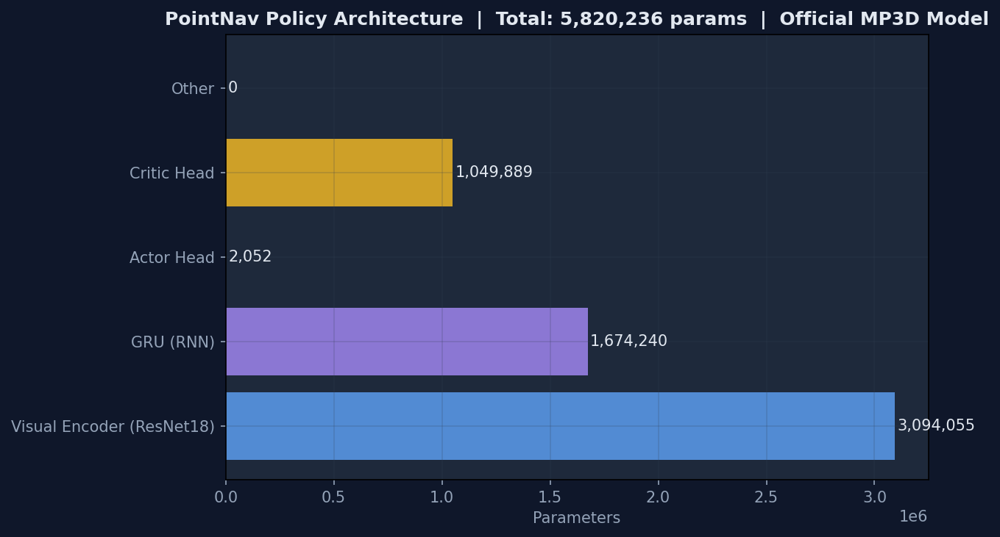
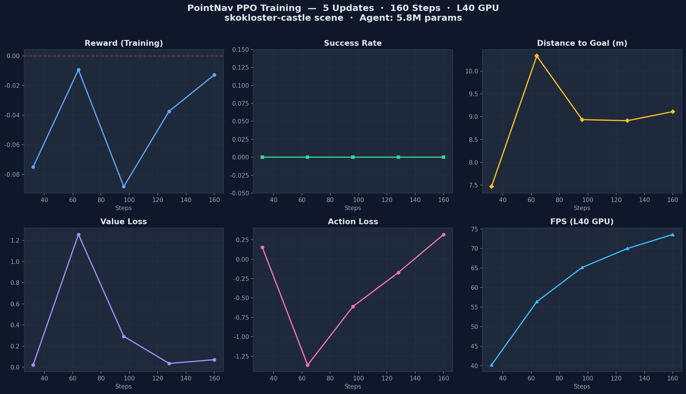
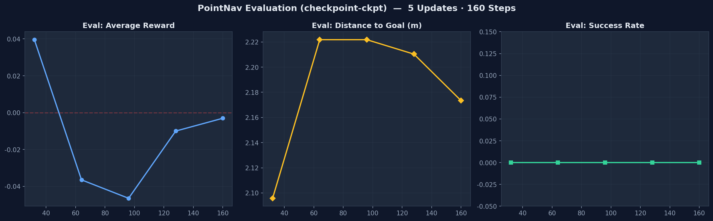

# 第6章：RL 训练入门 — Habitat 从零理解

> 从配置到训练，从 checkpoint 到评估指标。理解 PPO 训练流程、RL 环境包装链、以及如何解释训练结果。

## 0\. 训练全景图

一次完整的训练涉及 4 层结构：CLI 入口 → Trainer → VectorEnv → RLEnv → Core Env。

<div>

<div class="info-title" style="color:#60a5fa;">

学习目标

</div>

理解 CLI → Trainer → VectorEnv → RLEnv 四层架构  
<span style="color:#fbbf24;font-size:0.82rem;">🤔 你敲下 python -m habitat\_baselines.run 之后，Habitat 内部经历了哪些步骤才让 agent 开始移动？</span>

</div>

<div class="arch-diagram">

<div class="arch-row">

<div class="arch-layer" style="background:#f59e0b20;border:1px solid #f59e0b40;">

🖥 CLI 入口 <span class="small">habitat\_baselines/run.py</span>

<div class="arch-arrow-center">

↓ Hydra 配置加载 + 训练/评估 分支

</div>

<div class="arch-row">

<div class="arch-layer" style="background:#ec489920;border:1px solid #ec489940;">

🤖 PPOTrainer <span class="small">rl/ppo/ppo\_trainer.py</span>

<div class="arch-arrow-center">

↓ 管理训练循环、checkpoint、日志

</div>

<div class="arch-row">

<div class="arch-layer" style="background:#8b5cf620;border:1px solid #8b5cf640;">

📊 AgentAccessMgr (Single) <span class="small">Policy + Storage + Updater</span>

<div class="arch-arrow-center">

↓ 收集 rollouts → 计算 returns → PPO 更新

</div>

<div class="arch-row">

<div class="arch-layer" style="background:#3b82f620;border:1px solid #3b82f640;">

🔄 VectorEnv (N 个并行) <span class="small">habitat/core/vector\_env.py</span>

<div class="arch-arrow-center">

↓ 每个 env 独立运行一个场景实例

</div>

<div class="arch-row">

<div class="arch-layer" style="background:#22d3ee20;border:1px solid #22d3ee40;">

🎮 RLEnv → Env <span class="small">step() → (obs, reward, done, info)</span>

</div>

  

<div class="arch-layer" style="background:#10b98120;border:1px solid #10b98140;">

🧠 Task (Nav-v0) <span class="small">reward\_measure + success\_measure</span>

</div>

  

<div class="arch-layer" style="background:#06b6d420;border:1px solid #06b6d440;">

🏗 Simulator <span class="small">habitat\_sim 渲染引擎</span>

</div>

<div>

**📁 两个仓库的边界**

**habitat-lab**：提供 `Env`、`RLEnv`、`Benchmark`、`Task`、`Simulator` — 环境基础设施。  
**habitat-baselines**：提供 `run.py`、`PPOTrainer`、`PPO`、`Policy` — 训练算法和工具。  
训练时，baselines 通过 Hydra `defaults` 引用 lab 的 benchmark 配置，统一在 `DictConfig` 中。

## 2\. Policy 网络结构

`PointNavResNetPolicy` — Habitat 中 PointNav 任务的标准策略网络。 理解网络的每一层，才能回答核心问题：**RL 到底在训练什么？**

<div>

<div class="info-title" style="color:#60a5fa;">

学习目标

</div>

理解 CNN+RNN+Actor/Critic 每层的作用和参数量  
<span style="color:#fbbf24;font-size:0.82rem;">🤔 训练出来的 .pth 文件有 22MB，里面到底存了什么？为什么视觉编码器占了 90% 的参数，而做决策的 Actor 头只占 3%？</span>

</div>

### 2.1 网络全景：CNN + RNN + Actor/Critic

<div class="screenshot-frame" style="margin-bottom:14px;">



<span style="color:#60a5fa;font-weight:600;">📋 分析 torch.load("mp3d-rgb-best.pth")\["state\_dict"\] 的参数分布 → 5,820,236 参数</span>  
PointNav Policy 参数分布 — 视觉编码器 (ResNet18) 占主体 — 总计 5,820,236 参数 — 基于官方 MP3D 模型

</div>

### 2.1 网络全景：CNN + RNN + Actor/Critic

<div class="arch-diagram">

<div class="arch-row">

<div class="arch-layer" style="background:#3b82f620;border:1px solid #3b82f640;">

📷 **Visual Encoder** <span class="small">ResNet18/50 → 压缩空间特征</span>

</div>

<span style="font-size:1.5rem;color:var(--text-dim);align-self:center;">+</span>

<div class="arch-layer" style="background:#10b98120;border:1px solid #10b98140;">

🧭 **GPS+Compass** <span class="small">PointGoal 传感器 (2维向量)</span>

<div class="arch-arrow-center">

↓ 拼接 → Linear(hidden\_size)

</div>

<div class="arch-row">

<div class="arch-layer" style="background:#8b5cf620;border:1px solid #8b5cf640;">

🔄 **GRU** (可选) <span class="small">hidden\_size=512, num\_layers=1</span>

<div class="arch-arrow-center">

↓ 隐藏状态

</div>

<div class="arch-row">

<div class="arch-layer" style="background:#ec489920;border:1px solid #ec489940;">

🎯 **Actor Head** <span class="small">Linear → Categorical(4 actions)</span>

</div>

<div class="arch-layer" style="background:#f59e0b20;border:1px solid #f59e0b40;">

💰 **Critic Head** <span class="small">Linear → 1 (value scalar)</span>

</div>

<div>

**💡 为什么要 GPS+Compass？**

PointNav 任务中，agent 不仅有视觉输入（RGB/Depth），还有 `pointgoal_with_gps_compass` 传感器提供的 **目标方向+距离**（2维向量）。这是一个关键的"特权信息"——没有它， 纯视觉导航会难得多。策略网络将视觉特征和 GPS 向量拼接后一起送入决策头。

</div>

### 2.2 "RL 到底训练的是什么？"

<div>

**一句话回答**

训练的是**整个策略网络的权重参数**——不是规则、不是地图、不是规划器，而是一个**从像素到动作的端到端映射函数**。

</div>

<table>
<colgroup>
<col style="width: 25%" />
<col style="width: 25%" />
<col style="width: 25%" />
<col style="width: 25%" />
</colgroup>
<thead>
<tr class="header">
<th>模块</th>
<th>参数量 (ResNet18)</th>
<th>学的是什么</th>
<th>类比</th>
</tr>
</thead>
<tbody>
<tr class="odd">
<td><strong>视觉编码器</strong><br />
<span class="small">ResNet18/50</span></td>
<td>~11M</td>
<td>从 RGB-D 像素中提取空间特征：障碍物在哪、房间结构、物体纹理</td>
<td>"眼睛"——把像素变成有意义的结构信息</td>
</tr>
<tr class="even">
<td><strong>RNN 状态编码器</strong><br />
<span class="small">GRU/LSTM 512维</span></td>
<td>~3M</td>
<td>记忆历史观测，形成<strong>隐式空间认知</strong>：走过的路、看过的角落</td>
<td>"海马体"——在脑中维持对空间的动态记忆</td>
</tr>
<tr class="odd">
<td><strong>Actor 头</strong><br />
<span class="small">Linear → Categorical</span></td>
<td>~200K</td>
<td>给定当前状态，输出<strong>4 个动作的概率分布</strong>——哪个动作最可能到达目标</td>
<td>"决策者"——看情况选动作</td>
</tr>
<tr class="even">
<td><strong>Critic 头</strong><br />
<span class="small">Linear → 1</span></td>
<td>~100K</td>
<td>估计当前状态的<strong>未来预期回报</strong>（value）——这个位置有利吗？</td>
<td>"评论家"——好坏我来评判</td>
</tr>
</tbody>
</table>

<div class="key-finding">

**训练更新的是权重，不是行为规则。** 对于一张包含走廊和椅子的 RGB 图像，训练后的网络学会给它分配低 value（远离目标） 并降低 TURN\_LEFT 概率（因为左边是墙）。但这些知识不是被编程进去的——是 CNN 卷积核 通过 **PPO 梯度更新**从数百万步交互中自己浮现出来的。

</div>

### 2.3 "RL 需要基础模型吗？是微调吗？"

<div>

**取决于配置——有三种模式**

Habitat RL 的支持介于**"从零训练"**和**"预训练迁移"**之间，你可以根据任务选择。

</div>

<table>
<colgroup>
<col style="width: 25%" />
<col style="width: 25%" />
<col style="width: 25%" />
<col style="width: 25%" />
</colgroup>
<thead>
<tr class="header">
<th>模式</th>
<th>配置开关</th>
<th>说明</th>
<th>类比</th>
</tr>
</thead>
<tbody>
<tr class="odd">
<td><strong>A — 从零训练</strong></td>
<td><code>SimpleCNN</code> 默认</td>
<td>所有参数随机初始化，完全从零学。适合小规模实验，收敛慢</td>
<td>训练一个全新的 CNN 做图像分类</td>
</tr>
<tr class="even">
<td><strong>B — 预训练编码器</strong></td>
<td><code>pretrained_encoder: True</code><br />
<code>pretrained_weights: gibson-2plus-resnet50.pth</code></td>
<td>从 Gibson 数据集 DD-PPO 训练的 ResNet50 加载视觉编码器权重，<strong>其余随机初始化</strong>，然后在新数据集（HM3D/MP3D）上继续 PPO</td>
<td>NLP 中 "加载 BERT 权重，在新的下游任务上微调"</td>
</tr>
<tr class="odd">
<td><strong>C — CLIP 特征提取</strong></td>
<td><code>backbone: resnet50_clip_avgpool</code></td>
<td>加载 OpenAI CLIP ResNet50，<strong>视觉编码器完全冻结</strong>（<code>requires_grad=False</code>）。策略只学如何利用 CLIP 语义特征导航</td>
<td>用 GPT 的 embedding 做情感分类——特征提取器不变，只用它的输出</td>
</tr>
</tbody>
</table>

> 💡
> 
> <div class="tip-title">
> 
> Habitat 的 "微调" 与 NLP 的微调有何不同？
> 
> |           | NLP (BERT → 分类)   | Habitat RL (Gibson → HM3D) |
> | --------- | ----------------- | -------------------------- |
> | **预训练来源** | 海量文本自监督 (MLM)     | DD-PPO 在 Gibson 上的 RL 训练   |
> | **预训练规模** | 百亿 token          | 数亿步交互                      |
> | **迁移什么**  | 语言理解能力            | 视觉特征提取能力                   |
> | **微调方式**  | 加分类头 + 小 LR 全参数更新 | 冻结/解冻编码器 + 继续 PPO 更新       |
> | **本质**    | 任务迁移（语言 → 情感分类）   | 领域迁移（Gibson 场景 → HM3D 场景）  |
> 

> </div>
> 
> ### 2.4 "训练好的模型和环境、设备有关吗？"
> 
> | 因素                 | 相关程度                                  | 说明                                                                    | 缓解措施                   |
> | ------------------ | ------------------------------------- | --------------------------------------------------------------------- | ---------------------- |
> | **场景几何**           | <span style="color:#ef4444;">高</span> | Gibson 训练的模型直接跑 MP3D 测试，成功率可掉 20%+——房间布局、走廊宽度不同                       | 预训练编码器 + 目标数据集微调       |
> | **传感器分辨率**         | <span style="color:#ef4444;">高</span> | 256×256 训练的模型接收 640×480 输入会出错（FC 层输入维度固定）                             | resize 预处理；或用全卷积网络     |
> | **动作空间**           | <span style="color:#ef4444;">高</span> | 4-action (PointNav) 模型**不能**直接用于 6-action (ObjectNav) 任务——Actor 头维度不同 | 重新训练 Actor/Critic 头    |
> | **RGB vs 深度**      | <span style="color:#f59e0b;">中</span> | 有深度的模型迁移到纯 RGB 场景性能下降——深度提供几何信息                                       | 多任务训练；深度 dropout       |
> | **数据集 split**      | <span style="color:#f59e0b;">中</span> | 同一场景的不同 episode（train vs val）泛化通常较好；不同场景则考验泛化能力                       | 严格按照 train/val/test 分离 |
> | **GPU 设备**         | <span style="color:#10b981;">低</span> | PyTorch 自动处理 CUDA/CPU 转换；checkpoint 可跨 GPU 加载（`map_location`）         | 无需特殊处理                 |
> | **Habitat-Sim 版本** | <span style="color:#10b981;">低</span> | 传感器输出格式跨版本兼容；极少情况需要重新导出 checkpoint                                    | 固定版本依赖                 |
> 

> <div class="key-finding" style="margin-top:14px;">
> 
> **本质：Habitat RL 学的是视觉运动策略，不是场景地图。** 策略编码的是 "看到这样的走廊，应该这样做" 的**通用能力**，而不是某个特定房间的布局。 这就是为什么可以通过预训练编码器跨数据集迁移——视觉特征提取的底层卷积核（边缘、纹理、形状） 在不同场景间是可以共享的。
> 
> <div class="section">
> 
> <div class="container">
> 
> > ⚠️
> > 
> > <div class="warn-title">
> > 
> > 🛠 Policy 网络常见错误
> > 
> > | 错误信息                              | 可能原因                       | 解决方法                                 |
> > | --------------------------------- | -------------------------- | ------------------------------------ |
> > | `RuntimeError: size mismatch`     | CNN 输出维度与 RNN 输入不匹配        | 检查 `BACKBONE` 参数和 `hidden_size` 是否一致 |
> > | `IndexError: action out of range` | 策略输出维度 ≠ 动作空间大小            | Policy 最后一层必须输出 `num_actions` 维      |
> > | `CUDA out of memory`              | 视觉 backbone 太大 (ResNet101) | 降级为 `resnet50` 或减小 `hidden_size`     |
> > 

> > <div class="section">
> > 
> > <div class="container">
> > 
> > ## 3\. RL 环境包装链
> > 
> > 从最内层的 `Env` 到最外层的 `VectorEnv`，每一层封装增加一个能力维度。
> > 
> > <div>
> > 
> > <div class="info-title" style="color:#60a5fa;">
> > 
> > 学习目标
> > 
> > </div>
> > 
> > 理解 VectorEnv → RLEnv → Env 逐层封装的作用  
> > <span style="color:#fbbf24;font-size:0.82rem;">🤔 Habitat 的 Env 返回的是一个字典 {rgb, depth, pointgoal}，但 PPO 算法需要 (obs, reward, done, info) 元组——谁在中间做了转换？</span>
> > 
> > </div>
> > 
> > <div class="arch-diagram">
> > 
> > <div class="arch-row">
> > 
> > <div class="arch-layer" style="background:#0f172a;border:2px solid #f59e0b;">
> > 
> > **VectorEnv** (N 个并行) <span class="small">habitat/core/vector\_env.py</span>
> > 
> > <div class="arch-arrow-center" style="font-size:0.85rem;color:#fbbf24;">
> > 
> > ↑ 管理 N 个独立环境实例，合并 batch
> > 
> > </div>
> > 
> > <div class="arch-row">
> > 
> > <div class="arch-layer" style="background:#1e293b;border:1px solid #3b82f6;">
> > 
> > **GymHabitatEnv** <span class="small">habitat/gym/gym\_definitions.py</span>
> > 
> > <div class="arch-arrow-center" style="font-size:0.85rem;color:#60a5fa;">
> > 
> > ↑ 将字典 action/obs 转换为 gym 标准空间
> > 
> > </div>
> > 
> > <div class="arch-row">
> > 
> > <div class="arch-layer" style="background:#1e293b;border:1px solid #10b981;">
> > 
> > **RLEnv** (gym.Env) <span class="small">habitat/core/env.py:357</span>
> > 
> > <div class="arch-arrow-center" style="font-size:0.85rem;color:#34d399;">
> > 
> > ↑ step() → (obs, reward, done, info)
> > 
> > </div>
> > 
> > <div class="arch-row">
> > 
> > <div class="arch-layer" style="background:#1e293b;border:1px solid #8b5cf6;">
> > 
> > **Env** (核心) <span class="small">habitat/core/env.py:39</span>
> > 
> > <div class="arch-arrow-center" style="font-size:0.85rem;color:#a78bfa;">
> > 
> > ↑ 组合 Simulator + Task + Dataset
> > 
> > </div>
> > 
> > <div class="arch-row">
> > 
> > <div class="arch-layer" style="background:#1e293b;border:1px solid #64748b;">
> > 
> > 🏗 Simulator <span class="small">habitat\_sim 渲染引擎</span>
> > 
> > </div>
> > 
> > <div class="arch-layer" style="background:#1e293b;border:1px solid #64748b;">
> > 
> > 🧠 Task (Nav-v0) <span class="small">reward + success + measurements</span>
> > 
> > </div>
> > 
> > <div class="arch-layer" style="background:#1e293b;border:1px solid #64748b;">
> > 
> > 📦 Dataset <span class="small">episodes 迭代器</span>
> > 
> > </div>
> > 
> > <div>
> > 
> > **💡 RLEnv 做了什么？**
> > 
> > 原始 `Env.step()` 返回的是 `Observations`（字典）。  
> > `RLEnv.step()` 包装后返回标准的 **`(obs, reward, done, info)`** 元组：  
> > · `reward` 来自 `task.measurements` 中的 `reward_measure`（如 `distance_to_goal_reward`）  
> > · `done` 由 `task` 判断 episode 是否结束（到达目标 / 超步数 / 碰撞）  
> > · `info` 包含 `task.get_metrics()` 返回的所有指标
> > 
> > <div class="section">
> > 
> > <div class="container">
> > 
> > ## 4\. PPO 训练算法
> > 
> > Proximal Policy Optimization (Schulman et al., 2017) — Habitat 使用的核心 RL 算法。
> > 
> > <div style="margin:14px 0;padding:14px 18px;background:#1e293b;border-left:3px solid #fbbf24;border-radius:0 8px 8px 0;">
> > 
> > <span style="font-size:1.1rem;">🤔</span> <span style="color:#e2e8f0;font-size:0.88rem;"> 假设你是 agent 的策略网络。你刚刚发现了一个**"捷径"**——穿过墙直接到达目标。  
> > 新策略给这个"穿墙"动作 100% 的概率，旧策略只给了 1%。  
> > 如果你**不加限制**地更新——ratio = 100/1 = 100——你会立刻忘记之前学会的一切，变成"只会穿墙的 agent"。  
> >   
> > **PPO 的做法**：给更新加一个"**刹车**"——ε = 0.2。  
> > 不管新策略多想做一件旧策略没做过的事，实际用的 ratio 被 clip 到 \[0.8, 1.2\] 之间。  
> > 这样你可以**慢慢倾斜**向新策略，但不会一夜之间推翻旧策略。  
> >   
> > 这就是 PPO 的核心思想——也是下面所有公式要表达的同一件事。 </span>
> > 
> > </div>
> > 
> > <div>
> > 
> > <div class="info-title" style="color:#60a5fa;">
> > 
> > 学习目标
> > 
> > </div>
> > 
> > 掌握 PPO clipped objective 公式和代码映射  
> > <span style="color:#fbbf24;font-size:0.82rem;">🤔 PPO 论文里说 "clip the ratio to 1±ε"——如果新策略想做一件旧策略从来没想过的事（ratio=100），PPO 会怎么阻止它？clip 之后实际用的 ratio 是多少？</span>
> > 
> > </div>
> > 
> > ### 4.1 PPO 训练循环 (PPOTrainer.train)
> > 
> > <div class="screenshot-frame" style="margin-bottom:14px;">
> > 
> > **实际训练曲线 (L40 GPU · 5 次 PPO 更新 · 160 环境步)**
> > 
> > 
> > 
> > <span style="color:#60a5fa;font-weight:600;">📋 运行 §1.2 训练命令: python -m habitat\_baselines.run --config-name=pointnav/ppo\_pointnav\_example.yaml 的训练日志 (TensorBoard)</span>  
> > skokloster-castle 场景 · 5.8M 参数 · Reward 仍为负, Success=0% (此阶段预期行为) · FPS 40-74
> > 
> > </div>
> > 
> > ### 4.1 PPO 训练循环 (PPOTrainer.train)
> > 
> > ### 4.1A PPO 核心思想
> > 
> > <div>
> > 
> > **💡 一句话总结：**PPO（Proximal Policy Optimization，近端策略优化）是当前深度强化学习中最主流的策略梯度算法。它解决了「如何在更新策略时既`学得快`，又`不翻车`」这一核心矛盾。
> > 
> > </div>
> > 
> > 在强化学习中，策略梯度方法面临一个老问题：**学习率太大，策略更新过猛，训练直接崩溃；学习率太小，训练慢如蜗牛，永远学不会。**TRPO（Trust Region Policy Optimization）通过复杂的二阶优化来约束更新幅度，但实现难度极高。PPO 的提出者 John Schulman 团队在 2017 年给出了一个巧妙的替代方案：**用一阶优化的代价，实现近似的信任域约束**——这就是「裁剪替代目标函数」（Clipped Surrogate Objective）的核心直觉。
> > 
> > 想象你在「微调」一个旧策略来得到新策略：对每一步动作，新策略的概率和旧策略的概率之比，叫做 **概率比率 r<sub>t</sub>(θ)**。如果这个比率偏离 1 太远（比如旧策略给动作 FORWARD 的概率是 0.4，新策略猛拉到 0.9，比率=2.25），说明策略变化太剧烈。PPO 的做法是：**用 clip 操作把比率强行限制在 \[1−ε, 1+ε\] 范围内**，然后取裁剪前后两个损失的最小值。这样，当更新方向「好」时（优势 \> 0），不会无限制拉高概率；当更新方向「不好」时（优势 \< 0），也不会无限制压低概率。**PPO 就像给策略更新装了一个「安全阀」**，在学得快和安全之间找到了最佳平衡点。
> > 
> > <div class="key-finding">
> > 
> > **🔑 关键理解：**PPO 的精髓不在于它「发明了什么新东西」，而在于它用最简单的裁剪操作（`clip`），近似实现了 TRPO 的信任域效果，同时保持了极低的实现复杂度。这就是为什么 Habitat 团队选择 PPO 作为 PointNav、ObjectNav、VLN 等导航任务的默认训练算法。
> > 
> > </div>
> > 
> > ### 4.1B 公式推导
> > 
> > 下面从核心到外围，逐步拆解 PPO 的完整损失函数。先看懂每个符号的含义，再用 Habitat 的代码去对应。
> > 
> > #### 1\. 概率比率 (Probability Ratio)
> > 
> >     rt(θ) = πθ(at | st) / πθ_old(at | st)
> > 
> > | 符号                 | 含义                                                    |
> > | ------------------ | ----------------------------------------------------- |
> > | `πθ(at \| st)`     | 新策略（正在训练的策略）在状态 s<sub>t</sub> 下选择动作 a<sub>t</sub> 的概率 |
> > | `πθ_old(at \| st)` | 旧策略（收集数据时的策略）在同样状态下选择同样动作的概率                          |
> > | `rt(θ)`            | 概率比率——衡量新旧策略对该动作的「偏好变化」                               |
> > 

> > > 💡 **📌 直观理解：**r<sub>t</sub> = 1 表示新旧策略完全一致（没学到东西）；r<sub>t</sub> \> 1 表示新策略更偏爱这个动作；r<sub>t</sub> \< 1 表示新策略变得不太喜欢这个动作。
> > 
> > #### 2\. 优势函数 (Advantage Function)
> > 
> >     Ât = A(st, at)  ← 由 GAE (Generalized Advantage Estimation) 计算
> > 
> > **优势 Â<sub>t</sub>** 回答一个核心问题：「在状态 s<sub>t</sub> 下执行动作 a<sub>t</sub>，比「平均水平」好多少？」优势 \> 0 说明这个动作是「好动作」，应该鼓励；优势 \< 0 说明是「坏动作」，应该抑制。GAE 通过在偏差（bias）和方差（variance）之间引入 λ 参数做折中，得到更稳定的优势估计。
> > 
> > <div>
> > 
> > **💡 Habitat 中的 GAE：**在 `rollout_storage.py` 中，`compute_returns` 方法利用 Value 网络的预测值 + 实际奖励，结合 `gamma`（折扣因子）和 `tau`（GAE-λ 的 λ）计算出每个时间步的优势值。这一步骤发生在数据收集完成之后、PPO 更新之前。
> > 
> > </div>
> > 
> > #### 3\. 裁剪替代目标函数 (Clipped Surrogate Objective)
> > 
> >     LCLIP(θ) = Et[ min( rt(θ) · Ât ,  clip(rt(θ), 1−ε, 1+ε) · Ât ) ]
> > 
> > 这个公式是 PPO 的灵魂，分三层理解：
> > 
> >   - **第一项 r<sub>t</sub>(θ) · Â<sub>t</sub>：**标准策略梯度项，用概率比率加权优势。这是「想学多少就学多少」的版本。
> >   - **第二项 clip(r<sub>t</sub>(θ), 1−ε, 1+ε) · Â<sub>t</sub>：**把概率比率裁剪到 \[1−ε, 1+ε\] 区间内，限制单次更新的最大幅度。这是「装安全阀」的版本。
> >   - **外层 min(·, ·)：**取两者最小值。当 Â<sub>t</sub> \> 0 时，裁剪阻止 r<sub>t</sub> 变得太大（不要让好动作的概率涨太多）；当 Â<sub>t</sub> \< 0 时，裁剪阻止 r<sub>t</sub> 变得太小（不要让坏动作的概率跌太多）。
> > 
> > <div class="key-finding">
> > 
> > **🔑 ε（裁剪范围）的含义：**ε 控制策略更新的最大幅度。ε = 0.2 意味着新策略的概率比率最多偏离 1 的 ±20%（即 r<sub>t</sub> ∈ \[0.8, 1.2\]）。Habitat 默认使用 `clip_param = 0.1` 或 `0.2`：ε=0.1 更保守、更稳定但学习慢；ε=0.2 更激进、学得快但可能不稳定。对于导航任务，0.1\~0.2 之间都是合理选择。
> > 
> > </div>
> > 
> > #### 4\. 完整 PPO 损失函数
> > 
> >     Ltotal(θ) = LCLIP(θ)  −  c1 · LVF(θ)  +  c2 · S[πθ]
> > 
> > PPO 不是只有一个损失，它由三个部分加权组成：
> > 
> > | 组成部分     | 公式                              | 作用                             | Habitat YAML 参数                   |
> > | -------- | ------------------------------- | ------------------------------ | --------------------------------- |
> > | **策略损失** | `LCLIP(θ)`                      | 让策略产出更高优势的动作（核心优化目标）           | `clip_param` 控制 ε                 |
> > | **价值损失** | `LVF(θ) = (Vθ(st) − Vtarget)2`  | 让 Value 网络更准确地预测未来累积奖励（MSE 损失） | `value_loss_coef` = c<sub>1</sub> |
> > | **熵奖励**  | `S[πθ] = −Σπ(a\|s)·log π(a\|s)` | 鼓励策略保持一定程度的探索（防止过早收敛到次优解）      | `entropy_coef` = c<sub>2</sub>    |
> > 

> > > 💡 **📌 符号注意：**价值损失项前面是「减号」（−c<sub>1</sub>），因为我们要 **最大化** 整体目标。在代码实现中，通常转为求最小化（加负号），所以你会看到 `loss = -policy_loss + c1 * value_loss - c2 * entropy` 的写法。Habitat 代码中采用「最大化」范式，因此减去价值损失（让它变小更好）。
> > 
> > ### 4.1C 代码映射：公式到 Habitat-Baselines 源码
> > 
> > 下面将每个公式组件精确映射到 Habitat-Baselines 的实际文件和代码行。
> > 
> > #### 映射总览
> > 
> > | 公式组件                   | 代码文件                                          | 关键类/方法                                                | 对应 YAML 参数                    |
> > | ---------------------- | --------------------------------------------- | ----------------------------------------------------- | ----------------------------- |
> > | `LCLIP(θ)` + 整体损失      | `habitat_baselines/rl/ppo/ppo.py`             | `PPO.update()` 方法                                     | `clip_param`                  |
> > | `πθ(at\|st)` 新策略概率     | `habitat_baselines/rl/ppo/ppo.py`             | `ActorCritic.act()` → `action_distribution.log_probs` | —                             |
> > | `πθ_old(at\|st)` 旧策略概率 | `habitat_baselines/common/rollout_storage.py` | `RolloutStorage` 中存储的 `action_log_probs`              | —                             |
> > | `Ât` (GAE 优势)          | `habitat_baselines/common/rollout_storage.py` | `RolloutStorage.compute_returns()`                    | `gamma`, `tau`                |
> > | `LVF` 价值损失             | `habitat_baselines/rl/ppo/ppo.py`             | `PPO.update()` 中 value\_loss                          | `value_loss_coef`             |
> > | `S[πθ]` 熵奖励            | `habitat_baselines/rl/ppo/ppo.py`             | `PPO.update()` 中 action\_distribution.entropy         | `entropy_coef`                |
> > | PPO 更新循环               | `habitat_baselines/rl/ppo/ppo_updater.py`     | `PPOUpdater.update()`（调用 PPO.update 的包装器）             | `ppo_epoch`, `num_mini_batch` |
> > 

> > #### 关键代码位置详解
> > 
> > <div>
> > 
> > **📁 文件 1：`habitat_baselines/rl/ppo/ppo.py`** — PPO 算法核心类
> > 
> > **类 `PPO` 的方法 `update()`** 是公式的直接翻译。其核心逻辑（伪代码重构）如下：
> > 
> >     # ppo.py — PPO.update() 的核心逻辑 (简化版)
> >     
> >     def update(self, rollouts):
> >         # 从 RolloutStorage 取数据
> >         values, action_log_probs, actions, advantages, returns = rollouts.get_data()
> >         
> >         # 遍历多个 epoch（ppo_epoch）和 mini-batch
> >         for epoch in range(self.ppo_epoch):
> >             for batch in data_generator:
> >                 # === 第1章：计算新策略的概率 ===
> >                 new_action_dist = self.actor_critic.act(batch.observations, ...)
> >                 new_action_log_probs = new_action_dist.log_probs(batch.actions)
> >                 
> >                 # === 第2章：计算概率比率 r_t(θ) ===
> >                 ratio = torch.exp(new_action_log_probs - batch.action_log_probs)
> >                 #  batch.action_log_probs 是旧策略的 log π_old
> >                 
> >                 # === 第3章：计算裁剪损失 L^CLIP ===
> >                 surr1 = ratio * batch.advantages           # r_t * Â_t
> >                 surr2 = torch.clamp(ratio, 1.0 - clip_param, 1.0 + clip_param) * batch.advantages
> >                 action_loss = -torch.min(surr1, surr2).mean()  # 取 min，负号因为要最小化
> >                 
> >                 # === 第4章：计算价值损失 L^VF ===
> >                 value_loss = F.mse_loss(new_values, batch.returns)
> >                 
> >                 # === 第5章：完整损失 = L^CLIP + c1·L^VF − c2·S ===
> >                 total_loss = (
> >                     action_loss
> >                     + self.value_loss_coef * value_loss        # c1 * L^VF
> >                     - self.entropy_coef * new_action_dist.entropy().mean()  # -c2 * S
> >                 )
> >                 
> >                 # === 第6章：反向传播 ===
> >                 self.optimizer.zero_grad()
> >                 total_loss.backward()
> >                 torch.nn.utils.clip_grad_norm_(..., self.max_grad_norm)
> >                 self.optimizer.step()
> > 
> > **符号对应关系：**
> > 
> >   - `ratio` → `rt(θ)`（通过 exp(log 差值) 计算，数值更稳定）
> >   - `batch.advantages` → `Ât`（已在 rollout\_storage 中 GAE 计算好）
> >   - `clip_param` → `ε`（来自 YAML，默认 0.1 或 0.2）
> >   - `value_loss_coef` → `c1`（来自 YAML）
> >   - `entropy_coef` → `c2`（来自 YAML）
> > 
> > </div>
> > 
> > <div>
> > 
> > **📁 文件 2：`habitat_baselines/rl/ppo/ppo_updater.py`** — PPO 更新调度器
> > 
> > `PPOUpdater` 是 `PPO.update()` 的外层包装，负责控制 **「何时更新」** 而不是「如何更新」：
> > 
> >     # ppo_updater.py 核心逻辑
> >     
> >     class PPOUpdater:
> >         def update(self, rollouts):
> >             # 1. 先让 RolloutStorage 计算 GAE 优势和回报
> >             rollouts.compute_returns(
> >                 next_value,        # 最后一步的 V(s_{T+1})
> >                 use_gae=True,      # 使用 GAE 而非简单 n-step 回报
> >                 gamma=self.gamma,
> >                 tau=self.tau,      # GAE 的 λ 参数
> >             )
> >             
> >             # 2. 调用 PPO.update() 执行实际的网络更新
> >             value_loss, action_loss, dist_entropy = self.agent.update(rollouts)
> >             
> >             # 3. 清空 rollout 缓冲区，准备下一轮数据收集
> >             rollouts.after_update()
> >             
> >             return value_loss, action_loss, dist_entropy
> > 
> > **关键点：**`rollouts.compute_returns()` 必须在 `agent.update()` 之前调用，因为 PPO 更新需要预先计算好的 `advantages` 和 `returns`。
> > 
> > </div>
> > 
> > <div>
> > 
> > **📁 文件 3：`habitat_baselines/common/rollout_storage.py`** — GAE 优势计算
> > 
> > `RolloutStorage.compute_returns()` 是 `Ât` 的实际计算场所：
> > 
> >     # rollout_storage.py — GAE 优势计算
> >     
> >     def compute_returns(self, next_value, use_gae, gamma, tau):
> >         if use_gae:
> >             # Generalized Advantage Estimation (GAE)
> >             self.value_preds[-1] = next_value
> >             gae = 0
> >             for step in reversed(range(self.rewards.size(0))):
> >                 delta = (
> >                     self.rewards[step]
> >                     + gamma * self.value_preds[step + 1] * masks[step]
> >                     - self.value_preds[step]
> >                 )
> >                 # GAE 核心公式：Â_t = Σ (γτ)^l · δ_{t+l}
> >                 gae = delta + gamma * tau * masks[step] * gae
> >                 self.returns[step] = gae + self.value_preds[step]
> >                 
> >                 # ^ 注意：returns = advantages + value_preds（用于 Value 网络训练）
> >                 #    advantages = gae（用于策略网络训练）
> >         else:
> >             # 不带 GAE 的 n-step 回报（备用方案）
> >             ...
> > 
> > **GAE 公式对应：**
> > 
> >   - `delta` → TD 误差：δ<sub>t</sub> = r<sub>t</sub> + γ·V(s<sub>t+1</sub>) − V(s<sub>t</sub>)
> >   - `gae` → GAE 优势累积：Â<sub>t</sub><sup>GAE</sup> = Σ<sub>l=0</sub><sup>∞</sup> (γτ)<sup>l</sup> · δ<sub>t+l</sub>
> >   - `self.returns` → 用于 Value 网络 MSE 训练的目标：R<sub>t</sub> = Â<sub>t</sub> + V(s<sub>t</sub>)
> >   - `gamma` → γ（折扣因子，通常 0.99）
> >   - `tau` → τ（GAE 的 λ 参数，通常 0.95——注意 Habitat 用 `tau` 而非 `lambda` 命名）
> > 
> > </div>
> > 
> > #### YAML 配置参数到公式的完整映射
> > 
> >     # 典型 Habitat PPO 训练配置 (ppo_pointnav.yaml)
> >     RL:
> >       PPO:
> >         clip_param: 0.2          # → ε（裁剪范围）
> >         ppo_epoch: 4             # → 每轮数据重复训练几次
> >         num_mini_batch: 2        # → mini-batch 切分数
> >         value_loss_coef: 0.5     # → c₁（价值损失权重）
> >         entropy_coef: 0.01       # → c₂（熵奖励权重）
> >         max_grad_norm: 0.5       # → 梯度裁剪阈值（额外保护）
> >         lr: 2.5e-4               # → 优化器学习率
> >         eps: 1e-5                # → Adam 优化器的 ε（非 PPO 的 ε！）
> >         gamma: 0.99              # → γ（折扣因子，影响返回值计算）
> >         tau: 0.95                # → τ（GAE 的 λ 参数）
> >         use_gae: True            # → 是否启用 GAE
> >         use_clipped_value_loss: True  # → 是否也对 L^VF 做裁剪（额外稳定）
> > 
> > > 💡 **📌 常见混淆：**YAML 中 `eps: 1e-5` 是 Adam 优化器的数值稳定参数（防止除零），**不是** PPO 的 `epsilon`（裁剪范围）。PPO 的 ε 对应 `clip_param`。
> > 
> > ### 4.1D 直观理解：一个完整数值例子
> > 
> > 让我们用一个具体场景，把公式从头到尾走一遍。这是理解 PPO 内部分数流动的最佳方式。
> > 
> > <div>
> > 
> > **🎬 场景设定：**Agent 在 Habitat 场景中导航。在 **step 5**，Agent 执行了动作 `FORWARD`（向前走一步）。
> > 
> > </div>
> > 
> > #### 第1章：获取新旧策略概率
> > 
> > | 指标                                           | 值       | 来源                                                 |
> > | -------------------------------------------- | ------- | -------------------------------------------------- |
> > | 旧策略 π<sub>old</sub>(FORWARD | s<sub>5</sub>) | **0.4** | 收集 rollout 数据时，ActorCritic 网络输出的概率分布中对 FORWARD 的概率 |
> > | 新策略 π<sub>new</sub>(FORWARD | s<sub>5</sub>) | **0.6** | PPO 更新时，当前 ActorCritic 网络对同一状态重新计算的概率              |
> > 

> > #### 第2章：计算概率比率
> > 
> >     rt(θ) = πnew / πold = 0.6 / 0.4 = 1.5
> > 
> > 比率 1.5 \> 1，说明新策略比旧策略更「喜欢」FORWARD 这个动作——训练正在鼓励这个动作。
> > 
> > #### 第3章：查看优势值和裁剪参数
> > 
> > | 参数                | 值        | 含义                                             |
> > | ----------------- | -------- | ---------------------------------------------- |
> > | Â<sub>5</sub>（优势） | **+0.3** | 正值 → FORWARD 是个「好动作」，它的回报比 Value 网络预测的基线更好     |
> > | ε（clip\_param）    | **0.2**  | 概率比率最多偏差 20%，即 r<sub>t</sub> 被限制在 \[0.8, 1.2\] |
> > 

> > #### 第4章：应用裁剪
> > 
> >     无裁剪版本：  rt · Ât       = 1.5 × 0.3 = 0.45
> >     裁剪版本：    clip(rt, 0.8, 1.2) × Ât
> >                 = 1.2 × 0.3
> >                 = 0.36
> > 
> > 因为 r<sub>t</sub> = 1.5 超出了裁剪上限 1.2，PPO 把它强行「按住」在 1.2，**牺牲了 0.09 的潜在收益（0.45 − 0.36 = 0.09），换来了策略更新的稳定性。**
> > 
> > #### 第5章：min 操作最终裁决
> > 
> >     目标值 = min(无裁剪版, 裁剪版) = min(0.45, 0.36) = 0.36
> > 
> > 本例中裁剪版本更小，所以 `min` 选择了裁剪版本 0.36。**PPO 宁愿少学一点，也不想冒策略崩溃的风险。**
> > 
> > <div class="key-finding">
> > 
> > **🔑 关键领悟：**这个数值例子展示了 PPO 裁剪机制的精妙之处。当优势为正（Â<sub>t</sub> = +0.3）且新策略对动作偏好大幅上升（r<sub>t</sub> = 1.5）时，`clip` + `min` 的组合阻止了本轮更新将该动作的概率拉升得过高。下一次数据收集时，旧策略会更新为这一轮收敛后的策略，概率比率重新从 1.0 开始计算——PPO 以这种逐轮小幅更新的方式，确保策略平稳改进。
> > 
> > </div>
> > 
> > #### 反向场景（优势为负）的补充说明
> > 
> > > 💡 **📌 假设同一场景中 Â<sub>5</sub> = −0.3（FORWARD 是个坏动作）：**
> > > 
> > >   - 无裁剪版：1.5 × (−0.3) = **−0.45**
> > >   - 裁剪版：clip(1.5, 0.8, 1.2) × (−0.3) = 1.2 × (−0.3) = **−0.36**
> > >   - min(−0.45, −0.36) = **−0.45**（无裁剪版本更小，被选中）
> > > 
> > > 当优势为负时，`min` 会选择「让损失更负」的版本，即**无裁剪版本 −0.45**（因为裁剪版 −0.36 更大）。这等价于：当应该减少概率时，PPO 允许充分减少，不会被裁剪限制——因为裁剪只限制了概率比率的最低值（1−ε），而 r<sub>t</sub> = 1.5 并不会触发下限。
> > > 
> > > 只有当 r<sub>t</sub> \< 0.8（新策略把概率降得太低）时，裁剪下限才会介入。这是 PPO 设计的精妙之处：**对好动作限制涨幅，对坏动作允许充分跌幅**。
> > 
> > <div class="key-finding">
> > 
> > #### 📋 PPO 公式快速参考卡
> > 
> > | 公式                   | Habitat 参数                        | 推荐值        | 一句话作用              |
> > | -------------------- | --------------------------------- | ---------- | ------------------ |
> > | `rt = πnew / πold`   | —（隐式计算）                           | —          | 衡量新旧策略对同一动作的偏好变化   |
> > | `clip(rt, 1−ε, 1+ε)` | `clip_param` = ε                  | 0.1 \~ 0.2 | 限制单次更新幅度，防止训练崩溃    |
> > | `Ât（GAE）`            | `gamma`, `tau`                    | 0.99, 0.95 | 评估动作的「好/坏」程度       |
> > | `LVF（MSE）`           | `value_loss_coef` = c<sub>1</sub> | 0.5        | 让 Value 网络学会预测未来回报 |
> > | `S[πθ]（熵）`           | `entropy_coef` = c<sub>2</sub>    | 0.01       | 鼓励探索，防止过早收敛        |
> > | `Ltotal`             | —（三部分加权和）                         | —          | PPO 的完整优化目标        |
> > 

> > </div>
> > 
> > <div class="arch-diagram">
> > 
> > <div class="arch-row">
> > 
> > <div class="arch-layer" style="background:#ec489920;border:1px solid #ec489940;">
> > 
> > **① 初始化** <span class="small">创建 VectorEnv → Policy → Updater</span>
> > 
> > <div class="arch-arrow-center">
> > 
> > ↓
> > 
> > </div>
> > 
> > <div class="arch-row">
> > 
> > <div class="arch-layer" style="background:#f59e0b20;border:1px solid #f59e0b40;">
> > 
> > **② 收集 Rollout** <span class="small">N 个 env × num\_steps 步</span>
> > 
> > </div>
> > 
> > <span style="font-size:0.85rem;color:var(--text-dim);align-self:center;">→</span>
> > 
> > <div class="arch-layer" style="background:#3b82f620;border:1px solid #3b82f640;">
> > 
> > **③ 计算 Returns + Advantages** <span class="small">GAE (gamma=0.99, tau=0.95)</span>
> > 
> > <div class="arch-arrow-center">
> > 
> > ↓
> > 
> > </div>
> > 
> > <div class="arch-row">
> > 
> > <div class="arch-layer" style="background:#10b98120;border:1px solid #10b98140;">
> > 
> > **④ PPO Update** <span class="small">ppo\_epoch=1, num\_mini\_batch=1</span>
> > 
> > </div>
> > 
> > <span style="font-size:0.85rem;color:var(--text-dim);align-self:center;">→</span>
> > 
> > <div class="arch-layer" style="background:#8b5cf620;border:1px solid #8b5cf640;">
> > 
> > **⑤ Clip Gradient + Step** <span class="small">clip\_param=0.1, max\_grad\_norm=0.5</span>
> > 
> > <div class="arch-arrow-center">
> > 
> > ↓
> > 
> > </div>
> > 
> > <div class="arch-row">
> > 
> > <div class="arch-layer" style="background:#22d3ee20;border:1px solid #22d3ee40;">
> > 
> > **⑥ Log + Checkpoint** <span class="small">tensorboard / 定期保存</span>
> > 
> > </div>
> > 
> > <span style="font-size:0.85rem;color:var(--text-dim);align-self:center;">⟲</span>
> > 
> > <div class="arch-layer" style="background:#64748b40;border:1px solid #64748b;">
> > 
> > **重复 ②-⑥** <span class="small">直到 total\_num\_steps</span>
> > 
> > </div>
> > 
> > ### 4.2 PPO 核心参数详解
> > 
> > <div class="param-grid">
> > 
> > <div class="param-card" style="border-left-color:#f59e0b;">
> > 
> > #### clip\_param = 0.1
> > 
> > <div class="param-val">
> > 
> > 默认 0.2，示例中用 0.1
> > 
> > </div>
> > 
> > <div class="param-desc">
> > 
> > PPO 的核心创新——限制策略更新的幅度。新策略与旧策略的概率比被裁剪到 `[1-ε, 1+ε]`。 **越小越保守**，训练更稳定但收敛更慢。
> > 
> > <div class="param-card" style="border-left-color:#3b82f6;">
> > 
> > #### lr = 2.5e-4
> > 
> > <div class="param-val">
> > 
> > Adam 优化器学习率
> > 
> > </div>
> > 
> > <div class="param-desc">
> > 
> > 标准设置。可配合 `use_linear_lr_decay=True` 让学习率从初始值线性衰减到 0。
> > 
> > <div class="param-card" style="border-left-color:#10b981;">
> > 
> > #### num\_steps = 32
> > 
> > <div class="param-val">
> > 
> > 每次 rollout 收集的环境步数
> > 
> > </div>
> > 
> > <div class="param-desc">
> > 
> > 每次 PPO 更新前，每个环境执行 32 步。batch\_size = `num_environments × num_steps`。 更大的值提供更多样本但降低更新频率。
> > 
> > <div class="param-card" style="border-left-color:#8b5cf6;">
> > 
> > #### gamma = 0.99
> > 
> > <div class="param-val">
> > 
> > 折扣因子
> > 
> > </div>
> > 
> > <div class="param-desc">
> > 
> > 未来 reward 的衰减系数。`0.99` 意味着 100 步后的 reward 权重约为 `0.99^100 ≈ 0.37`。 接近 1.0 表示重视远期奖励。
> > 
> > <div class="param-card" style="border-left-color:#ec4899;">
> > 
> > #### tau = 0.95 (GAE λ)
> > 
> > <div class="param-val">
> > 
> > Generalized Advantage Estimation
> > 
> > </div>
> > 
> > <div class="param-desc">
> > 
> > 控制 advantage 估计中偏差-方差的权衡。`λ=1` 等价于 Monte Carlo（无偏但高方差）； `λ=0` 等价于 TD(0)（有偏但低方差）。0.95 是经验最优值。
> > 
> > <div class="param-card" style="border-left-color:#06b6d4;">
> > 
> > #### entropy\_coef = 0.01
> > 
> > <div class="param-val">
> > 
> > 熵正则化系数
> > 
> > </div>
> > 
> > <div class="param-desc">
> > 
> > 鼓励策略保持探索（不收敛到单一动作）。值越大探索越多，可设置 `use_adaptive_entropy_pen=True` 自动调整。
> > 
> > </div>
> > 
> > ### 4.3 DD-PPO (分布式 PPO)
> > 
> > 当单卡不够时，使用 DD-PPO 在多 GPU/多节点上训练。它与 PPO 共享同一个 `PPOTrainer` 类， 区别在于通过 `DecentralizedDistributedMixin` 增加了分布式同步。
> > 
> > <div class="param-grid">
> > 
> > <div class="param-card" style="border-left-color:#f59e0b;">
> > 
> > #### sync\_frac = 0.6
> > 
> > <div class="param-val">
> > 
> > 每 60% 步数后同步一次梯度
> > 
> > </div>
> > 
> > <div class="param-desc">
> > 
> > 不每步同步（那样通信开销太大），而是积累一定步数后平均梯度。
> > 
> > <div class="param-card" style="border-left-color:#3b82f6;">
> > 
> > #### backbone = "resnet18"
> > 
> > <div class="param-val">
> > 
> > 视觉编码器 (ResNet18/50/101)
> > 
> > </div>
> > 
> > <div class="param-desc">
> > 
> > DD-PPO 默认使用 ResNet18 作为视觉 backbone。支持 `pretrained_encoder=True` 加载预训练权重。
> > 
> > <div class="param-card" style="border-left-color:#10b981;">
> > 
> > #### num\_recurrent\_layers = 1
> > 
> > <div class="param-val">
> > 
> > GRU 循环层数
> > 
> > </div>
> > 
> > <div class="param-desc">
> > 
> > Policy 在 CNN 特征后接 GRU 层处理序列信息。设为 0 可禁用循环层。
> > 
> > <div class="param-card" style="border-left-color:#8b5cf6;">
> > 
> > #### distrib\_backend = "GLOO"
> > 
> > <div class="param-val">
> > 
> > PyTorch 分布式后端
> > 
> > </div>
> > 
> > <div class="param-desc">
> > 
> > CPU 训练用 GLOO，GPU 训练可用 NCCL（更快）。
> > 
> > <div class="section">
> > 
> > <div class="container">
> > 
> > > ⚠️
> > > 
> > > <div class="warn-title">
> > > 
> > > 🛠 RL 环境包装链常见错误
> > > 
> > > | 错误信息                                         | 可能原因                                | 解决方法                                                  |
> > > | -------------------------------------------- | ----------------------------------- | ----------------------------------------------------- |
> > > | `TypeError: RLEnv.__init__() missing config` | 用 `Env(config)` 替代了 `RLEnv(config)` | 训练必须用 RLEnv——Env 不提供 reward 计算                        |
> > > | `KeyError: 'reward_measure'`                 | RLEnv 配置缺少 `reward_measure` 段       | 在 yaml 中补全 `habitat.task.measurements.reward_measure` |
> > > | `AttributeError: 'VectorEnv' has no 'step'`  | VectorEnv 的 API 与单 Env 不同           | VectorEnv 使用 `vector_step(actions)` 而非 `step()`       |
> > > 

> > > <div class="section">
> > > 
> > > <div class="container">
> > > 
> > > ## 5\. 训练配置体系
> > > 
> > > 训练配置 = **Benchmark 配置**（环境） + **Baselines 配置**（算法） ，通过 Hydra `defaults` 合并。
> > > 
> > > ### 5.1 配置入口 — run.py
> > > 
> > >     # habitat-baselines/habitat_baselines/run.py
> > >     @hydra.main(
> > >         config_path="config",
> > >         config_name="pointnav/ppo_pointnav_example",  ← 默认配置文件
> > >     )
> > >     def main(cfg):
> > >         trainer_init = baseline_registry.get_trainer(cfg.habitat_baselines.trainer_name)
> > >         trainer = trainer_init(cfg)
> > >         if run_type == "train":
> > >             trainer.train()       # 开始训练
> > >         else:
> > >             trainer.eval()        # 评估模式
> > > 
> > > ### 5.2 训练配置文件
> > > 
> > > <div class="config-tree">
> > > 
> > > <span class="cmt">\# habitat\_baselines/config/pointnav/ppo\_pointnav\_example.yaml</span> <span class="kw">defaults:</span> - /benchmark/nav/pointnav: pointnav\_habitat\_test <span class="cmt">← 环境配置（场景、任务、传感器）</span> - /habitat\_baselines: habitat\_baselines\_rl\_config\_base <span class="cmt">← 训练配置（算法、超参）</span> - <span class="warn">\_self\_</span> <span class="key">habitat\_baselines:</span> <span class="key">trainer\_name:</span> <span class="str">"ppo"</span> <span class="cmt">← 注册在 baseline\_registry 中的 trainer</span> <span class="key">num\_environments:</span> <span class="num">1</span> <span class="cmt">← 并行环境数（DD-PPO 时可设多卡）</span> <span class="key">total\_num\_steps:</span> <span class="num">1e6</span> <span class="cmt">← 总训练步数</span> <span class="key">checkpoint\_folder:</span> <span class="str">"data/new\_checkpoints"</span> <span class="key">num\_checkpoints:</span> <span class="num">50</span> <span class="cmt">← 保存 50 个均匀分布的快照</span> <span class="key">rl:</span> <span class="key">ppo:</span> <span class="key">clip\_param:</span> <span class="num">0.1</span> <span class="cmt">← PPO 裁剪范围</span> <span class="key">lr:</span> <span class="num">2.5e-4</span> <span class="cmt">← 学习率</span> <span class="key">num\_steps:</span> <span class="num">32</span> <span class="cmt">← 每次 rollout 收集的环境步数</span> <span class="key">gamma:</span> <span class="num">0.99</span> <span class="cmt">← 折扣因子</span> <span class="key">tau:</span> <span class="num">0.95</span> <span class="cmt">← GAE λ 参数</span> <span class="key">hidden\_size:</span> <span class="num">512</span> <span class="cmt">← 网络隐藏层维度</span>
> > > 
> > > </div>
> > > 
> > > ### 5.3 配置合并结果
> > > 
> > > 合并后的 `DictConfig` 同时包含 `habitat` 和 `habitat_baselines` 两个顶层节点， 它们的 structured config 类型分别定义在两个文件中。
> > > 
> > > <div class="module-grid">
> > > 
> > > <div class="module" style="border-left-color:#3b82f6;">
> > > 
> > > ### cfg.habitat (环境)
> > > 
> > >   - `habitat.seed` — 随机种子
> > >   - `habitat.environment.max_episode_steps`
> > >   - `habitat.simulator.agents.main_agent.sim_sensors`
> > >   - `habitat.task.type` (Nav-v0)
> > >   - `habitat.task.measurements` (success, spl, distance\_to\_goal)
> > >   - `habitat.dataset.split` (train/val/test)
> > > 
> > > </div>
> > > 
> > > <div class="module" style="border-left-color:#f59e0b;">
> > > 
> > > ### cfg.habitat\_baselines (训练)
> > > 
> > >   - `trainer_name` — "ppo" 或 "ddppo"
> > >   - `num_environments` — 并行环境数
> > >   - `total_num_steps / num_updates`
> > >   - `rl.ppo.clip_param, lr, gamma, tau, ...`
> > >   - `rl.ddppo.backbone` — "resnet18"
> > >   - `eval.video_option` — \["disk", "tensorboard"\]
> > > 
> > > </div>
> > > 
> > > <div class="section">
> > > 
> > > <div class="container">
> > > 
> > > > ⚠️
> > > > 
> > > > <div class="warn-title">
> > > > 
> > > > 🛠 训练配置常见错误
> > > > 
> > > > | 错误信息                                               | 可能原因                            | 解决方法                                          |
> > > > | -------------------------------------------------- | ------------------------------- | --------------------------------------------- |
> > > > | `ConfigAttributeError: Key 'xxx' is not in struct` | Hydra Structured Config 拒绝不存在字段 | 先 `OmegaConf.to_container()` 转普通 dict 再修改     |
> > > > | `FileNotFoundError: ...cfg_file_path...`           | yaml 路径写错（相对路径基准是 cwd）          | 用 `habitat.get_config()` 自动解析路径，不要手写          |
> > > > | `MissingConfigException: dataset not found`        | benchmark config 引用的数据集未下载      | 检查 `habitat.dataset.data_path` 指向正确的 .json.gz |
> > > > 

> > > > <div class="section">
> > > > 
> > > > <div class="container">
> > > > 
> > > > ## 6\. RL 导航实战：观测→动作→奖励
> > > > 
> > > > 在深入 PPO 算法之前，先用一个完整的 Demo 理解 RL 如何让 agent 学会导航。 **观测什么、输出什么、奖励什么**——这三个问题是一切 RL 训练的基础。
> > > > 
> > > > <div>
> > > > 
> > > > <div class="info-title" style="color:#60a5fa;">
> > > > 
> > > > 学习目标
> > > > 
> > > > </div>
> > > > 
> > > > 运行完整的训练流程，理解观测→动作→奖励的闭环  
> > > > <span style="color:#fbbf24;font-size:0.82rem;">🤔 agent 往前走了一步，reward 是 +0.3 还是 -0.01？这个数字是怎么算出来的？如果我把 success\_distance 从 0.2m 改成 0.1m，reward 会变吗？</span>
> > > > 
> > > > </div>
> > > > 
> > > > ### 6.1 传统导航 vs RL 导航
> > > > 
> > > > RL 导航与传统 ROS Nav2 的根本区别：**不分解为独立模块，而是端到端学习**。
> > > > 
> > > > <div class="arch-diagram">
> > > > 
> > > > <div class="arch-row">
> > > > 
> > > > <div class="arch-layer" style="background:#3b82f620;border:1px solid #3b82f640;">
> > > > 
> > > > **传统导航 (ROS Nav2)** <span class="small">SLAM 建图 → AMCL 定位 → A\* 规划 → DWA 控制</span>
> > > > 
> > > > <div class="arch-arrow-center">
> > > > 
> > > > vs
> > > > 
> > > > </div>
> > > > 
> > > > <div class="arch-row">
> > > > 
> > > > <div class="arch-layer" style="background:#f59e0b20;border:1px solid #f59e0b40;">
> > > > 
> > > > **RL 导航 (Habitat PointNav)** <span class="small">RGB+Depth+GPS → CNN+GRU → (前进|左转|右转|停止)</span>
> > > > 
> > > > </div>
> > > > 
> > > > <div>
> > > > 
> > > > **🔑 关键差异**
> > > > 
> > > > RL 用 **CNN+GRU 隐状态** 替代了显式地图和规划器。 GPS+Compass 传感器提供 **完美的相对目标向量**（距离+角度）， 这是一种**特权信息**——它绕过了 SLAM 问题，让策略专注学习"如何从视觉走到目标"。 真实机器人需要用视觉里程计或 SLAM 来近似这个信号。
> > > > 
> > > > </div>
> > > > 
> > > > <div>
> > > > 
> > > > **为什么要用强化学习？**
> > > > 
> > > > **1. 学「看」→「走」，不需要人类标注**  
> > > > 传统导航需要人工设计 SLAM、定位、规划、控制每个模块。RL 只需要定义**奖励函数**（"靠近目标加分"）， 策略网络自己从几百万次试错中学会从像素到动作的端到端映射。没有人类告诉它「这里该左转」— 奖励信号自动指引。  
> > > >   
> > > > **2. 泛化到未见过的场景**  
> > > > RL 训练的策略不是背地图 — 它学的是「看到什么样的视觉模式该做什么动作」。 在 Gibson 场景集上训练的策略，可以在从未见过的 MP3D 场景中导航（zero-shot），因为 CNN 提取的是**通用视觉特征**而非特定场景坐标。  
> > > >   
> > > > **3. 这是 Sim-to-Real 的基础**  
> > > > GPS+Compass 在仿真中是完美特权信息，但在真实机器人上只能用视觉里程计近似。 RL 策略可以逐步去掉 GPS 依赖（从 PointNav → ImageNav → VLN），最终变成纯视觉导航 — 这就是 Habitat 作为**具身智能研究平台**的核心使命：在仿真中训练，向真实世界迁移。
> > > > 
> > > > </div>
> > > > 
> > > > ### 6.2 Demo 全貌：`examples/rl_nav_demo.py`
> > > > 
> > > > 这是本章配套的 RL 导航 Demo 脚本，分为 4 个 Part，覆盖从环境探索到策略推理的完整流程。
> > > > 
> > > > <div class="arch-diagram">
> > > > 
> > > > <div class="arch-row">
> > > > 
> > > > <div class="arch-layer" style="background:#22d3ee20;border:1px solid #22d3ee40;">
> > > > 
> > > > **Part 1** 🎮 <span class="small">探索环境：观测空间、动作空间、奖励信号</span>
> > > > 
> > > > </div>
> > > > 
> > > > <span style="font-size:1.2rem;color:var(--text-dim);align-self:center;">→</span>
> > > > 
> > > > <div class="arch-layer" style="background:#8b5cf620;border:1px solid #8b5cf640;">
> > > > 
> > > > **Part 2** 🧠 <span class="small">策略架构：CNN+GRU+Actor/Critic</span>
> > > > 
> > > > </div>
> > > > 
> > > > <span style="font-size:1.2rem;color:var(--text-dim);align-self:center;">→</span>
> > > > 
> > > > <div class="arch-layer" style="background:#ec489920;border:1px solid #ec489940;">
> > > > 
> > > > **Part 3** 🤖 <span class="small">PPO 训练：采样→计算优势→更新策略</span>
> > > > 
> > > > </div>
> > > > 
> > > > <span style="font-size:1.2rem;color:var(--text-dim);align-self:center;">→</span>
> > > > 
> > > > <div class="arch-layer" style="background:#10b98120;border:1px solid #10b98140;">
> > > > 
> > > > **Part 4** ✅ <span class="small">推理评估：加载 checkpoint，看策略表现</span>
> > > > 
> > > > </div>
> > > > 
> > > > ### 6.3 案例：RL 环境探索（Part 1）
> > > > 
> > > > <div>
> > > > 
> > > > **① 案例含义**
> > > > 
> > > > **目的**：理解 RL agent 在每一步看到了什么、能做什么、得到什么奖励。  
> > > > **难度**：⭐（纯探索，无需训练）  
> > > > **前置条件**：habitat-lab 已安装，test 数据集已下载（均就绪）
> > > > 
> > > > </div>
> > > > 
> > > > #### ② 核心代码 & 关键函数调用
> > > > 
> > > >     # examples/rl_nav_demo.py — Part 1（简化版）
> > > >     import gym
> > > >     import habitat.gym  # 注册 Habitat-v0
> > > >     
> > > >     env = gym.make("Habitat-v0",
> > > >         cfg_file_path="benchmark/nav/pointnav/pointnav_habitat_test.yaml")
> > > >     
> > > >     # 观测空间
> > > >     obs = env.reset()
> > > >     # obs = {'rgb': (256,256,3), 'depth': (256,256,1),
> > > >     #        'pointgoal_with_gps_compass': (2,)}
> > > >     
> > > >     # 动作空间: 0=STOP, 1=MOVE_FORWARD, 2=TURN_LEFT, 3=TURN_RIGHT
> > > >     action = env.action_space.sample()  # 随机动作
> > > >     obs, reward, done, info = env.step(action)
> > > >     # reward = -(新距离 - 旧距离)，靠近目标为正
> > > > 
> > > > | 函数                          | 角色         | 说明                                                 |
> > > > | --------------------------- | ---------- | -------------------------------------------------- |
> > > > | `gym.make("Habitat-v0")`    | 创建环境       | Gym 标准 API，加载 PointNav benchmark 配置                |
> > > > | `env.reset()`               | 重置 episode | 返回观测字典 {rgb, depth, pointgoal\_with\_gps\_compass} |
> > > > | `env.action_space.sample()` | 随机采样动作     | 从 4 个离散动作中均匀随机选择                                   |
> > > > | `env.step(action)`          | 执行动作       | 返回 (obs, reward, done, info) 四元组                   |
> > > > 

> > > > #### ③ 如何创建和运行
> > > > 
> > > >     $ python examples/rl_nav_demo.py --explore-only
> > > > 
> > > > #### ④ 运行效果
> > > > 
> > > >     === PART 1: Understanding the RL Environment ===
> > > >     
> > > >     [1.2] Observation Space
> > > >       depth                 shape=(256, 256, 1)         dtype=float32
> > > >       pointgoal_with_gps_compass  shape=(2,)                  dtype=float32
> > > >       rgb                   shape=(256, 256, 3)         dtype=uint8
> > > >     
> > > >     [1.3] Action Space (discrete)
> > > >       [0] STOP
> > > >       [1] MOVE_FORWARD    ← 前进 0.25m
> > > >       [2] TURN_LEFT       ← 左转 10°
> > > >       [3] TURN_RIGHT      ← 右转 10°
> > > >     
> > > >     [1.6] Sample Episode (random actions)
> > > >       Episode ended at step 7
> > > >       Total reward: 0.367
> > > >       Info: {'distance_to_goal': 1.547, 'success': 0.0, 'spl': 0.0}
> > > > 
> > > > <div>
> > > > 
> > > > **⑤ 输出结果的含义**
> > > > 
> > > > 1.  **rgb / depth** — agent 第一视角的视觉输入。RGB 是 0-255 的 uint8 像素，depth 是浮点米值（0-10m）。
> > > > 2.  **pointgoal\_with\_gps\_compass** — `[距离 ρ, 角度 φ]`。ρ 是 agent 到目标的直线距离（米），φ 是相对偏转角（弧度）。这是 RL 的关键"特权信息"。
> > > > 3.  **STOP/MOVE\_FORWARD/TURN\_LEFT/TURN\_RIGHT** — 离散动作空间，每次只能选一个。turn\_angle=10°，意味着转 90° 需要 9 次 TURN 动作。
> > > > 4.  **reward = -(新距离 - 旧距离)** — 靠近目标得正奖励，远离得负奖励。0.367 的总奖励意味着 agent 在 7 步随机移动中总体靠近了目标约 0.37m。
> > > > 5.  **success=0.0, SPL=0.0** — 随机 agent 不可能导航成功，这是 baseline。
> > > > 
> > > > </div>
> > > > 
> > > > <div>
> > > > 
> > > > **🔍 深入：奖励的三层组装公式**
> > > > 
> > > > 上面第 4 点的 `reward = -(新距离 - 旧距离)` 只是**核心部分**。 `RLTaskEnv.get_reward()`（源码 `habitat/core/environments.py:73`）实际返回的是**三层叠加**：
> > > > 
> > > > <table>
> > > > <colgroup>
> > > > <col style="width: 33%" />
> > > > <col style="width: 33%" />
> > > > <col style="width: 33%" />
> > > > </colgroup>
> > > > <thead>
> > > > <tr class="header">
> > > > <th>层次</th>
> > > > <th>默认值</th>
> > > > <th>含义</th>
> > > > </tr>
> > > > </thead>
> > > > <tbody>
> > > > <tr class="odd">
> > > > <td><strong>slack_reward</strong><br />
> > > > <span class="small">每步固定</span></td>
> > > > <td><code>-0.01</code></td>
> > > > <td><strong>「效率惩罚」</strong> — agent 每走一步就扣 0.01 分，逼迫它走最短路径。如果 agent 原地转圈，slack 持续扣分，总 reward 永远上不去</td>
> > > > </tr>
> > > > <tr class="even">
> > > > <td><strong>reward_measure</strong><br />
> > > > <span class="small">每步动态</span></td>
> > > > <td><code>distance_to_goal_reward</code></td>
> > > > <td><strong>「核心信号」</strong> — 这就是上面第 4 点的 <code>-(新距离 - 旧距离)</code>。向目标靠近 1 米 ≈ +1.0 分，远离 1 米 ≈ -1.0 分</td>
> > > > </tr>
> > > > <tr class="odd">
> > > > <td><strong>success_reward</strong><br />
> > > > <span class="small">终点一次性</span></td>
> > > > <td><code>+2.5</code></td>
> > > > <td><strong>「成功大奖」</strong> — 只在 episode 成功时发放一次（<code>end_on_success: True</code> 时到达目标后 episode 立即终止，不会再扣 slack）</td>
> > > > </tr>
> > > > </tbody>
> > > > </table>
> > > > 
> > > > ``` 
> > > >         源码中的奖励组装（habitat/core/environments.py:73）
> > > > ```
> > > > 
> > > >     def get_reward(self, observations):
> > > >         current_measure = self._env.get_metrics()[self._reward_measure_name]
> > > >         reward = self._slack_reward          # -0.01
> > > >         reward += current_measure            # +(旧距离 - 新距离)
> > > >         if self._episode_success():
> > > >             reward += self._success_reward   # +2.5
> > > >         return reward
> > > > 
> > > > </div>
> > > > 
> > > > **一个成功 episode 的典型奖励轨迹：**  
> > > > 设起点距离目标 5 米，agent 用 50 步到达（成功）：  
> > > > · slack 贡献：`50 × (-0.01) = -0.5`（走了 50 步，扣 0.5 分）  
> > > > · distance 贡献：从 5m 逐步减到 0m，累积约 `+5.0`（每步靠近一点就加分）  
> > > > · success 贡献：到达那一刻 `+2.5`  
> > > > · **episode 总奖励 ≈ +7.0** — 这个正值告诉 PPO：「做得好，多做这种事」
> > > > 
> > > > > 💡
> > > > > 
> > > > > <div class="tip-title">
> > > > > 
> > > > > 这些值在哪配置？
> > > > > 
> > > > > `pointnav.yaml` 的 `reward_measure: "distance_to_goal_reward"` 指定用哪个 Measure 做奖励； `slack_reward` 和 `success_reward` 是 `TaskConfig` 的字段（Structured Config），默认值 分别为 `-0.01` 和 `2.5`。你可以通过 Hydra 覆盖：  
> > > > > `python -m habitat_baselines.run ... habitat.task.slack_reward=-0.001 habitat.task.success_reward=5.0`
> > > > > 
> > > > > | ⑥ 调整项          | 怎么改                                                  | 预期看到什么                     |
> > > > > | -------------- | ---------------------------------------------------- | -------------------------- |
> > > > > | 增大探索步数         | 修改 `range(50)` → `range(200)`                        | 更长的随机游走，可能看到更多场景区域         |
> > > > > | 固定动作序列         | 改 `random action` 为 `action=1`（只前进）                  | agent 直线前进直到撞墙，reward 持续为负 |
> > > > > | 打印每一步的 goal 向量 | step 循环里加 `print(obs["pointgoal_with_gps_compass"])` | 看到目标距离在不断变化（随机动作时增减不定）     |
> > > > > 

> > > > > ### 6.4 从环境探索到策略推理
> > > > > 
> > > > > 当理解了环境后，Demo 的 Part 4 展示了完整闭环——加载训练好的策略网络，替代随机动作：
> > > > > 
> > > > > <div class="arch-diagram">
> > > > > 
> > > > > <div class="arch-row">
> > > > > 
> > > > > <div class="arch-layer" style="background:#1e293b;border:1px solid #64748b;">
> > > > > 
> > > > > 📷 RGB+Depth <span class="small">256×256 像素</span>
> > > > > 
> > > > > </div>
> > > > > 
> > > > > <span style="font-size:1.2rem;color:var(--text-dim);align-self:center;">+</span>
> > > > > 
> > > > > <div class="arch-layer" style="background:#1e293b;border:1px solid #64748b;">
> > > > > 
> > > > > 🧭 GPS+Compass <span class="small">\[距离, 角度\]</span>
> > > > > 
> > > > > </div>
> > > > > 
> > > > > <span style="font-size:1.2rem;color:var(--text-dim);align-self:center;">→</span>
> > > > > 
> > > > > <div class="arch-layer" style="background:#8b5cf620;border:1px solid #8b5cf640;">
> > > > > 
> > > > > **CNN+GRU** <span class="small">\~5.8M 参数</span>
> > > > > 
> > > > > </div>
> > > > > 
> > > > > <span style="font-size:1.2rem;color:var(--text-dim);align-self:center;">→</span>
> > > > > 
> > > > > <div class="arch-layer" style="background:#10b98120;border:1px solid #10b98140;">
> > > > > 
> > > > > **动作概率** <span class="small">4 分类分布</span>
> > > > > 
> > > > > </div>
> > > > > 
> > > > >     # 策略推理（Part 4 简化版）
> > > > >     ckpt = torch.load("data/new_checkpoints/ckpt.9.pth", weights_only=False)
> > > > >     policy.load_state_dict(ckpt["state_dict"])
> > > > >     policy.eval()
> > > > >     
> > > > >     for step in range(200):
> > > > >         result = policy.act(obs_batch, rnn_state, prev_actions, masks, deterministic=True)
> > > > >         action = result.actions.item()      # 策略选择的动作
> > > > >         obs, reward, done, info = env.step(action)  # 执行
> > > > >         if action == 0:  # STOP → 到达目标
> > > > >             break
> > > > > 
> > > > > > 💡
> > > > > > 
> > > > > > <div class="tip-title">
> > > > > > 
> > > > > > 💡 为什么 Demo 里策略只训练了 5000 步？
> > > > > > 
> > > > > > 默认 `--train-steps 50000` 只够验证 pipeline 是否正常。 要让策略真正学会导航，需要 **数百万甚至上亿步**（生产配置用 `total_num_steps=7.5e7`）。 因此 Part 4 输出的 3 个 episode 都会看到 `[FAILED]` 和 1 步 STOP——策略还没学会如何移动。 **完整训练后再跑推理，才能看到有效的导航行为。**
> > > > > > 
> > > > > > </div>
> > > > > > 
> > > > > > <div>
> > > > > > 
> > > > > > **🔗 Demo 与本章后续内容的关系**
> > > > > > 
> > > > > > · Part 1（环境探索）→ **RL 环境包装链**（第3节）将解释 `Env → RLEnv → VectorEnv` 的每一层。  
> > > > > > · Part 2（策略架构）→ **Policy 网络结构**（第2节）将展开 CNN+GRU+Actor/Critic 的内部细节。  
> > > > > > · Part 3（训练）→ **PPO 训练算法**（第4节）将深入 rollout→GAE→clip update 的数学原理。  
> > > > > > · Part 4（推理）→ **评估与 Benchmark**（第7节）将教你怎么科学地衡量模型好坏。  
> > > > > > · 想知道 PointNav 之外还有什么导航任务？→ **导航任务全景**（第1节）将讲解 5 种目标类型。
> > > > > > 
> > > > > > <div class="section">
> > > > > > 
> > > > > > <div class="container">
> > > > > > 
> > > > > > ## 7\. 评估与 Benchmark
> > > > > > 
> > > > > > 训练完成后，使用 `habitat.Benchmark` 或 trainer 的 `eval()` 评估模型性能。
> > > > > > 
> > > > > > <div>
> > > > > > 
> > > > > > <div class="info-title" style="color:#60a5fa;">
> > > > > > 
> > > > > > 学习目标
> > > > > > 
> > > > > > </div>
> > > > > > 
> > > > > > 掌握 success/SPL/distance\_to\_goal 三个核心指标  
> > > > > > <span style="color:#fbbf24;font-size:0.82rem;">🤔 训练 loss 一直在降，但 agent 在测试场景里一动不动——SPL=0, Success=0。这是过拟合吗？还是你的评估方式有问题？</span>
> > > > > > 
> > > > > > </div>
> > > > > > 
> > > > > > ### 7.1 Benchmark 评估流程
> > > > > > 
> > > > > >     # 方式 1：直接使用 Benchmark
> > > > > >     from habitat.config.default import get_config
> > > > > >     import habitat
> > > > > >     
> > > > > >     cfg = get_config('benchmark/nav/pointnav/pointnav_habitat_test.yaml')
> > > > > >     benchmark = habitat.Benchmark(cfg)
> > > > > >     metrics = benchmark.evaluate(agent, num_episodes=100)
> > > > > >     # → {'success': 0.42, 'spl': 0.35, 'distance_to_goal': 1.23, ...}
> > > > > > 
> > > > > > <div class="screenshot-frame" style="margin:14px 0;">
> > > > > > 
> > > > > > **评估指标可视化 (5 次 PPO 更新 · 160 环境步)**
> > > > > > 
> > > > > > 
> > > > > > 
> > > > > > <span style="color:#60a5fa;font-weight:600;">📋 运行 §7 评估: habitat\_baselines.evaluate=True 的输出指标可视化</span>  
> > > > > > Checkpoint 评估 — Average Reward / Distance to Goal / Success Rate — 160 步总计
> > > > > > 
> > > > > > </div>
> > > > > > 
> > > > > > ### 7.2 评估指标详解
> > > > > > 
> > > > > > | 指标                     | 全称                                                   | 范围                | 含义                                                           |
> > > > > > | ---------------------- | ---------------------------------------------------- | ----------------- | ------------------------------------------------------------ |
> > > > > > | **success**            | Success Rate                                         | \[0, 1\]          | Agent 是否在 max\_episode\_steps 内到达目标（距离 \< success\_distance） |
> > > > > > | **spl**                | Success weighted by (normalized inverse) Path Length | \[0, 1\]          | 成功率 × (最短路径长度 / max(实际路径长度, 最短路径长度))。惩罚绕路                    |
> > > > > > | **distance\_to\_goal** | Final Distance to Goal                               | \[0, ∞) m         | Episode 结束时 agent 到目标的欧式距离。越小越好                              |
> > > > > > | **num\_steps**         | Episode Steps Taken                                  | \[0, max\_steps\] | Agent 在 episode 中执行的步数（非 STOP 动作次数）                          |
> > > > > > | **collisions**         | Collision Count                                      | \[0, ∞)           | Agent 碰撞墙壁/障碍物的次数（`previous_step_collided`）                  |
> > > > > > 

> > > > > > <div class="key-finding">
> > > > > > 
> > > > > > <span class="icon">💡</span>
> > > > > > 
> > > > > > <div>
> > > > > > 
> > > > > > **SPL vs Success：**Success 只关心"到了没有"，SPL 关心"走了多高效"。 两个 agent 可能都有 80% success，但 SPL 更高的那个路径更短。 **实际项目中 SPL 往往是更重要的指标**，因为它反映了导航效率。
> > > > > > 
> > > > > > ### 7.3 使用 Trainer 评估已有 Checkpoint
> > > > > > 
> > > > > >     # 方式 2：命令行评估（通过 run.py）
> > > > > >     # 在 habitat-baselines 目录下运行：
> > > > > >     python -u -m habitat_baselines.run \
> > > > > >       --config-name=pointnav/ppo_pointnav_example \
> > > > > >       habitat_baselines.evaluate=True \
> > > > > >       habitat_baselines.eval_ckpt_path_dir="data/new_checkpoints/ckpt.50.pth" \
> > > > > >       habitat_baselines.eval.video_option='["disk"]'
> > > > > > 
> > > > > > > 💡
> > > > > > > 
> > > > > > > <div class="tip-title">
> > > > > > > 
> > > > > > > 📹 视频输出
> > > > > > > 
> > > > > > > 设置 `eval.video_option: ["disk"]` 会在评估时保存 agent 的第一视角视频到 `video_dir`。 设置 `["tensorboard"]` 会将视频上传到 TensorBoard。 视频对于调试和理解 agent 行为非常有帮助。
> > > > > > > 
> > > > > > > </div>
> > > > > > > 
> > > > > > > ### 7.4 训练 vs 评估的数据集分离
> > > > > > > 
> > > > > > > <div class="arch-diagram">
> > > > > > > 
> > > > > > > <div class="arch-row">
> > > > > > > 
> > > > > > > <div class="arch-layer" style="background:#3b82f620;border:1px solid #3b82f640;">
> > > > > > > 
> > > > > > > **Train Split** <span class="small">用于训练 RL policy</span>
> > > > > > > 
> > > > > > > </div>
> > > > > > > 
> > > > > > > <div class="arch-layer" style="background:#10b98120;border:1px solid #10b98140;">
> > > > > > > 
> > > > > > > **Val Split** <span class="small">用于调超参 + 早停</span>
> > > > > > > 
> > > > > > > </div>
> > > > > > > 
> > > > > > > <div class="arch-layer" style="background:#f59e0b20;border:1px solid #f59e0b40;">
> > > > > > > 
> > > > > > > **Test Split** <span class="small">最终评测（不用于训练）</span>
> > > > > > > 
> > > > > > > </div>
> > > > > > > 
> > > > > > > 在配置文件中通过 `habitat.dataset.split: "train"` 指定使用哪个 split。 训练时用 train split，评估时用 val/test split。这是 ML 的基本实践但在 RL 中容易被忽略。
> > > > > > > 
> > > > > > > </div>
> > > > > > > 
> > > > > > > <div class="section">
> > > > > > > 
> > > > > > > <div class="container">
> > > > > > > 
> > > > > > > ## 8\. 实践指南
> > > > > > > 
> > > > > > > 从安装到首次训练成功的步骤清单。
> > > > > > > 
> > > > > > > <div>
> > > > > > > 
> > > > > > > <div class="info-title" style="color:#60a5fa;">
> > > > > > > 
> > > > > > > 学习目标
> > > > > > > 
> > > > > > > </div>
> > > > > > > 
> > > > > > > 学会解读训练日志、调优参数、估算训练时间  
> > > > > > > <span style="color:#fbbf24;font-size:0.82rem;">🤔 你盯着 TensorBoard 看了一个小时，reward 曲线像心电图一样上下跳动——这是在"学习"还是在"抽风"？你怎么判断训练是正常的？</span>
> > > > > > > 
> > > > > > > </div>
> > > > > > > 
> > > > > > > ### 8.1 训练前检查清单
> > > > > > > 
> > > > > > > | \# | 检查项                   | 命令 / 说明                                                      |
> > > > > > > | -- | --------------------- | ------------------------------------------------------------ |
> > > > > > > | 1  | habitat-lab 已安装       | `pip install -e habitat-lab`                                 |
> > > > > > > | 2  | habitat-baselines 已安装 | `pip install -e habitat-baselines`                           |
> > > > > > > | 3  | 场景数据集已下载              | `data/scene_datasets/` 下的 .glb 文件                            |
> > > > > > > | 4  | 任务数据集已下载              | `data/datasets/pointnav/` 下的 .json.gz 文件                     |
> > > > > > > | 5  | GPU 可用                | `python -c "import torch; print(torch.cuda.is_available())"` |
> > > > > > > | 6  | 配置文件路径正确              | 确认 benchmark YAML 中的 data\_path 指向正确路径                       |
> > > > > > > 

> > > > > > > ### 8.2 启动训练
> > > > > > > 
> > > > > > >     # 在 habitat-baselines 目录下：
> > > > > > >     cd habitat-baselines
> > > > > > >     
> > > > > > >     # 方式 A：使用示例配置（habitat-test 数据集，快速试跑）
> > > > > > >     python -u -m habitat_baselines.run \
> > > > > > >       --config-name=pointnav/ppo_pointnav_example
> > > > > > >     
> > > > > > >     # 方式 B：使用完整 PointNav PPO 配置（Gibson 数据集）
> > > > > > >     python -u -m habitat_baselines.run \
> > > > > > >       --config-name=pointnav/ppo_pointnav
> > > > > > >     
> > > > > > >     # 方式 C：DD-PPO 多 GPU 训练
> > > > > > >     python -u -m habitat_baselines.run \
> > > > > > >       --config-name=pointnav/ddppo_pointnav
> > > > > > > 
> > > > > > > <div>
> > > > > > > 
> > > > > > > **训练的最终目的是什么？**
> > > > > > > 
> > > > > > > **不是跑通命令，而是让策略网络学会"看→走"。** 每个配置项都为这个目标服务：  
> > > > > > > · `total_num_steps` — 给策略多长时间的试错机会（越多越好，受限于时间和算力）  
> > > > > > > · `lr` — 每次试错后更新多大的步子（太大发散，太小收敛太慢）  
> > > > > > > · `num_environments` — 同时跑多少个并行环境（更多=样本更多样=训练更稳定）  
> > > > > > > · `reward_measure` — 定义"什么是做得好"（distance\_to\_goal\_reward = "靠近目标加分"）  
> > > > > > > · 最终输出：一批 `.pth` checkpoint 文件，加载后可推理导航
> > > > > > > 
> > > > > > > </div>
> > > > > > > 
> > > > > > > ### 8.2B 程序执行流程分析
> > > > > > > 
> > > > > > > 当你执行 `python -u -m habitat_baselines.run` 时，Habitat 内部发生了以下事情：
> > > > > > > 
> > > > > > > <div class="arch-diagram">
> > > > > > > 
> > > > > > > <div class="arch-row">
> > > > > > > 
> > > > > > > <div class="arch-layer" style="background:#3b82f620;border:1px solid #3b82f640;">
> > > > > > > 
> > > > > > > **① Hydra 配置加载** <span class="small">habitat\_baselines/run.py:main()</span>
> > > > > > > 
> > > > > > > <div class="arch-arrow-center">
> > > > > > > 
> > > > > > > ↓ 读取 `pointnav/ppo_pointnav_example.yaml` → 组合 lab + baselines 配置
> > > > > > > 
> > > > > > > </div>
> > > > > > > 
> > > > > > > <div class="arch-row">
> > > > > > > 
> > > > > > > <div class="arch-layer" style="background:#f59e0b20;border:1px solid #f59e0b40;">
> > > > > > > 
> > > > > > > **② 创建 Trainer** <span class="small">baseline\_registry.get\_trainer(config)</span>
> > > > > > > 
> > > > > > > </div>
> > > > > > > 
> > > > > > > <span style="font-size:0.85rem;color:var(--text-dim);align-self:center;">→</span>
> > > > > > > 
> > > > > > > <div class="arch-layer" style="background:#3b82f620;border:1px solid #3b82f640;">
> > > > > > > 
> > > > > > > **③ 创建 VectorEnv** <span class="small">construct\_envs() → N 个并行 env</span>
> > > > > > > 
> > > > > > > <div class="arch-arrow-center">
> > > > > > > 
> > > > > > > ↓ VectorEnv 自动分派：每个子进程运行一个独立的 Habitat Env
> > > > > > > 
> > > > > > > </div>
> > > > > > > 
> > > > > > > <div class="arch-row">
> > > > > > > 
> > > > > > > <div class="arch-layer" style="background:#10b98120;border:1px solid #10b98140;">
> > > > > > > 
> > > > > > > **④ 训练循环** <span class="small">trainer.train() → PPOTrainer.\_collect\_rollout()</span>
> > > > > > > 
> > > > > > > <div class="arch-arrow-center">
> > > > > > > 
> > > > > > > ↓ 循环 num\_updates 次，每次：
> > > > > > > 
> > > > > > > | 步骤 | 操作             | 对应代码                               | 说明                                                                                                                            |
> > > > > > > | -- | -------------- | ---------------------------------- | ----------------------------------------------------------------------------------------------------------------------------- |
> > > > > > > | 4a | **收集 Rollout** | `_collect_rollout_step()`          | 每个 env 执行 `num_steps` 步（默认 32）。总共收集 `num_environments × num_steps` 个 (obs, action, reward, next\_obs, done) 元组                |
> > > > > > > | 4b | **计算 Returns** | `RolloutStorage.compute_returns()` | 用 GAE (Generalized Advantage Estimation) 从每个 step 的 reward 反向计算 advantage 和 return。`gamma=0.99` 控制远期奖励权重，`tau=0.95` 控制偏差-方差权衡 |
> > > > > > > | 4c | **PPO Update** | `PPOUpdater.update()`              | 用 clipped surrogate objective 更新策略网络：限制新旧策略的概率比在 `[1-ε, 1+ε]` 区间，防止单次更新过大导致训练崩溃                                               |
> > > > > > > | 4d | **日志记录**       | `log_interval` 控制                  | 每隔 `log_interval` 次 update 打印一次终端日志 + 写入 TensorBoard（reward, success, SPL, losses, entropy）                                   |
> > > > > > > | 4e | **Checkpoint** | `checkpoint_interval` 控制           | 每隔 `checkpoint_interval` 次 update 保存一次模型（`ckpt.{N}.pth`），保存 optimizer/scheduler 状态以支持 resume                                  |
> > > > > > > 

> > > > > > > > 💡
> > > > > > > > 
> > > > > > > > <div class="tip-title">
> > > > > > > > 
> > > > > > > > 关键源码路径
> > > > > > > > 
> > > > > > > > · `habitat_baselines/run.py` — Hydra main 入口，解析配置 → 创建 trainer → 调用 train()  
> > > > > > > > · `habitat_baselines/rl/ppo/ppo_trainer.py` — PPOTrainer 类，`train()` 主循环（约 1200 行）  
> > > > > > > > · `habitat_baselines/common/rollout_storage.py` — RolloutStorage, GAE 计算  
> > > > > > > > · `habitat_baselines/rl/ppo/ppo_updater.py` — PPO clip objective + 梯度更新
> > > > > > > > 
> > > > > > > > </div>
> > > > > > > > 
> > > > > > > > ### 8.2C 关键训练参数调优建议
> > > > > > > > 
> > > > > > > > <table>
> > > > > > > > <colgroup>
> > > > > > > > <col style="width: 25%" />
> > > > > > > > <col style="width: 25%" />
> > > > > > > > <col style="width: 25%" />
> > > > > > > > <col style="width: 25%" />
> > > > > > > > </colgroup>
> > > > > > > > <thead>
> > > > > > > > <tr class="header">
> > > > > > > > <th>参数</th>
> > > > > > > > <th>默认值</th>
> > > > > > > > <th>Hydra 覆盖方式</th>
> > > > > > > > <th>调优建议</th>
> > > > > > > > </tr>
> > > > > > > > </thead>
> > > > > > > > <tbody>
> > > > > > > > <tr class="odd">
> > > > > > > > <td><strong>total_num_steps</strong><br />
> > > > > > > > <span class="small">总训练步数</span></td>
> > > > > > > > <td>1e6 (示例)<br />
> > > > > > > > 7.5e7 (生产)</td>
> > > > > > > > <td><code>habitat_baselines.total_num_steps=5e6</code></td>
> > > > > > > > <td>示例配置仅 100 万步（约 10 分钟），策略不会学会导航。要看到有效的导航行为<strong>至少设 500 万步</strong>（500 万 ~ 1 小时）。生产级训练建议 7500 万步以上（3-7 天）<br />
> > > > > > > > · 快速验证 pipeline：<code>1e5</code>（5 分钟）<br />
> > > > > > > > · 观察学习趋势：<code>5e6</code>（30-60 分钟）<br />
> > > > > > > > · 获得可用模型：<code>≥ 2.5e7</code>（半天-1天）</td>
> > > > > > > > </tr>
> > > > > > > > <tr class="even">
> > > > > > > > <td><strong>num_environments</strong><br />
> > > > > > > > <span class="small">并行环境数</span></td>
> > > > > > > > <td>4 (示例)<br />
> > > > > > > > 16-32 (生产)</td>
> > > > > > > > <td><code>habitat_baselines.num_environments=8</code></td>
> > > > > > > > <td>每个 update 的 batch size = <code>num_environments × num_steps</code>。增大会让训练更稳定（更多样本估计梯度），但 GPU 显存和 CPU 内存线性增长<br />
> > > > > > > > · 8GB 显存：4-6 env<br />
> > > > > > > > · 16GB 显存：8-12 env<br />
> > > > > > > > · 24GB+ 显存：16-32 env</td>
> > > > > > > > </tr>
> > > > > > > > <tr class="odd">
> > > > > > > > <td><strong>num_steps</strong><br />
> > > > > > > > <span class="small">每 update 步数</span></td>
> > > > > > > > <td>32 (示例)<br />
> > > > > > > > 128 (生产)</td>
> > > > > > > > <td><code>habitat_baselines.num_steps=64</code></td>
> > > > > > > > <td>更大的 num_steps 让每个 update 包含更长的时间序列，有助于学习长期依赖。但 batch 内存 = <code>num_envs × num_steps × obs_size</code><br />
> > > > > > > > · PointNav 简单任务：32-64 足够<br />
> > > > > > > > · ObjectNav/VLN 复杂任务：128-256</td>
> > > > > > > > </tr>
> > > > > > > > <tr class="even">
> > > > > > > > <td><strong>lr</strong><br />
> > > > > > > > <span class="small">学习率</span></td>
> > > > > > > > <td>2.5e-4</td>
> > > > > > > > <td><code>habitat_baselines.lr=1e-4</code></td>
> > > > > > > > <td><strong>这与 PPO 的 clip_param 耦合。</strong> 如果 reward 震荡剧烈，先降 lr（试试 1e-4 或 5e-5）；如果 reward 始终不上升，试试增大 lr (5e-4)。配合 <code>use_linear_lr_decay=True</code> 使用更佳</td>
> > > > > > > > </tr>
> > > > > > > > <tr class="odd">
> > > > > > > > <td><strong>clip_param</strong><br />
> > > > > > > > <span class="small">PPO 裁剪参数</span></td>
> > > > > > > > <td>0.1 (示例)<br />
> > > > > > > > 0.2 (标准)</td>
> > > > > > > > <td><code>habitat_baselines.clip_param=0.2</code></td>
> > > > > > > > <td>越小越保守（训练稳定但收敛慢），越大越激进（收敛快但可能发散）。0.1-0.2 是安全区间<br />
> > > > > > > > · 如果你看到 loss 频繁出现 NaN，减小到 0.05<br />
> > > > > > > > · 如果 reward 上升太慢，增大到 0.3</td>
> > > > > > > > </tr>
> > > > > > > > <tr class="even">
> > > > > > > > <td><strong>entropy_coef</strong><br />
> > > > > > > > <span class="small">熵正则化</span></td>
> > > > > > > > <td>0.01</td>
> > > > > > > > <td><code>habitat_baselines.entropy_coef=0.02</code></td>
> > > > > > > > <td>防止策略过早收敛到单一动作。观察 TensorBoard：如果 <code>entropy</code> 快速降到 0，增大此值（0.02-0.05）。如果策略完全不学习，减小此值</td>
> > > > > > > > </tr>
> > > > > > > > <tr class="odd">
> > > > > > > > <td><strong>max_episode_steps</strong><br />
> > > > > > > > <span class="small">episode 最大步数</span></td>
> > > > > > > > <td>500</td>
> > > > > > > > <td><code>habitat.environment.max_episode_steps=200</code></td>
> > > > > > > > <td>限制每个 episode 的步数上限。太短会导致 agent 来不及到达目标就超时（影响成功率），太长会浪费训练时间<br />
> > > > > > > > · 小场景（test）：100-200<br />
> > > > > > > > · 中等场景（Gibson）：300-500<br />
> > > > > > > > · 大场景（MP3D/HM3D）：500-1000</td>
> > > > > > > > </tr>
> > > > > > > > <tr class="even">
> > > > > > > > <td><strong>eval_interval</strong><br />
> > > > > > > > <span class="small">评估间隔</span></td>
> > > > > > > > <td>25 (updates)</td>
> > > > > > > > <td><code>habitat_baselines.eval_interval=10</code></td>
> > > > > > > > <td>每隔多少步 evaluation 一次（在验证集上运行，不更新策略）。频繁评估会拖慢训练<br />
> > > > > > > > · 快速实验：10<br />
> > > > > > > > · 长周期训练：50-100</td>
> > > > > > > > </tr>
> > > > > > > > </tbody>
> > > > > > > > </table>
> > > > > > > > 
> > > > > > > > ``` 
> > > > > > > >       一个完整的「快速有效训练」命令示例
> > > > > > > > ```
> > > > > > > > 
> > > > > > > >     # 合并参数覆盖：更多步数 + 更多并行环境 + 小学习率
> > > > > > > >     $ python -u -m habitat_baselines.run \
> > > > > > > >         --config-name=pointnav/ppo_pointnav_example \
> > > > > > > >         habitat_baselines.total_num_steps=5000000 \
> > > > > > > >         habitat_baselines.num_environments=8 \
> > > > > > > >         habitat_baselines.num_steps=64 \
> > > > > > > >         habitat_baselines.lr=1e-4 \
> > > > > > > >         habitat_baselines.clip_param=0.1 \
> > > > > > > >         habitat_baselines.use_linear_lr_decay=True
> > > > > > > > 
> > > > > > > > ### 8.2D 训练过程的终端输出详解
> > > > > > > > 
> > > > > > > > 训练时终端会周期性打印状态。第一次看到时可能不知所措——下面是每条输出逐字段的解读。
> > > > > > > > 
> > > > > > > > ``` 
> > > > > > > >       训练启动信息
> > > > > > > > ```
> > > > > > > > 
> > > > > > > >     # 启动时会看到类似以下的信息（这是 ppo_pointnav_example 的典型输出）
> > > > > > > >     2026-06-11 10:15:23,456 Initializing dataset PointNav-v1
> > > > > > > >     2026-06-11 10:15:23,512 initializing sim Sim-v0
> > > > > > > >     # ── 关键信息：数据集大小、训练步数、环境数 ──
> > > > > > > >     Number of training episodes: 1  # habitat-test 只有 1 个训练 episode（用于快速测试）
> > > > > > > >     Total number of updates: 2441     # = total_num_steps / (num_envs × num_steps)，示例配置共 ~2441 次 update
> > > > > > > >     Number of environments: 4         # 4 个并行环境
> > > > > > > >     Number of steps per env: 32       # 每个 update 前每个 env 执行 32 步
> > > > > > > > 
> > > > > > > > ``` 
> > > > > > > >       训练中每隔 log_interval 次 update 的输出（简化示例）
> > > > > > > > ```
> > > > > > > > 
> > > > > > > >     update: 100   fps: 1580.3   total reward: -0.42   success: 0.00   spl: 0.00
> > > > > > > >       distance_to_goal: 3.24   entropy: 1.38   value_loss: 0.15   policy_loss: 0.003  lr: 2.5e-4
> > > > > > > > 
> > > > > > > > | 字段                       | 期望走势    | 含义                                                                                                                    |
> > > > > > > > | ------------------------ | ------- | --------------------------------------------------------------------------------------------------------------------- |
> > > > > > > > | `update: 100`            | 递增      | 第 100 次 PPO 更新。总共会有 \~2441 次 update。如果这个数字卡住不动，说明 rollout 收集卡死了                                                       |
> > > > > > > > | `fps: 1580`              | 稳定      | Frame Per Second — 每秒处理的仿真帧数。受场景复杂度、RGB 分辨率、env 数量影响。如果 fps 异常低（\<100），检查 GPU 是否被其他进程占用                               |
> > > > > > > > | `total reward: -0.42`    | ↑ 上升    | 最近一个 rollout 的平均 episode 总奖励。初始为负值是正常的（agent 随机移动碰不到目标，只收 slack penalty）。训练成功的标志是从负数逐渐上升，最终转正                         |
> > > > > > > > | `success: 0.00`          | ↑ 上升    | 最近 rollout 中成功到达目标的 episode 比例（= success\_rate）。前几百步通常为 0 — agent 还没学会如何移动。这是**最重要的指标**。如果 20% 总更新后 success 还是 0，检查参数 |
> > > > > > > > | `spl: 0.00`              | ↑ 上升    | Success weighted by Path Length。考虑路径效率的成功率：`SPL = 1/N Σ S_i × (l_i_opt / max(l_i, l_i_opt))`。agent 不仅到达目标，而且走了接近最短路径  |
> > > > > > > > | `distance_to_goal: 3.24` | ↓ 下降    | episode 结束时的平均剩余距离。训练初期 agent 原地转圈，距离维持不变甚至增大。学会导航后这个值会持续下降                                                           |
> > > > > > > > | `entropy: 1.38`          | 缓慢下降    | 策略的动作分布熵。`ln(4)≈1.39` 是最大值（4 个动作完全均匀随机）。如果快速跌到 \~0.01，说明策略过早崩溃为确定性（只选一个动作），需增大 `entropy_coef`                         |
> > > > > > > > | `value_loss: 0.15`       | 下降后稳定   | Value function 的 MSE loss。帮助判断 Critic 是否在改善对 future reward 的估计。如果持续上升说明策略更新太大，降低 lr                                   |
> > > > > > > > | `policy_loss: 0.003`     | 波动      | PPO clipped surrogate loss。这个值的大小没有绝对标准，重要的是它**不出现 NaN 或 ±∞**                                                         |
> > > > > > > > | `lr: 2.5e-4`             | 不变或线性衰减 | 当前 learning rate。如果启用了 `use_linear_lr_decay=True`，会从初始值线性衰减到 0                                                        |
> > > > > > > > 

> > > > > > > > ### 8.2E 训练过程分析：什么样的曲线是健康的？
> > > > > > > > 
> > > > > > > > <div>
> > > > > > > > 
> > > > > > > > **从随机到收敛的三个阶段**
> > > > > > > > 
> > > > > > > > 一个典型的 PPO PointNav 训练会经历以下阶段（以 `total_num_steps=5e6` 为例）：
> > > > > > > > 
> > > > > > > > | 阶段          | updates 范围  | 特征                             | 你应该看到的现象                                                                                                                               |
> > > > > > > > | ----------- | ----------- | ------------------------------ | -------------------------------------------------------------------------------------------------------------------------------------- |
> > > > > > > > | **1. 随机探索** | 0 \~ 10%    | reward 为负，success = 0          | total reward 在 -2 到 -0.5 之间波动。entropy \~1.38。策略还在随机试错，碰巧靠近目标时 reward 短暂为正但很快又被随机动作冲掉。这是正常的——耐心等                                        |
> > > > > > > > | **2. 初步学习** | 10% \~ 30%  | reward 开始上升，occasional success | total reward 从 -0.5 向 0 靠近。success 不再恒为 0，偶尔出现 0.05-0.15。entropy 开始缓慢下降（\~1.2-1.3）。策略开始理解"向 target direction 走有用"                      |
> > > > > > > > | **3. 稳定收敛** | 30% \~ 100% | success 持续上升，entropy 趋于稳定      | reward 转为正（+2 到 +5），success 达到 0.4-0.6+。SPL 从 0 上升到 0.3+（路径开始优化）。entropy 稳定在 0.3-0.8。如果 success 在某个值停滞不前且 entropy 接近 0，说明策略已经"满足"于局部最优 |
> > > > > > > > 

> > > > > > > > </div>
> > > > > > > > 
> > > > > > > > > ⚠️
> > > > > > > > > 
> > > > > > > > > <div class="warn-title">
> > > > > > > > > 
> > > > > > > > > 需要警惕的危险信号
> > > > > > > > > 
> > > > > > > > > | 现象                             | 可能原因                                   | 修复方法                                                    |
> > > > > > > > > | ------------------------------ | -------------------------------------- | ------------------------------------------------------- |
> > > > > > > > > | reward 完全不变（波动幅度 \< 0.01）      | 学习率太小或 reward scale 问题                 | 增大 lr → 5e-4；检查 reward\_measure 配置是否生效                  |
> > > > > > > > > | reward 剧烈震荡（相邻 update 之间跳 ±5+） | 学习率太大、batch size 太小                    | 降 lr → 5e-5；增大 num\_environments → 16                   |
> > > > > > > > > | entropy 在 5% 进度内降到 \< 0.01     | 策略过早崩溃（entropy collapse）               | 增大 entropy\_coef → 0.05；减小 clip\_param → 0.05           |
> > > > > > > > > | policy\_loss 出现 NaN            | 数值不稳定（梯度爆炸或 advantage 异常）              | 减小 clip\_param → 0.05；检查 max\_grad\_norm (设为 0.5)；降低 lr |
> > > > > > > > > | success 上升到 0.3 后突然跌回 0        | 策略"忘记"了已学会的行为（catastrophic forgetting） | 减小 lr；增大 num\_mini\_batch；降低 clip\_param                |
> > > > > > > > > | fps 在训练中途从 \~1500 掉到 \~100     | 某个 env 子进程卡住或 GPU 显存泄漏                 | 检查 GPU 显存使用（nvidia-smi）；减少 num\_environments；降低 RGB 分辨率 |
> > > > > > > > > 

> > > > > > > > > </div>
> > > > > > > > > 
> > > > > > > > > > 💡
> > > > > > > > > > 
> > > > > > > > > > <div class="tip-title">
> > > > > > > > > > 
> > > > > > > > > > 推荐查看 TensorBoard 的 4 个关键面板
> > > > > > > > > > 
> > > > > > > > > > `tensorboard --logdir=tb` 启动后在浏览器打开 `http://localhost:6006`：  
> > > > > > > > > > · **SCALARS → reward** — 窗口大小改为 100，观察平滑后的上升趋势  
> > > > > > > > > > · **SCALARS → success** — 这是最终目标指标，关注最终收敛值（\> 0.5 才算有效训练）  
> > > > > > > > > > · **SCALARS → entropy** — 不应为 0（为 0 = 策略死了），不应维持 1.38 不变（= 没学到任何东西）  
> > > > > > > > > > · **SCALARS → value\_loss + policy\_loss** — 两者都不应出现 NaN 或持续增大
> > > > > > > > > > 
> > > > > > > > > > </div>
> > > > > > > > > > 
> > > > > > > > > > ### 8.3 监控训练进度
> > > > > > > > > > 
> > > > > > > > > > <div class="module-grid">
> > > > > > > > > > 
> > > > > > > > > > <div class="module" style="border-left-color:#f59e0b;">
> > > > > > > > > > 
> > > > > > > > > > ### 📊 TensorBoard
> > > > > > > > > > 
> > > > > > > > > > 训练日志自动写入 `tensorboard_dir`。启动 TensorBoard 查看：
> > > > > > > > > > 
> > > > > > > > > >   - `tensorboard --logdir=tb`
> > > > > > > > > >   - 查看 reward 曲线（应上升）
> > > > > > > > > >   - 查看 value\_loss / policy\_loss
> > > > > > > > > >   - 查看熵值（不应为 0）
> > > > > > > > > > 
> > > > > > > > > > </div>
> > > > > > > > > > 
> > > > > > > > > > <div class="module" style="border-left-color:#10b981;">
> > > > > > > > > > 
> > > > > > > > > > ### 📁 Checkpoint
> > > > > > > > > > 
> > > > > > > > > > 模型按进度均匀保存到 `checkpoint_folder`：
> > > > > > > > > > 
> > > > > > > > > >   - `ckpt.1.pth` (2% 进度)
> > > > > > > > > >   - `ckpt.25.pth` (50% 进度)
> > > > > > > > > >   - `ckpt.50.pth` (100% 进度)
> > > > > > > > > >   - `latest.pth` (总是最新)
> > > > > > > > > > 
> > > > > > > > > > ### 8.4 常见问题排查
> > > > > > > > > > 
> > > > > > > > > > | 现象              | 可能原因                         | 解决方法                                         |
> > > > > > > > > > | --------------- | ---------------------------- | -------------------------------------------- |
> > > > > > > > > > | reward 不上升      | 学习率过高/过低、reward 缩放不正确        | 调整 lr (试 1e-4 \~ 1e-3)，检查 reward\_measure 定义 |
> > > > > > > > > > | success 始终为 0   | 任务太难、max\_episode\_steps 太短  | 减小场景复杂度、增大 max\_episode\_steps               |
> > > > > > > > > > | entropy → 0     | 策略过早收敛到确定性动作                 | 增大 entropy\_coef 或启用 adaptive entropy        |
> > > > > > > > > > | GPU 显存不足 (OOM)  | num\_environments 太大 / 分辨率太高 | 减小 num\_environments 或降低分辨率                  |
> > > > > > > > > > | checkpoint 加载失败 | 配置不匹配 / 模型结构变化               | 设置 `eval.use_ckpt_config=True` 使用保存时的配置      |
> > > > > > > > > > 

> > > > > > > > > > ### 8.5 训练周期估算
> > > > > > > > > > 
> > > > > > > > > > <div>
> > > > > > > > > > 
> > > > > > > > > > **⚡ 性能参考（单卡 RTX 2070 SUPER，habitat-test 数据集）**
> > > > > > > > > > 
> > > > > > > > > > · **1 个环境 + 128×128 RGB**：约 100-200 FPS（帧/秒）  
> > > > > > > > > > · **total\_num\_steps = 1e6**：约 1.5-3 小时  
> > > > > > > > > > · **完整 Gibson 数据集**（72 个训练场景）：建议 **total\_num\_steps ≥ 2.5e8**，约 3-7 天（单卡）  
> > > > > > > > > > · **DD-PPO 8 GPU**：可将 Gibson 训练缩短到约 12-24 小时
> > > > > > > > > > 
> > > > > > > > > > </div>
> > > > > > > > > > 
> > > > > > > > > > > ⚠️
> > > > > > > > > > > 
> > > > > > > > > > > <div class="warn-title">
> > > > > > > > > > > 
> > > > > > > > > > > ⚠️ habitat-test 只适合调试！
> > > > > > > > > > > 
> > > > > > > > > > > `habitat-test-scenes` 只有 1 个小场景，用于验证 pipeline 是否正常。 **训练有效模型必须使用完整数据集**（Gibson、HM3D 或 MP3D）。 habitat-test 上 train 出来的 checkpoint 在实际场景中几乎不可用。
> > > > > > > > > > > 
> > > > > > > > > > > <div class="section">
> > > > > > > > > > > 
> > > > > > > > > > > <div class="container">
> > > > > > > > > > > 
> > > > > > > > > > > ## 本章总结
> > > > > > > > > > > 
> > > > > > > > > > > | 主题              | 核心概念                                                                   | 你学到了什么                                    |
> > > > > > > > > > > | --------------- | ---------------------------------------------------------------------- | ----------------------------------------- |
> > > > > > > > > > > | **导航任务全景**      | 6 种任务类型：PointNav / ObjectNav / ImageNav / InstanceImageNav / VLN / EQA | 从几何坐标到语言问答，理解 Embodied AI 导航全谱系           |
> > > > > > > > > > > | **Policy 网络结构** | CNN+RNN+Actor/Critic；训练对象；预训练/微调；环境依赖性                                 | 理解 RL 到底训练什么、是否需要基础模型、模型如何跨场景迁移           |
> > > > > > > > > > > | **环境包装链**       | Env → RLEnv → GymHabitatEnv → VectorEnv                                | 每层增加一个能力维度，最终输出 (obs, reward, done, info) |
> > > > > > > > > > > | **PPO 算法**      | clip\_param + GAE + actor-critic                                       | Rollout → Compute Returns → PPO Update 循环 |
> > > > > > > > > > > | **训练配置体系**      | Hydra defaults 合并 benchmark + baselines                                | `run.py` → Hydra 加载 → 统一的 DictConfig      |
> > > > > > > > > > > | **RL 导航实战**     | 观测→动作→奖励循环；传统导航 vs RL 导航                                               | 用 `rl_nav_demo.py` 跑通完整的探索→训练→推理流程        |
> > > > > > > > > > > | **评估体系**        | Benchmark.evaluate() / trainer.eval()                                  | success, SPL, distance\_to\_goal 三项核心指标   |
> > > > > > > > > > > | **实践**          | 训练命令 + 监控 + 排查                                                         | 从 pip install 到 tensorboard 的完整流程         |
> > > > > > > > > > > 

> > > > > > > > > > > <div class="exercise">
> > > > > > > > > > > 
> > > > > > > > > > > #### 🏋️ 课后练习
> > > > > > > > > > > 
> > > > > > > > > > > **0.** 运行 RL 导航 Demo：`python examples/rl_nav_demo.py --explore-only`， 理解观测空间、动作空间和奖励信号的设计。  
> > > > > > > > > > > **1.** 用 habitat-test 数据集跑一次完整的 PPO 训练（`total_num_steps=50000`）， 观察 TensorBoard 中的 reward 和 entropy 曲线。  
> > > > > > > > > > > **2.** 修改 `entropy_coef` 从 0.01 到 0.05，重新训练，对比 exploration 行为的差异。  
> > > > > > > > > > > **3.** 对比 `clip_param=0.1` 和 `clip_param=0.3` 的训练曲线， 理解 "保守更新 vs 激进更新" 的差异。  
> > > > > > > > > > > **4.** 训练完成后，对同一个 checkpoint 用不同的 `success_distance` (0.1/0.2/0.5) 评估， 观察成功率的变化（提示：评估时修改 `task.measurements.success.success_distance`）。  
> > > > > > > > > > > **5. (进阶)** 注册一个自定义 `reward_measure`（如 collision\_penalty）， 训练一个学会避障的 agent。
> > > > > > > > > > > 
> > > > > > > > > > > </div>
> > > > > > > > > > > 
> > > > > > > > > > > </div>
> > > > > > > > > > > 
> > > > > > > > > > > </div>
> > > > > > > > > > > 
> > > > > > > > > > > </div>
> > > > > > > > > > 
> > > > > > > > > > </div>
> > > > > > > > > > 
> > > > > > > > > > </div>
> > > > > > > 
> > > > > > > </div>
> > > > > > > 
> > > > > > > </div>
> > > > > > > 
> > > > > > > </div>
> > > > > > > 
> > > > > > > </div>
> > > > > > > 
> > > > > > > </div>
> > > > > > > 
> > > > > > > </div>
> > > > > > > 
> > > > > > > </div>
> > > > > > > 
> > > > > > > </div>
> > > > > > > 
> > > > > > > </div>
> > > > > > > 
> > > > > > > </div>
> > > > > > > 
> > > > > > > </div>
> > > > > > 
> > > > > > </div>
> > > > > > 
> > > > > > </div>
> > > > > > 
> > > > > > </div>
> > > > > > 
> > > > > > </div>
> > > > > > 
> > > > > > </div>
> > > > > 
> > > > > </div>
> > > > > 
> > > > > </div>
> > > > > 
> > > > > </div>
> > > > 
> > > > </div>
> > > > 
> > > > </div>
> > > > 
> > > > </div>
> > > > 
> > > > </div>
> > > > 
> > > > </div>
> > > > 
> > > > </div>
> > > > 
> > > > </div>
> > > > 
> > > > </div>
> > > > 
> > > > </div>
> > > 
> > > </div>
> > > 
> > > </div>
> > > 
> > > </div>
> > > 
> > > </div>
> > > 
> > > </div>
> > > 
> > > </div>
> > 
> > </div>
> > 
> > </div>
> > 
> > </div>
> > 
> > </div>
> > 
> > </div>
> > 
> > </div>
> > 
> > </div>
> > 
> > </div>
> > 
> > </div>
> > 
> > </div>
> > 
> > </div>
> > 
> > </div>
> > 
> > </div>
> > 
> > </div>
> > 
> > </div>
> > 
> > </div>
> > 
> > </div>
> > 
> > </div>
> > 
> > </div>
> > 
> > </div>
> > 
> > </div>
> > 
> > </div>
> > 
> > </div>
> > 
> > </div>
> > 
> > </div>
> > 
> > </div>
> > 
> > </div>
> > 
> > </div>
> > 
> > </div>
> > 
> > </div>
> > 
> > </div>
> > 
> > </div>
> > 
> > </div>
> > 
> > </div>
> > 
> > </div>
> > 
> > </div>
> > 
> > </div>
> > 
> > </div>
> > 
> > </div>
> > 
> > </div>
> > 
> > </div>
> > 
> > </div>
> > 
> > </div>
> > 
> > </div>
> > 
> > </div>
> > 
> > </div>
> > 
> > </div>
> 
> </div>
> 
> </div>
> 
>
